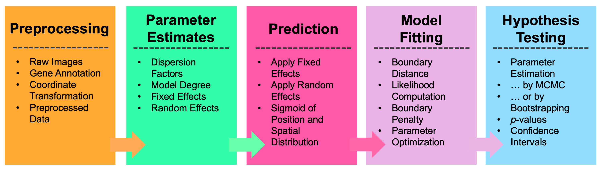
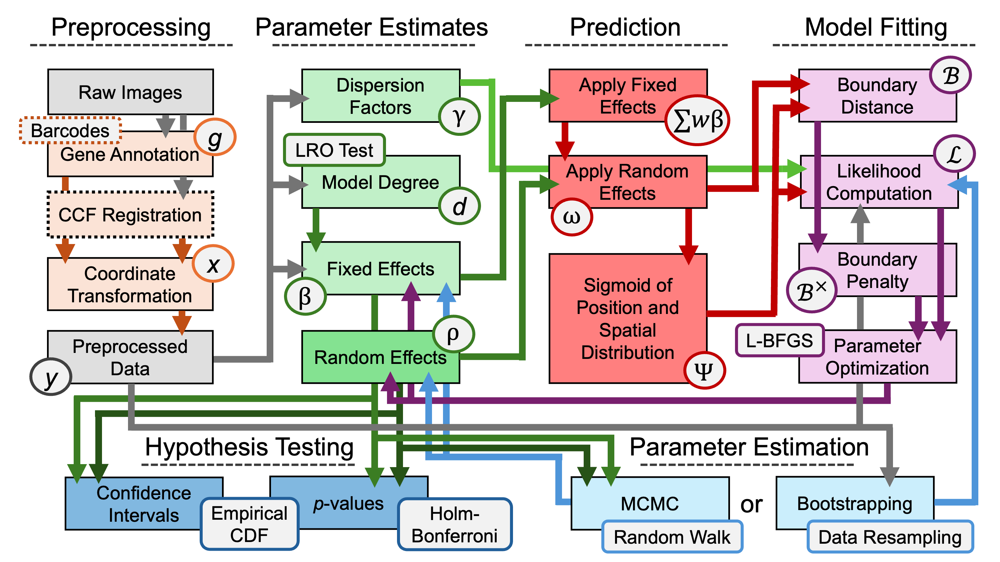
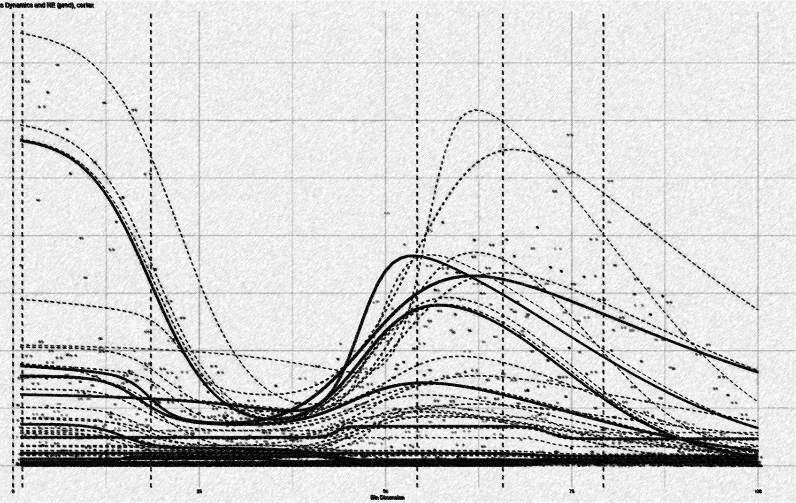

# Wispack: An R package for warped sigmoidal Poisson-process mixed-effects modeling

Wispack (pronounced "wisp package" or "wisp pack") is an R package for testing for between-group effects on spatial variation in spatial transcriptomics data. As such variation is often functional, these can be thought of as *functional spatial effects* (FSE). 

<div class="figure">
  
  <p class="caption">True-color image of fluorescing probes bound to mRNA molecules in cortical cells, the raw data of spatial transcriptomics.</p>
</div>

Unlike testing for spatially variable genes (SVGs), which only involves testing for spatial variation of gene expression within a group, and unlike differential expression (DE) analysis which tests for between-group effects without regard to spatial distribution, testing for FSEs involves testing whether a factor such as age or rearing conditions has a nonzero effect on spatial variation between groups differing on that factor.

<div class="figure">
  
  <p class="caption">Comparison between testing for differentially expressed genes, spatially variable genes, and genes with function spatial effects. For visualization purposes, mouse brain slices represent the tissue sample and laterality (left vs right hemisphere) represents a fixed effect (i.e., covariate).</p>
</div>

Wispack performs FSE testing by first using change-point detection to find spatial variation in samples, then fitting a nonlinear mixed-effect model to the detected change points. The core of the nonlinear model is a parameterization of the found change-points as inflections in logistic functions representing gradients of gene expression change. Multiple change-points are handled by summing the component logistic functions into a "poly-sigmoid" function. Fixed effects (such as age or rearing conditions) are then modeled as effects on the underlying logistic parameters. Random (within group) effects are modeled as further nonlinear warping of the poly-sigmoid. Significance testing is performed on the effects through either bootstrapping or MCMC resampling. A complete mathematical description of wisp models can be found in this [preprint](https://doi.org/10.1101/2025.06.11.659209). 

<div class="figure">
  
  <p class="caption">Demo plots of the functions involved in wisp. (A) The logistic function, used to model a single change point in gene expression. (B) The wisp poly-sigmoid function, built from three logistic components, representing three change points. (C) The warping function used to represent random effects, e.g., variation due to differences between individual animals or due to measurement noise. (D) The wisp poly-sigmoid from (B) with warping function applied.</p>
</div>

Wispack provides a user-facing function, <span class = "function">wisp</span>, which takes a data frame in the familiar format expected by standard R functions for linear models (e.g., [<span class = "function">lme4::lmer</span>](https://cran.r-project.org/web/packages/lme4/index.html) or [<span class = "function">stats::lm</span>](https://stat.ethz.ch/R-manual/R-devel/library/stats/html/lm.html)) and runs the complete test for FSEs. Preprocessing of the data is generally required before passing it to <span class = "function">wisp</span>, after which <span class = "function">wisp</span> executes a pipeline involving parameter estimates, prediction, model fitting, and hypothesis testing. 

<div class="figure">
  
  <p class="caption">Top-level overview of wisp modeling pipeline.</p>
</div>

As shown by the figure below, the steps of this pipeline are nonlinear and recurrent. 

<div class="figure">
  
  <p class="caption">Full modeling pipeline for wisp. Boxes represent variables in the model, or operations performed on variables. Arrows represent input-output relationships between these variables and operations.</p>
</div>
 
Unlike standard linear modeling packages in R which require a model formula, <span class = "function">wisp</span> merely needs the data. For example, the quick-start demo (which uses data from mice on <span class = "gene">RORB</span> expression across the laminar axis of the primary somatosensory cortex) runs the following code: 

```R
# Set random seed for reproducibility
ran.seed <- 123
set.seed(ran.seed)

# Load wispack
library(wispack)

# Load demo data
countdata <- read.csv(system.file(
      "extdata", 
      "S1_laminar_countdata_demo_default_col_names.csv", 
      package = "wispack"
    )
  )

# Fit model
laminar.model <- wisp(countdata)

# View model 
View(laminar.model)
```

No model formula is required. By default, wisp models include all possible effect interactions. However, effect interactions can be removed from the model using the <span class = "code_variable">trtKO</span> argument in <span class = "code_variable">model.settings</span>. Further, if not a set of defaults, column names from the data must be associated with model variables using the <span class = "code_variable">variables</span> argument. For example:

```R
# Define variables in the dataframe for the model
data.variables <- list(
    count = "count",
    bin = "bin", 
    context = "cortex", 
    species = "gene",
    ran = "mouse",
    timeseries = "age",
    fixedeffects = c("hemisphere", "age")
  )
  
# Remove the hemisphere x age interaction from the model
model.settings <- list(
    trtKO = c("right12")
  )
  
# Fit model
laminar.model <- wisp(
    count.data = countdata,
    variables = data.variables,
    model.settings = model.settings
  )
```

Both the quick-start demo and another demo showing all model options can be run using the demo() command: 

```R
demo("quick_start", package = "wispack")  
demo("full_options", package = "wispack")
```

The tutorials provide more detailed walkthroughs of the package and its options: 

1. [*Poisson processes and sigmoids:*](articles/tutorial_Poisson.html) Introduction to how wisps parameterize and model the spatial distribution of count data from a Poisson process such as gene transcription. 
2. [*Random effects and warping:*](articles/tutorial_warping.html) Explanation of random-effect modeling and how it's implemented in a wisp. 
3. [*RORB along the cortical laminar axis:*](articles/tutorial_corticallaminar.html) A detailed walkthrough of modeling a real biological dataset with wisp.
4. [*Time-series data:*](articles/tutorial_timeseries.html) Explanation of how wisp models times-series data.
5. [*Radial zonation in liver lobules:*](articles/tutorial_liverradial.html) A second example application from a different biological dataset, with an emphasis on time series and temporal-spatial interactions. 
6. [*Modeling cell types:*](articles/tutorial_multicontext.html) An extension of the <span class = "gene">RORB</span> example showing how to model not only Poisson-process species (i.e., genes), but also the broader biological context (i.e., cell type). 
7. [*Plotting wisp models:*](articles/tutorial_wispplots.html) An explanation of the various kinds of plots available through wispack.
8. [*Customizing statistical analyses:*](articles/tutorial_stats.html) A walkthrough of the various options for customizing the statistical analyses performed by wisp, including bootstrapping and MCMC resampling.
9. [*Benchmarks and comparisons:*](articles/tutorial_benchmarks.html) Development of a simulation framework (attractor simulations) for benchmarking wispack and two other packages for analyzing transcriptomics data. 

<div class="figure">
  
  <p class="caption">Artistic rendering of a wisp model. See [this tutorial](articles/tutorial_wispplots.html) for an explanation.</p>
</div>

Copyright (C) 2026, Michael Barkasi
barkasi@wustl.edu
