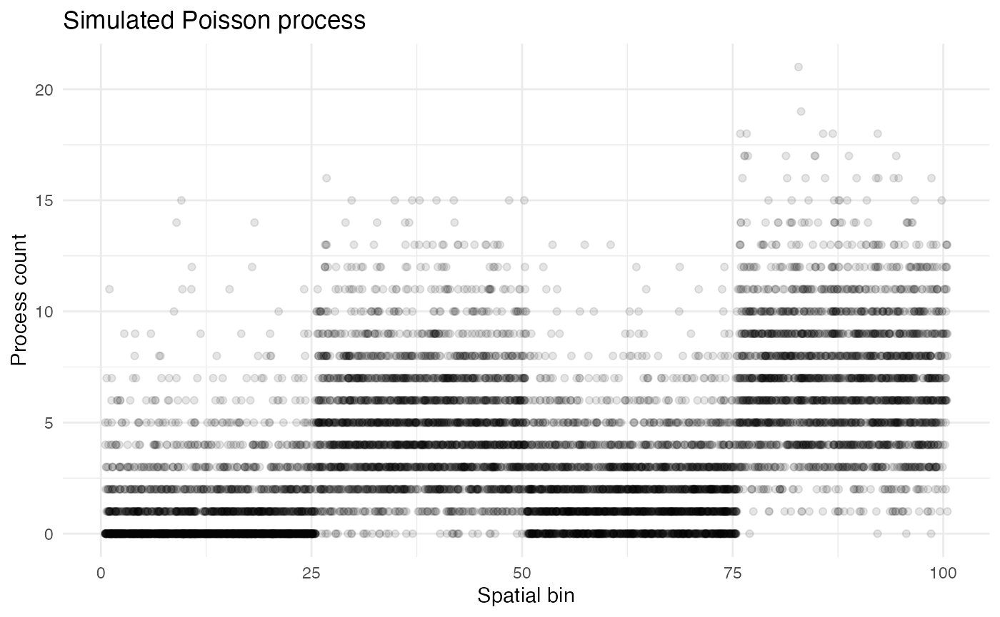
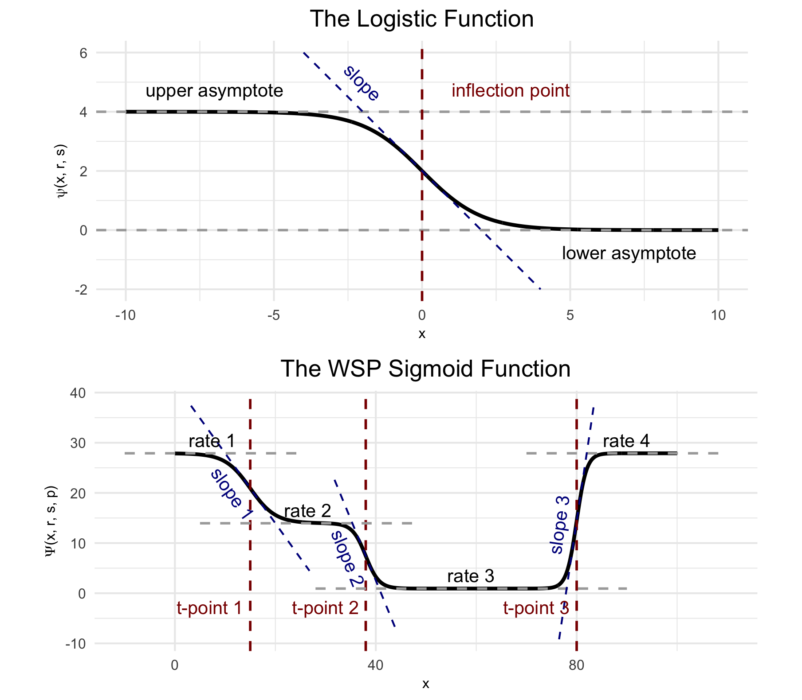
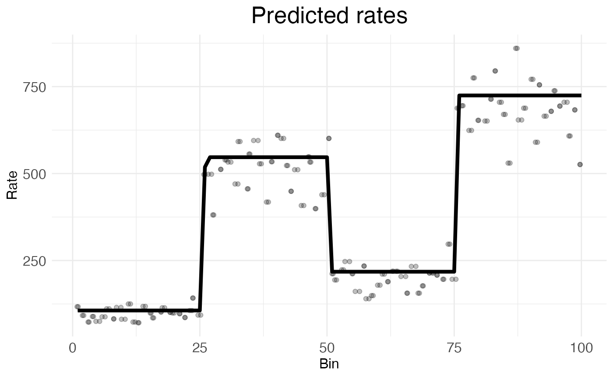

# Poisson processes and sigmoids

## Poisson processes

Suppose you want to model some process which generates tokens of a
certain type over space. For example, the cells in your body generate
RNA molecules through gene transcription and rabbits in a forest
generate offspring through reproduction. If every instance of the
process (e.g., every cell, or every rabbit) in the same place x produces
tokens at the same rate \lambda, then the number y of tokens generated
in a given region will follow a Poisson distribution y\sim
\text{Pois}(n\lambda) with rate parameter equal to n\lambda, for n the
number of process instances in the region.

Real cases of distributed Poisson processes rarely have instances with
identical rates. For example, rabbits will reproduce at different rates
depending on factors like age, and cells will transcribe genes at
different rates depending on their type and state. This variation is
often gamma-distributed, such that if \lambda is the mean process rate
at x, then individual process instances will have rate \Lambda drawn
from a gamma distribution \Lambda\sim \text{Gam}(\lambda,
\sigma\_\gamma^2) with expected value \lambda and variance
\sigma\_\gamma^2.

## Simulating data

Let’s simulate a Poisson process with gamma-distributed variation with
instances spread over a one-dimensional space x. The space will be
divided into 100 bins:

``` r
n_bins <- 100
x <- seq(1, n_bins)
```

We will randomly distribute 10,000 process instances across the space,
for an average of 100 instances per bin. The variable holding these
positions will be called “bin”:

``` r
set.seed(123) # for reproducibility
n_instances <- 10000
bin <- sample(x, n_instances, replace = TRUE)
```

Now suppose that the space is divided into four equal-sized blocks, each
with a different constant process rate \lambda, and suppose there is a
constant variance \sigma\_\gamma^2 = 2 across the entire space. Suppose
these rates \lambda are 1, 5, 2, and 7. We can represent this as a
vector lambda of length 100, with each block’s rate repeated twenty-five
times. The process counts can be simulated for each instance by pulling
individual process rates from a gamma distribution and then drawing
counts from a Poisson distribution with those rates:

``` r
lambda <- rep(c(1, 5, 2, 7), each = length(x)/4)
var_gamma <- 2
process_lambda <- rgamma(
    n_instances, 
    shape = lambda[bin]^2/var_gamma, 
    rate = lambda[bin]/var_gamma
  )
count <- rpois(n_instances, process_lambda)
```

The variable count is a vector of length 10,000 holding the observed
count for each process instance. These simulated process counts can be
combined into a dataframe called “countdata”:

``` r
countdata <- data.frame(bin, count)
print(head(countdata))
```

``` scroll-output
##   bin count
## 1  31     3
## 2  79     8
## 3  51     0
## 4  14     3
## 5  67     3
## 6  42     7
```

This data frame can be used to plot the counts as a function of space:

``` r
ggplot2::ggplot(countdata, ggplot2::aes(x = bin, y = count)) +
  ggplot2::geom_jitter(height = 0, width = 0.5, alpha = 0.1) +
  ggplot2::labs(
    title = "Simulated Poisson process",
    x = "Spatial bin",
    y = "Process count"
  ) +
  ggplot2::theme_minimal() +
  ggplot2::theme(
    panel.background = ggplot2::element_rect(fill = "white", colour = NA),
    plot.background  = ggplot2::element_rect(fill = "white", colour = NA)
  )
```



As Poisson distributions are preserved under addition, the counts for
each bin can be summed while maintaining a Poisson distribution.

``` r
summed_counts <- aggregate(count ~ bin, data = countdata, sum)
ggplot2::ggplot(summed_counts, ggplot2::aes(x = bin, y = count)) +
  ggplot2::geom_point() +
  ggplot2::labs(
    title = "Simulated Poisson process",
    x = "Spatial bin",
    y = "Summed process count"
  ) +
  ggplot2::theme_minimal() +
  ggplot2::theme(
    panel.background = ggplot2::element_rect(fill = "white", colour = NA),
    plot.background  = ggplot2::element_rect(fill = "white", colour = NA)
  )
```


## Modeling with sigmoids

Wisps are mathematical models for describing gamma-distributed Poisson
processes. The parameters used to create countdata can be recovered
using a wisp. A wisp model is fit in two steps.

The first is to find transition points p in count rate by looking for
outliers in the ratio between the likelihood of the neighborhood around
x having a constant rate and the likelihood of each side of the
neighborhood around x having different rates. If there are n such
transition points p=\langle p_1,\ldots,p_n\rangle, then a specific
variety of sigmoid, the logistic function: \psi(x,r,s) = \frac{r}{1 +
\exp({sx})} can be used to model the rate \lambda across space by
combining n such sigmoids into a wisp function: \Psi(x,r,s,p) = r_1 +
\sum\_{i=1}^n \psi(x - p_i, r\_{i+1} - r\_{i}, -s_i) with rate
parameters r=\langle r_1,\ldots,r\_{n+1}\rangle and slope parameters
s=\langle s_1,\ldots,s\_{n}\rangle.



(Top) The logistic function, used to model a single change point in gene
expression. (Bottom) The wisp poly-sigmoid function, built from three
logistic components, representing three change points.

The second is to use gradient-based optimization or MCMC to find the
parameters r, s and p which maximize the likelihood of the log transform
f(y)=\log(y+1) of countdata\$count.

For this demonstration, the data in countdata has been explicitly
constructed with the statistical structure captured by wisp using known
parameters r and p. Thus, fitting a wisp model to countdata should
recover those parameters. (Note: The verbose progress reports from wisp
show how the function adds columns to countdata for context, species,
ran, timeseries, and fixedeffects; while not used here, these columns
are used in more complex modeling scenarios.)

``` r
library(wispack, quietly = TRUE)
model <- wisp(
    countdata, 
    fit_only = TRUE, 
    plot.settings = list(CI_style = FALSE)
  )
```

``` scroll-output
## 
## 
## Parsing data and settings for wisp model
## ----------------------------------------
## 
## Model settings:
##  buffer_factor: 0.05
##  ctol: 1e-06
##  max_penalty_at_distance_factor: 0.01
##  LROcutoff: 2
##  LROwindow_factor: 1.25
##  rise_threshold_factor: 0.8
##  max_evals: 1000
##  rng_seed: 42
##  warp_precision: 1e-07
##  round_none: TRUE
##  inf_warp: 450359962.73705
##  allow_infeasible_params: TRUE
## 
## Plot settings:
##  print.plots: TRUE
##  dim.bounds: 
##  log.scale: FALSE
##  splitting_factor: 
##  CI_style: FALSE
##  label_size: 5.5
##  title_size: 20
##  axis_size: 12
##  legend_size: 10
##  count_size: 1.5
##  count_jitter: 0.5
##  count.alpha.ran: 0.25
##  count.alpha.none: 0.25
##  pred.alpha.ran: 0.9
##  pred.alpha.none: 1
## 
## Variable dictionary:
##  count: count
##  bin: bin
##  context: context
##  species: species
##  ran: ran
##  timeseries: timeseries
##  fixedeffects: 
## 
## Parsed data (head only):
## ------------------------------
##   count bin context species ran
## 1     3  31 context species ran
## 2     8  79 context species ran
## 3     0  51 context species ran
## 4     3  14 context species ran
## 5     3  67 context species ran
## 6     7  42 context species ran
## ----
## 
## Initializing Cpp (wspc) model
## ----------------------------------------
## 
## Infinity handling:
## machine epsilon: (eps_): 2.22045e-16
## pseudo-infinity (inf_): 1e+100
## warp_precision: 1e-07
## implied pseudo-infinity for unbounded warp (inf_warp): 4.5036e+08
## 
## Extracting variables and data information:
## Found max bin: 100.000000
## No fixed effects detected.
## No time series detected.
## Created treatment levels:
## "ref"
## Context grouping levels:
## "context"
## Species grouping levels:
## "species"
## Random-effect grouping levels:
## "ran"
## Total rows in summed count data table: 100
## Number of rows with unique model components: 1
## 
## Creating summed-count data columns and weight matrix:
## Random level 0, 1/1 complete
## 
## Making initial parameter estimates:
## Took log of observed counts
## Estimated gamma dispersion of raw counts
## Estimated change points
## Found average log counts for each context-species combination
## Estimated initial parameters for fixed-effect treatments
## Built initial beta (ref and fixed-effects) matrices
## Initialized random-effect warping factors
## Made and mapped parameter vector
## Number of parameters: 10
## Constructed grouping variable IDs
## Size of boundary vector: 11
## 
## Fitting model to data
## ----------------------------------------
## 
## Setting boundary penalty coefficients
## Initial neg_loglik: 183.522
## Initial neg_loglik with penalty: 185.191
## Initial min boundary distance: 0.25
## Final neg_loglik: 183.287
## Final neg_loglik with penalty: 184.448
## Final min boundary distance: 4.68473
## Number of evaluations: 34
## Checking feasibility of provided parameters
## ... no tpoints below buffer
## ... no NAN rates predicted
## ... no negative rates predicted
## Provided parameters are feasible
## Initial boundary distance (want > 0): 4.68473
## 
## Making rate-count plots...
```



The above plot makes visually clear that the wisp is a good fit for the
data. The
[wisp()](https://michaelbarkasi.github.io/wispack/reference/wisp.md)
function has identified the three rate-transition points dividing the
data into four equal-sized blocks and, within each block, has identified
a rate parameter which visually seems to land in the middle of the data.

The recovered parameters can also be extracted as numerical values:

``` r
param_names <- names(model$fitted.parameters)
est_param <- round(model$fitted.parameters, 3)
for (param_type in c("Rt", "tslope", "tpoint")) {
  cat(
  "\nRecovered", param_type, "parameters:", 
  paste0(
      est_param[grepl(param_type, param_names)], 
      collapse = ", "
    )
  )
}
```

``` scroll-output
## 
## Recovered Rt parameters: 4.675, 6.306, 5.388, 6.587
## Recovered tslope parameters: 86.644, 32.061, 83.237
## Recovered tpoint parameters: 25.961, 50.259, 75.876
```

It is immediately clear from the three tpoint parameters (i.e., p) that
wisp has recovered the transition points at bins 25, 50, and 75.
However, at first glance, the rates (Rt) look off. This is because wisp
has predicted the log transform of the sum of the rates. To recover the
original rates of 1, 5, 2, and 7, we need to exponentiate the recovered
rates, subtract 1, and divide by the mean number of tokens per bin
within the block.

``` r
tokens_per_bin <- rep(NA, n_bins)
for (b in 1:n_bins) tokens_per_bin[b] <- sum(countdata$bin == b)
for (block in 1:4) {
  start_bin <- (block - 1) * 25 + 1
  end_bin <- block * 25
  mean_tokens <- mean(tokens_per_bin[start_bin:end_bin])
  rate_param <- model$fitted.parameters[block]
  recovered_rate <- (exp(rate_param) - 1) / mean_tokens
  cat(
    paste0(
        "\nBlock ", block, 
        " recovered rate: ", round(recovered_rate, 3)
      )
    )
}
```

``` scroll-output
## 
## Block 1 recovered rate: 1.058
## Block 2 recovered rate: 5.415
## Block 3 recovered rate: 2.16
## Block 4 recovered rate: 7.405
```

Thus, wisp indeed works well for modeling gamma-distributed Poisson
processes!
