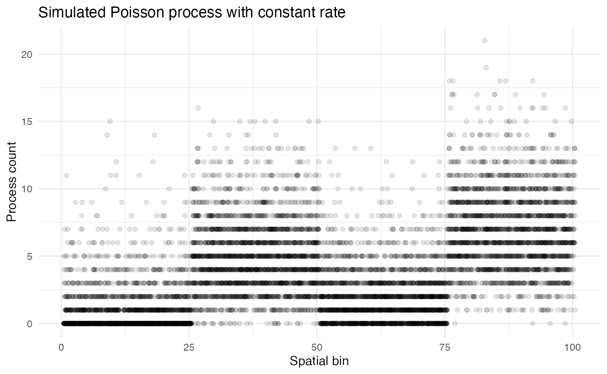
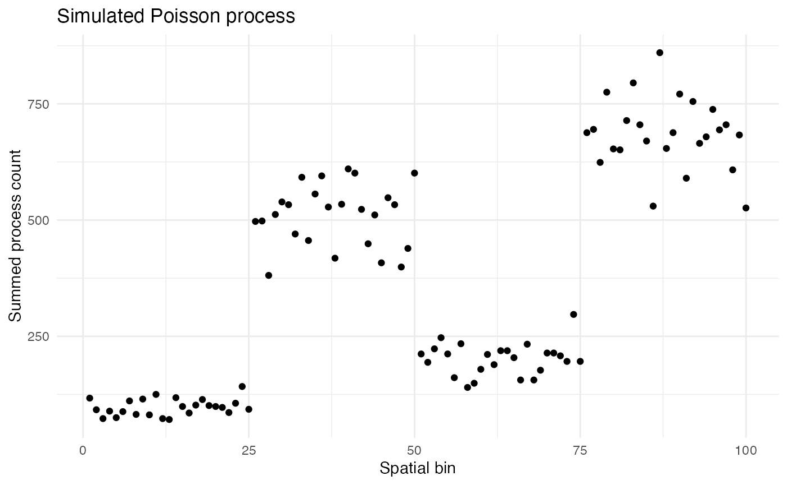
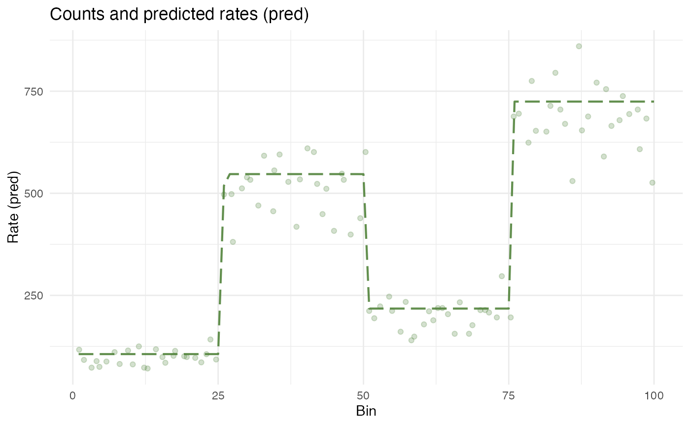

# Simulating a Poisson process

## Poisson processes

Suppose you wanted to model some process which generates tokens of a
certain type over space. For example, the cells in your body generate
RNA molecules through gene transcription and rabbits spread across a
forest generate offspring through reproduction. If every instance of the
process (e.g., every cell, or every rabbit) in the same place $`x`$
produces tokens at the same rate $`\lambda`$, then the number $`y`$ of
tokens generated in a given region will follow a Poisson distribution
``` math
y\sim \text{Pois}(n\lambda)
```
with rate parameter equal to $`n\lambda`$, for $`n`$ the number of
process instances in the region. As Poisson distributions are linear, it
is just as well to ignore $`n`$ and let $`\lambda`$ be the overall rate
of token generation in the region $`x`$. In this case, empirical
measures of $`\lambda`$ are obtained simply by summing the tokens
produced by all the process instances in $`x`$.

Real cases of distributed Poisson processes rarely have instances with
identical rates. For example, rabbits will reproduce at different rates
depending on factors like age, and cells will transcribe genes at
different rates depending on their type and state. Some of this
variation is due to systematic factors (which can be modeled as fixed
effects), but much of it is due to random noise. This noise is often
gamma-distributed, such that if $`\lambda`$ is the mean process rate at
$`x`$, then individual process instances will have rate $`\Lambda`$
drawn from a gamma distribution
``` math
\Lambda\sim \text{Gam}(\lambda, \sigma_\gamma^2)
```
with expected value $`\lambda`$ and variance $`\sigma_\gamma^2`$.

## Simulating data

Let’s simulate a Poisson process with gamma-distributed noise with
instances spread over a one-dimensional space. The space will be divided
into 100 bins:

``` r
n_bins <- 100
x <- seq(1, n_bins)
```

We will randomly distribute 10,000 process instances across the space,
for an average of 100 instances per bin. The variable holding these
positions will be called **bin**:

``` r
set.seed(123)
n_instances <- 10000
bin <- sample(x, n_instances, replace = TRUE)
```

Now suppose that the space is divided into four equal-sized blocks, each
with a different constant process rate $`\lambda`$, and suppose there is
a constant variance $`\sigma_\gamma^2 = 2`$ across the entire space.
Suppose these rates are 1, 5, 2, and 7. We can represent this as a
vector **lambda** of length 100, with each block’s rate repeated
twenty-five times. The process counts can be simulated for each instance
by pulling from both a gamma and Poisson distribution:

``` r
lambda <- rep(c(1, 5, 2, 7), each = length(x)/4)
var_gamma <- 2
process_lambda <- rgamma(
  n_instances, 
  shape = lambda[bin]^2/var_gamma, 
  rate = lambda[bin]/var_gamma
  )
count <- rpois(n_instances, process_lambda)
```

These simulated process counts can be plotted as a function of space:

``` r
countdata <- data.frame(bin, count)
ggplot2::ggplot(countdata, ggplot2::aes(x = bin, y = count)) +
  ggplot2::geom_jitter(height = 0, width = 0.5, alpha = 0.1) +
  ggplot2::labs(
    title = "Simulated Poisson process",
    x = "Spatial bin",
    y = "Process count"
  ) +
  ggplot2::theme_minimal() +
  ggplot2::theme(
    panel.background = ggplot2::element_rect(fill = "white", colour = NA),
    plot.background  = ggplot2::element_rect(fill = "white", colour = NA)
  )
```



As noted above, the counts for each bin can be summed while maintaining
a Poisson distribution.

``` r
summed_counts <- aggregate(count ~ bin, data = countdata, sum)
ggplot2::ggplot(summed_counts, ggplot2::aes(x = bin, y = count)) +
  ggplot2::geom_point() +
  ggplot2::labs(
    title = "Simulated Poisson process",
    x = "Spatial bin",
    y = "Summed process count"
  ) +
  ggplot2::theme_minimal() +
  ggplot2::theme(
    panel.background = ggplot2::element_rect(fill = "white", colour = NA),
    plot.background  = ggplot2::element_rect(fill = "white", colour = NA)
  )
```



## Modeling with wisp

Wisps are mathematical models for describing a gamma-distributed Poisson
process with the statistical structure described above. The parameters
used to create **countdata** can be recovered using a wisp. A wisp model
is fit in two steps.

The first is to find transition points $`p`$ in count rate by looking
for outliers in the ratio between the likelihood of the neighborhood
around $`x`$ having a constant rate and the likelihood of each side of
the neighborhood around $`x`$ having different rates. If there are $`n`$
such transition points $`p=\langle p_1,\ldots,p_n\rangle`$, a sum of
$`n`$ logistic functions
``` math
\psi(x,r,s) = \frac{r}{1 + \exp({sx})}
```
of the form
``` math
\Psi(x,r,s,p) = r_1 + \sum_{i=1}^n \psi(x - p_i, r_{i+1} - r_{i}, -s_i)
```
with rate parameters $`r=\langle r_1,\ldots,r_{n+1}\rangle`$ and slope
parameters $`s=\langle s_1,\ldots,s_{n}\rangle`$ can be used to model
the rate $`\lambda`$ across space.

The second is to use gradient-based optimization or MCMC to find the
parameters $`r`$, $`s`$ and $`p`$ which maximize the likelihood of the
log transform $`f(y)=\log(y+1)`$ of **countdata**.

For this demonstration, the data in **countdata** has been explicitly
constructed with the statistical structure captured by wisp using known
parameters $`r`$ and $`p`$. Thus, fitting a wisp model to **countdata**
should recover those parameters.

``` r
library(wispack, quietly = TRUE)
model <- wisp(countdata, fit_only = TRUE)
```

    ## 
    ## 
    ## Parsing data and settings for wisp model
    ## ----------------------------------------
    ## 
    ## Model settings:
    ##  buffer_factor: 0.05
    ##  ctol: 1e-06
    ##  max_penalty_at_distance_factor: 0.01
    ##  LROcutoff: 2
    ##  LROwindow_factor: 1.25
    ##  rise_threshold_factor: 0.8
    ##  max_evals: 1000
    ##  rng_seed: 42
    ##  warp_precision: 1e-07
    ##  inf_warp: 450359962.73705
    ## 
    ## Variable dictionary:
    ##  count: count
    ##  bin: bin
    ##  context: context
    ##  species: species
    ##  ran: ran
    ##  timeseries: timeseries
    ##  fixedeffects: 
    ## 
    ## Parsed data (head only):
    ## ------------------------------
    ##   count bin context species ran
    ## 1     3  31 context species ran
    ## 2     8  79 context species ran
    ## 3     0  51 context species ran
    ## 4     3  14 context species ran
    ## 5     3  67 context species ran
    ## 6     7  42 context species ran
    ## ----
    ## 
    ## Initializing Cpp (wspc) model
    ## ----------------------------------------
    ## 
    ## Infinity handling:
    ## machine epsilon: (eps_): 2.22045e-16
    ## pseudo-infinity (inf_): 1e+100
    ## warp_precision: 1e-07
    ## implied pseudo-infinity for unbounded warp (inf_warp): 4.5036e+08
    ## 
    ## Extracting variables and data information:
    ## Found max bin: 100.000000
    ## No fixed effects detected.
    ## No time series detected.
    ## Created treatment levels:
    ## "ref"
    ## Context grouping levels:
    ## "context"
    ## Species grouping levels:
    ## "species"
    ## Random-effect grouping levels:
    ## "ran"
    ## Total rows in summed count data table: 100
    ## Number of rows with unique model components: 1
    ## 
    ## Creating summed-count data columns and weight matrix:
    ## Random level 0, 1/1 complete
    ## 
    ## Making initial parameter estimates:
    ## Took log of observed counts
    ## Estimated gamma dispersion of raw counts
    ## Estimated change points
    ## Found average log counts for each context-species combination
    ## Estimated initial parameters for fixed-effect treatments
    ## Built initial beta (ref and fixed-effects) matrices
    ## Initialized random-effect warping factors
    ## Made and mapped parameter vector
    ## Number of parameters: 10
    ## Constructed grouping variable IDs
    ## Size of boundary vector: 11
    ## 
    ## Fitting model to data
    ## ----------------------------------------
    ## 
    ## Setting boundary penalty coefficients
    ## Initial neg_loglik: 183.522
    ## Initial neg_loglik with penalty: 185.191
    ## Initial min boundary distance: 0.25
    ## Final neg_loglik: 183.287
    ## Final neg_loglik with penalty: 184.448
    ## Final min boundary distance: 4.68473
    ## Number of evaluations: 34
    ## Checking feasibility of provided parameters
    ## ... no tpoints below buffer
    ## ... no NAN rates predicted
    ## ... no negative rates predicted
    ## Provided parameters are feasible
    ## Initial boundary distance (want > 0): 4.68473
    ## 
    ## Making rate-count plots... $plot_pred_context_context_fixEff_species



The above plot makes visually clear that the wisp is a good fit for the
data. The recovered parameters can be extracted explicitly as follows:

``` r
n_params <- length(model$fitted.parameters)
for (i in 1:n_params) {
  param_name <- names(model$fitted.parameters)[i]
  param_value <- model$fitted.parameters[i]
  cat(paste0(param_name, ": ", toString(round(param_value, 3)), "\n"))
}
```

    ## baseline_context_Rt_species_Tns/Blk1: 4.675
    ## baseline_context_Rt_species_Tns/Blk2: 6.306
    ## baseline_context_Rt_species_Tns/Blk3: 5.388
    ## baseline_context_Rt_species_Tns/Blk4: 6.587
    ## baseline_context_tslope_species_Tns/Blk1: 86.644
    ## baseline_context_tslope_species_Tns/Blk2: 32.061
    ## baseline_context_tslope_species_Tns/Blk3: 83.237
    ## baseline_context_tpoint_species_Tns/Blk1: 25.961
    ## baseline_context_tpoint_species_Tns/Blk2: 50.259
    ## baseline_context_tpoint_species_Tns/Blk3: 75.876

It is immediately clear from the final three **tpoint** parameters
(i.e., $`p`$) that wisp has recovered the transition points at bins 25,
50, and 75. However, at first glance, the rates look off. This is
because wisp has predicted the log transform of the sum of the rates. To
recover the original rates of 1, 5, 2, and 7, we need to exponentiate
the recovered rates, subtract 1, and divide by the mean number of tokens
per bin within the block.

``` r
tokens_per_bin <- rep(NA, n_bins)
for (b in 1:n_bins) tokens_per_bin[b] <- sum(countdata$bin == b)
for (block in 1:4) {
  start_bin <- (block - 1) * 25 + 1
  end_bin <- block * 25
  mean_tokens <- mean(tokens_per_bin[start_bin:end_bin])
  rate_param <- model$fitted.parameters[block]
  recovered_rate <- (exp(rate_param) - 1) / mean_tokens
  cat(paste0("Block ", block, " recovered rate: ", round(recovered_rate, 3), "\n"))
}
```

    ## Block 1 recovered rate: 1.058
    ## Block 2 recovered rate: 5.415
    ## Block 3 recovered rate: 2.16
    ## Block 4 recovered rate: 7.405

Thus, wisp indeed works well for modeling gamma-distributed Poisson
processes!
