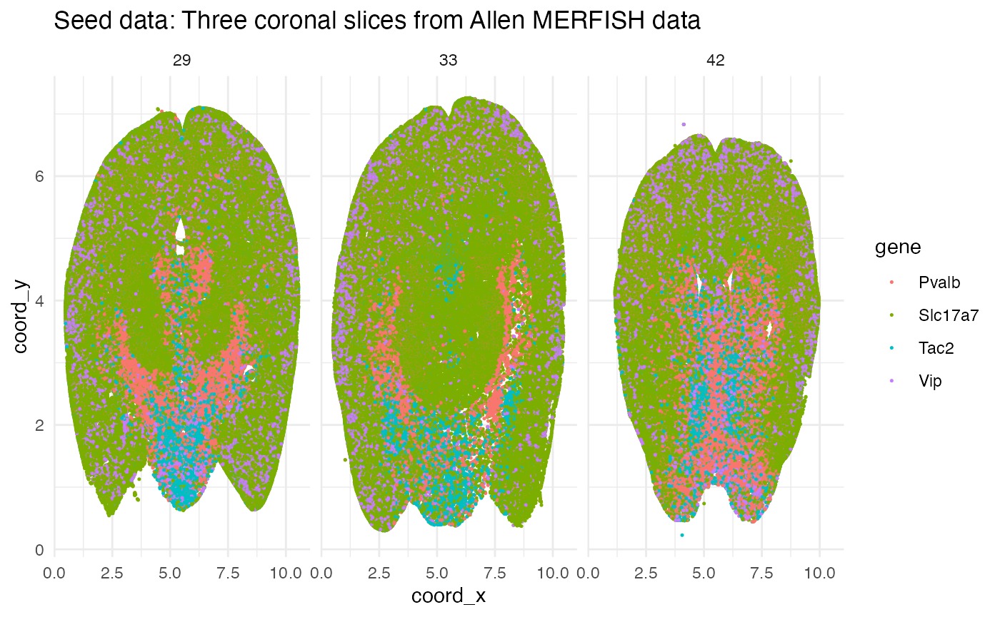
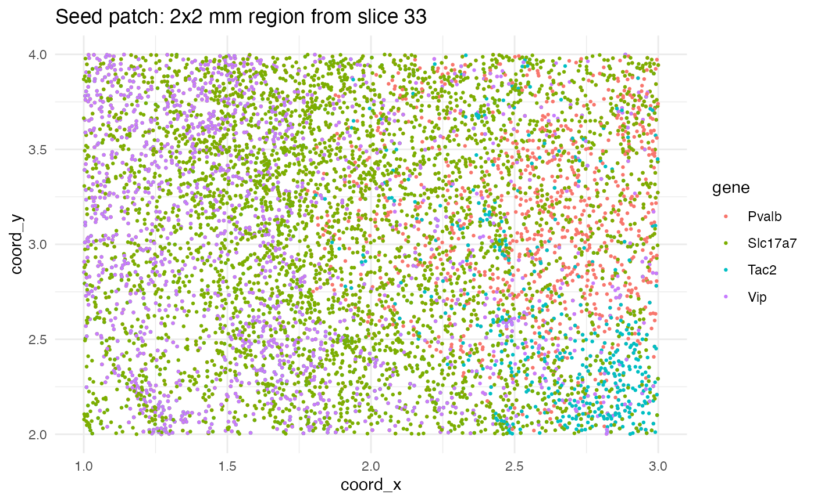
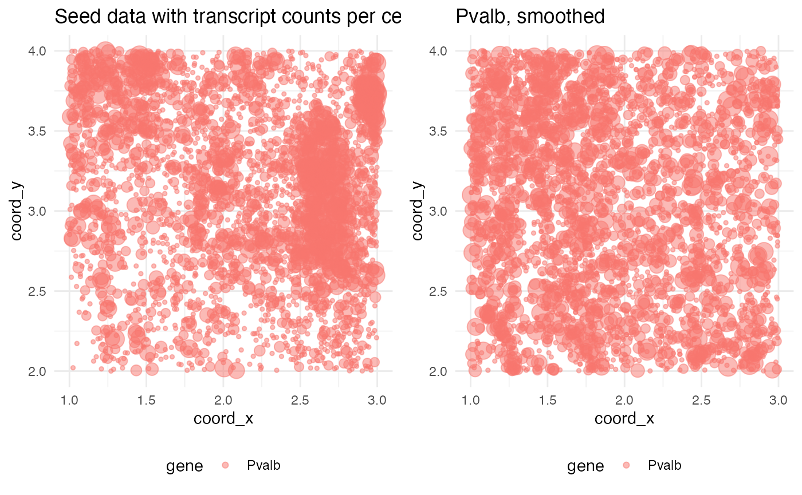
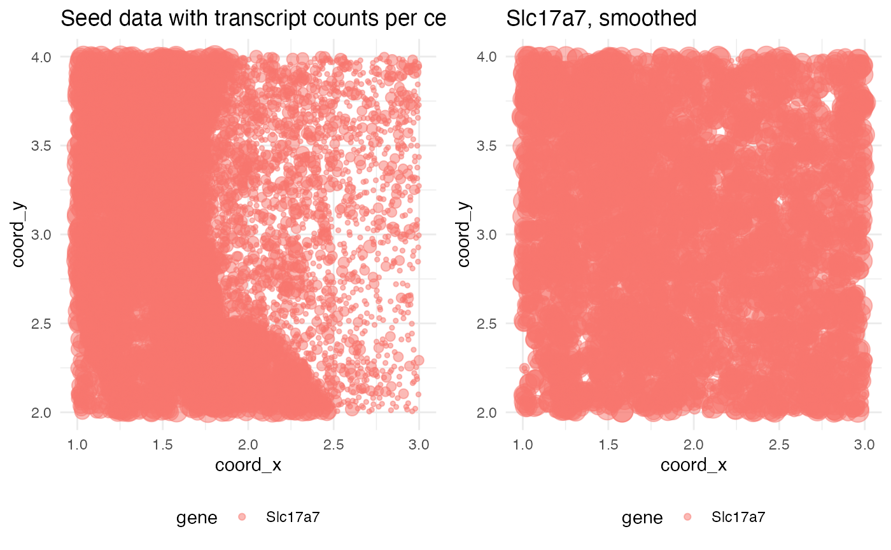
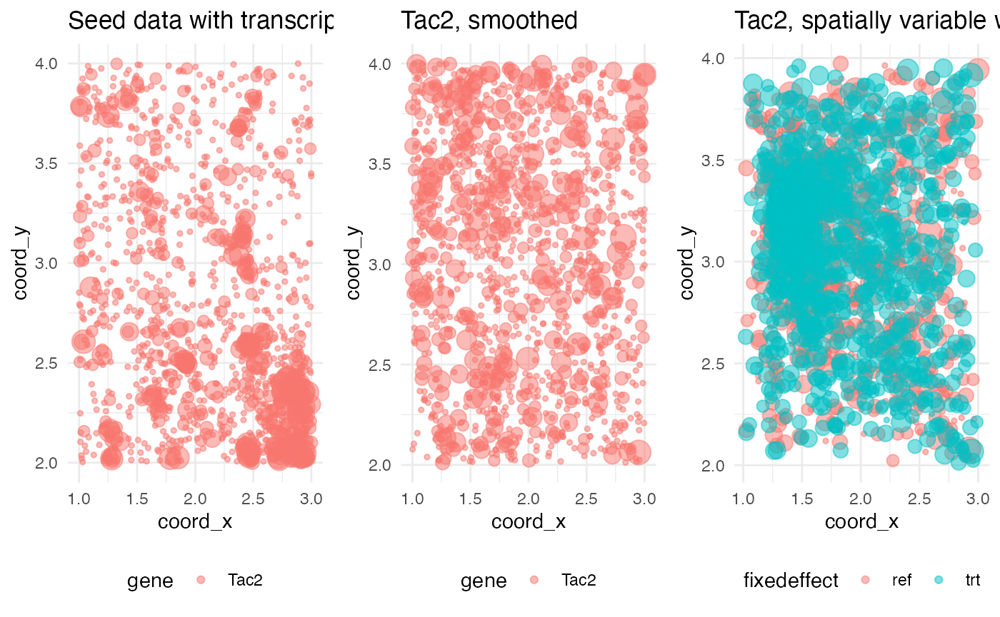
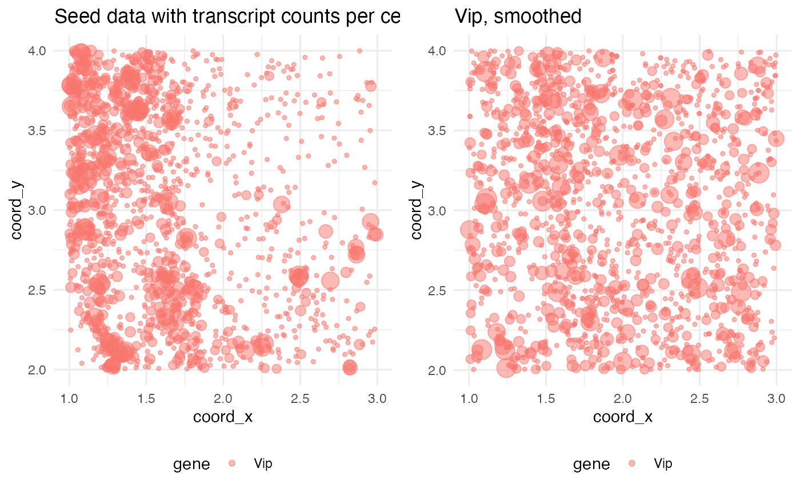

# Benchmarks and comparisons

## Introduction

The purpose of wispack is to test for *functional spatial effects*
(FSEs) using spatial transcriptomics data. Consider a two-level
covariate $`\xi`$ (e.g., control vs treatment, healthy vs diseased, left
vs right hemisphere) and spatial coordinate $`x`$ (e.g., cortical depth,
distance from a tumor, distance from a central vein in the liver). A
gene is *differentially expressed* (DE) with respect to $`\xi`$ if its
overall expression level depends on the level of $`\xi`$. A gene is
*spatially variable* (SVG) if its expression level depends on spatial
coordinate $`x`$. A covariate $`\xi`$ has a FSE on a gene if the spatial
distribution of that gene with respect to $`x`$ depends on the level of
$`\xi`$. (The adjective “functional” is included because it’s assumed
that the distribution of the gene with respect to $`x`$ has biological
significance.)


Comparison between testing for differentially expressed genes, spatially
variable genes, and genes with function spatial effects. For
visualization purposes, mouse brain slices represent the tissue sample
and laterality (left vs right hemisphere) represents a fixed effect
(i.e., covariate).

To the best of our knowledge, wisp models provide the only statistical
framework for testing for FSEs and (hence) wispack is the only software
for FSE testing. Wisp models allow for FSE testing because they
explicitly model the spatial distribution of gene expression in terms of
[parameters](https://michaelbarkasi.github.io/wispack/articles/tutorial_Poisson.md)
which can themselves depend on some other covariate. A coarse-grain
work-arounds for FSE testing would be to include an interaction term
between a spatial variable and another covariate of interest in a linear
model, but this approach could only capture an additive effect constant
across space. Wisp models, on the other hand, can capture complex
effects on density gradients, change-point locations, and local
expression levels.

This tutorial will use semi-synthetic simulation data to benchmark
wispack’s ability to detect FSEs. In order to compare FSE testing to DE
and SVG testing, we will also analyze the simulations with
[DESeq2](http://www.bioconductor.org/packages/release/bioc/html/DESeq2.md)
from [Love et al
2014](https://link.springer.com/article/10.1186/s13059-014-0550-8) and
[ELLA](https://github.com/jadexq/ELLA/tree/main) from [Wang and Zhou
2025](https://www.nature.com/articles/s41467-025-64867-0).

## Simulating data

### Seeding simulations with real data

To simulate data with known DE genes, SVGs, and FSEs, we begin with real
spatial transcriptomics data from the [Allen
Institute](https://alleninstitute.org/). This [data
set](https://alleninstitute.github.io/abc_atlas_access/descriptions/MERFISH-C57BL6J-638850.html),
described by [Yao et al
2023](https://www.nature.com/articles/s41586-023-06812-z), contains
coronal brain slices from an adult male mouse imaged in the Vizgen
MERSCOPE platform with a 500 gene panel. Wispack includes a csv file
with counts for four marker genes from three slices: Pvalb (parvalbumin
neurons), Slc17a7 (glutamatergic neurons), Tac2 (somatostatin neurons),
and Vip (vasoactive intestinal peptide neurons).

``` r
countdata <- read.csv(
  system.file(
      "extdata", 
      "Allen_data.csv", 
      package = "wispack"
    )
  )

print(head(countdata))
```

``` scroll-output
##   count               cell_id slice_num    gene  coord_x  coord_y
## 1    10   1018093344200990605        29 Slc17a7 3.485960 4.946534
## 2     1   1018093344200990605        29     Vip 3.485960 4.946534
## 3     1   1018093344101180865        29    Tac2 4.062627 5.040059
## 4     1   1018093344101180865        29 Slc17a7 4.062627 5.040059
## 5     2   1018093344100990765        29 Slc17a7 3.502277 4.956870
## 6     1 1018093344102270476-1        29   Pvalb 6.834409 5.008881
```

This data can be visualized as follows:

``` r
ggplot(countdata, aes(x = coord_x, y = coord_y, color = gene)) +
  geom_point(size = 0.25) + 
  facet_wrap(~ slice_num) +
  ggtitle("Seed data: Three coronal slices from Allen MERFISH data") +
  theme_minimal() +
  theme(
    panel.background = element_rect(fill = "white", colour = NA),
    plot.background  = element_rect(fill = "white", colour = NA))
```



The point of starting with real data is to ensure that the simulations
contain genes with realistic transcript counts and distributions. We
will seed the simulations with data from a $`2\times 2`$ mm region of
slice 33.

``` r
seed_patch <- countdata[
  countdata$slice_num == 33 &
    countdata$coord_y >= 2 & countdata$coord_y <= 4 &
    countdata$coord_x >= 1 & countdata$coord_x <= 3,]
```

The cell ID column can also be dropped, as we will not use cell ID in
the benchmarking.

``` r
seed_patch <- seed_patch[,c("count", "slice_num", "gene", "coord_x", "coord_y")]
```

Let’s visualize the seed patch. Note that in this plot (and the previous
one), a single dot is used for each cell coordinate containing at least
one transcript from each gene. Thus, some dots may represent multiple
transcripts from the same gene in the same cell.

``` r
ggplot(seed_patch, aes(x = coord_x, y = coord_y, color = gene)) +
  geom_point(size = 0.5) + 
  ggtitle("Seed patch: 2x2 mm region from slice 33") +
  theme_minimal() +
  theme(
    panel.background = element_rect(fill = "white", colour = NA),
    plot.background  = element_rect(fill = "white", colour = NA))
```



### Simulating random and fixed effects

With a patch of seed data in hand, we need functions which will
transform this data into simulations with known DE genes, SVGs, and
FSEs. Specifically, we need three functions: one to simulate the random
effects of inter-replicate noise, one to smooth spatial gene
distribution to ensure no spatial variability in some conditions, and
one to induce a known amount of spatial variability.

Random effects of inter-replicate noise will be simulated via a
combination of affine transformation of spatial coordinates and Poisson
resampling of counts. The following helper function makes a single
replicate from input data:

``` r
# Helper function to make replicates
make_replicate <- function(
    data, 
    rate_scalar = 0.5, # number between 0 and 1
    affine_transform = NULL,
    spatial_scalar = 0.05
  ) {
    # Initialize a copy of the data to spatially transform
    data_transformed <- data
    # If none provided, make affine transformation to shift cells around
    if (is.null(affine_transform)) {
      Ax <- matrix(c(1,0,rnorm(1,0,spatial_scalar),1),2,2)  # shear x
      Ay <- matrix(c(1,rnorm(1,0,spatial_scalar),0,1),2,2)  # shear y
      As <- matrix(c(rnorm(1,0,spatial_scalar)+1, 0, 0, rnorm(1,0,spatial_scalar)+1),2,2) # scale
      A <- As %*% Ay %*% Ax
    } else {
      A <- affine_transform
    }
    # Make scales to keep cells roughly in bounds
    x_mid <- diff(range(data$coord_x))/2 + min(data$coord_x)
    distx <- (data$coord_x - x_mid)^2
    distx <- distx/max(distx)
    y_mid <- diff(range(data$coord_y))/2 + min(data$coord_y)
    disty <- (data$coord_y - y_mid)^2
    disty <- disty/max(disty)
    # Applied scaled affine transformation
    data_transformed$coord_x = distx*data$coord_x + (1-distx)* (A[1,1]*data$coord_x + A[1,2]*data$coord_y)
    data_transformed$coord_y = disty*data$coord_y + (1-disty)* (A[2,1]*data$coord_x + A[2,2]*data$coord_y)
    # Poisson resampling of genes with scaled rate
    data_transformed$count <- rpois(nrow(data), data_transformed$count * (2*rate_scalar))
    return(data_transformed)
  }
```

Next, we need a function to smooth out the spatial distribution of the
genes. This function will do this via shuffling spatial coordinates:

``` r
smooth_data <- function(
    data
  ) {
    idx_shuffled <- sample(nrow(data), nrow(data), replace = FALSE)
    data$coord_x[idx_shuffled] <- data$coord_x
    data$coord_y[idx_shuffled] <- data$coord_y
    return(data)
  }
```

We will use a single function to both induce spatial variation on
smoothed data and to create an inter-condition (\`\`fixed’’) effect
$`\xi`$. Spatial variation will be induced for a gene by randomly
selecting an attractor point in the data and pulling all other
coordinates for transcripts of that gene towards it. An effect $`\xi`$
will be chosen by randomly selecting a value between zero and two,
squaring that value, multiplying the counts for that gene by the
resulting factor, and using the result as the rate for a random Poisson
draw.

``` r
induce_SV <- function(
    data_mixed, 
    gene, 
    attractor,    # number between 0 and 1
    effect = 0.5  # number between 0 and 1, to simulate fixed effects on rate
  ) {
    # Get attractor coordinates
    n_rows <- nrow(data_mixed)
    attractor_idx <- as.integer(n_rows * attractor)
    attractor_idx <- min(max(1, attractor_idx), n_rows)
    coord_attractor <- c(data_mixed$coord_x[attractor_idx], data_mixed$coord_y[attractor_idx])
    # Find distances from cells (i.e., transcripts) to attractor points
    gene_mask <- data_mixed$gene == gene
    x_diff <- data_mixed$coord_x[gene_mask] - coord_attractor[1]
    y_diff <- data_mixed$coord_y[gene_mask] - coord_attractor[2]
    d <- sqrt(x_diff^2 + y_diff^2)
    # Normalize distance
    d_norm <- 1 - d/max(d)
    # Add noise to normalization by using it as mean for beta distribution
    shape1 <- 1
    shape2 <- (shape1 - (shape1 * d_norm)) / d_norm
    n_points <- sum(gene_mask)
    d_norm_noise <- rbeta(n_points, shape1, shape2)
    # Scale differences with noisy normalized distance
    x_diff_norm <- x_diff * d_norm_noise
    y_diff_norm <- y_diff * d_norm_noise
    # Apply attraction
    data_attracted <- data_mixed
    data_attracted$coord_x[gene_mask] <- data_mixed$coord_x[gene_mask] - x_diff_norm 
    data_attracted$coord_y[gene_mask] <- data_mixed$coord_y[gene_mask] - y_diff_norm 
    # Apply effect
    data_attracted$count[gene_mask] <- rpois(sum(gene_mask), data_attracted$count[gene_mask] * (2*effect)^2)
    return(data_attracted)
  }
```

### Simulation functions

With functions for controling replicate noise, spatial variation, and
functional spatial effects, we need to write a single function for
generating a simulation from the seed patch. First, we start with two
helper functions, one to bin spatial coordinates and one to extract
ground-truth from a simulation.

``` r
# Helper function to bin data
bin_data <- function(
    data,
    n_bins = 100
  ) { 
    # Bin coordinates
    data$bin_x <- cut(
      data$coord_x,
      breaks = seq(min(data$coord_x), max(data$coord_x), length.out = n_bins + 1),
      include.lowest = TRUE,
      labels = FALSE
    )
    data$bin_y <- cut(
      data$coord_y,
      breaks = seq(min(data$coord_y), max(data$coord_y), length.out = n_bins + 1),
      include.lowest = TRUE,
      labels = FALSE
    )
    # Return binned data
    return(data)
  }

# Function to extract ground-truth from sim data 
ground_truth <- function(
    sim
  ) {
    # Extract ground-truth values for functional spatial effect values
    fse_true <- sim$effect
    # Extract ground-truth values for replicate random effect values
    ran_true <- sim$replicate_rate_scalars
    # Extract ground-truth values for whether a gene is SV
    SVGs <- rep(FALSE, length(sim$genes))
    names(SVGs) <- sim$genes
    SVGs[sim$SVGs] <- TRUE
    # Extract ground-truth values for whether a gene has FSE
    FSEs <- rep(FALSE, length(sim$genes))
    names(FSEs) <- sim$genes
    FSEs[sim$FSEs] <- TRUE 
    # Return as list
    return(
      list(
        fse_true = fse_true,
        ran_true = ran_true,
        SVGs = SVGs,
        FSEs = FSEs
      )
    )
  }
```

Finally, we can write the main simulation function. We will run it once
with plots to see how it works. Note that unlike the above plot of the
seed patch, spots are scaled in size according to the transcript count
per gene per cell.

``` r
# Load gridExtra for plotting
library(gridExtra)
# Define function to simulate data 
simulate_data <- function(
    seed_data, 
    n_bins = 100,
    n_replicates = 4, # number of replicates per treatment condition 
    replicate_spatial_scalar = 0.05, 
    print_plots = FALSE
  ) {
    
    # Get number and list of genes
    genes <- sort(unique(seed_data$gene))
    n_genes <- length(genes)
    
    # Randomly select genes to be spatially variable 
    # ... will select at least one
    SVGs <- sort(sample(n_genes, sample(n_genes, 1)))
    n_SVGs <- length(SVGs)
    
    # Randomly select SVGs to have FSEs
    # ... may select none
    FSEs <- c()
    n_FSEs <- sample(c(0:n_SVGs), 1)
    if (n_FSEs > 0) FSEs <- sort(sample(SVGs, n_FSEs))
    
    # Select attractors (some may not be used)
    attractor <- runif(n_genes)
    
    # Select effects
    # ... default is 0.5 * 2 = 1, i.e. no effect
    effect <- rep(0.5, n_genes)
    # ... apply effects to FSE genes, ensuring they are at least 5% different from no-effect
    if (n_FSEs > 0) {
      FSeffects <- runif(n_FSEs)
      min_pos_effect <- sqrt(1.05)/2
      min_neg_effect <- sqrt(0.95)/2
      FSeffects[FSeffects >= 0.5 & FSeffects < min_pos_effect] <- min_pos_effect
      FSeffects[FSeffects < 0.5 & FSeffects > min_neg_effect] <- min_neg_effect
      effect[FSEs] <- FSeffects
    }
    
    # Smooth seed data (no spatial variation)
    seed_data_smoothed <- smooth_data(seed_data)
    
    # Initialize variables for reference and treatment data
    sim_data_ref <- seed_data_smoothed
    sim_data_trt <- seed_data_smoothed
    
    # Smooth expression distribution, apply attractors, apply effects
    for (g in c(1:n_genes)) {
      
      # Print seed data and smoothed gene
      if (print_plots) {
        mask <- seed_data_smoothed$gene == genes[g]
        plt_seed <- ggplot(seed_data[mask,], aes(x = coord_x, y = coord_y, color = gene, size = log(count + 1))) +
          geom_point(alpha = 0.5) + 
          ggtitle("Seed data with transcript counts per cell") +
          theme_minimal() +
          guides(size = "none") +
          theme(
            legend.position = "bottom",
            panel.background = element_rect(fill = "white", colour = NA),
            plot.background  = element_rect(fill = "white", colour = NA))
        plt_smoothed <- ggplot(seed_data_smoothed[mask,], aes(x = coord_x, y = coord_y, color = gene, size = log(count + 1))) +
          geom_point(alpha = 0.5) + 
          ggtitle(paste0(genes[g], ", smoothed")) +
          theme_minimal() +
          guides(size = "none") +
          theme(
            legend.position = "bottom",
            panel.background = element_rect(fill = "white", colour = NA),
            plot.background  = element_rect(fill = "white", colour = NA))
        plt <- list(plt_seed, plt_smoothed)
      }
      if (any(g == SVGs)) {
        # Use attractor to induce spatial variability
        sim_data_ref <- induce_SV(sim_data_ref, genes[g], attractor[g])
        # Apply effects
        sim_data_trt <- induce_SV(sim_data_trt, genes[g], attractor[g], effect[g])
        # Print spatially variable gene
        if (print_plots) {
          FSE_title <- "with FSE"
          if (!(g %in% FSEs)) FSE_title <- "without FSE"
          mask <- sim_data_ref$gene == genes[g]
          sim_data_plt <- rbind(
            sim_data_ref[mask,],
            sim_data_trt[mask,]
          )
          sim_data_plt$fixedeffect <- c(rep("ref", sum(mask)), rep("trt", sum(mask)))
          plt_FSE <- ggplot(sim_data_plt, aes(x = coord_x, y = coord_y, color = fixedeffect, size = log(count + 1))) +
            geom_point(alpha = 0.5) + 
            ggtitle(paste0(genes[g], ", spatially variable ", FSE_title)) +
            theme_minimal() +
            guides(size = "none") +
            theme(
              legend.position = "bottom",
              panel.background = element_rect(fill = "white", colour = NA),
              plot.background  = element_rect(fill = "white", colour = NA))
          plt <- c(plt, list(plt_FSE))
        }
      }
      
      # Print
      if (print_plots) do.call(grid.arrange, c(plt, nrow = 1))
    }
    
    # Select replicate rate scalars 
    replicate_rate_scalars <- runif(n_replicates)
    
    # Make replicates and bin data
    rep_names <- paste0("replicate", c(1:n_replicates))
    nrow_rep <- nrow(sim_data_ref)
    ncol_rep <- ncol(sim_data_ref) + 2
    sim_data_ref_reps <- as.data.frame(matrix(NA, nrow = n_replicates * nrow_rep, ncol = ncol_rep))
    sim_data_trt_reps <- as.data.frame(matrix(NA, nrow = n_replicates * nrow_rep, ncol = ncol_rep))
    for (r in c(1:n_replicates)) {
      # Make affine transform for replicate 
      Ax <- matrix(c(1,0,rnorm(1,0,replicate_spatial_scalar),1),2,2)  # shear x
      Ay <- matrix(c(1,rnorm(1,0,replicate_spatial_scalar),0,1),2,2)  # shear y
      As <- matrix(c(rnorm(1,0,replicate_spatial_scalar)+1, 0, 0, rnorm(1,0,replicate_spatial_scalar)+1),2,2) # scale
      A <- As %*% Ay %*% Ax
      # Set index
      idx_start <- (r - 1) * nrow_rep + 1
      idx_end <- r * nrow_rep
      idx <- c(idx_start:idx_end)
      # Make replicate and bin data
      sim_data_ref_reps[idx,] <- bin_data(make_replicate(data = sim_data_ref, rate_scalar = replicate_rate_scalars[r], affine_transform = A), n_bins)
      sim_data_trt_reps[idx,] <- bin_data(make_replicate(data = sim_data_trt, rate_scalar = replicate_rate_scalars[r], affine_transform = A), n_bins)
    }
    colnames(sim_data_ref_reps) <- c(colnames(sim_data_ref), "bin_x", "bin_y") 
    colnames(sim_data_trt_reps) <- c(colnames(sim_data_trt), "bin_x", "bin_y") 
    # Create labels for replicates and fixed effect conditions
    sim_data_ref_reps$replicate <- rep(rep_names, each = nrow_rep)
    sim_data_trt_reps$replicate <- rep(rep_names, each = nrow_rep)
    sim_data_ref_reps$fixedeffect <- "ref"
    sim_data_trt_reps$fixedeffect <- "trt"
    
    # Combine binned data
    sim_data <- rbind(sim_data_ref_reps, sim_data_trt_reps)
    
    # Save effects, adjusting so that no-effect is zero
    effect <- effect - 0.5
    names(effect) <- genes
    replicate_rate_scalars <- replicate_rate_scalars - 0.5
    names(replicate_rate_scalars) <- rep_names
    
    # Combine simulation components into a list and return
    sim <- list(
      genes = genes,
      SVGs_idx = SVGs,
      SVGs = genes[SVGs],
      FSEs_idx = FSEs, 
      FSEs = genes[FSEs],
      attractor = attractor, 
      effect = effect, 
      replicate_rate_scalars = replicate_rate_scalars,
      data = sim_data
    )
    return(sim)
    
  }

# Run simulation with plots
test_sim <- simulate_data(seed_data = seed_patch, print_plots = TRUE)
```


