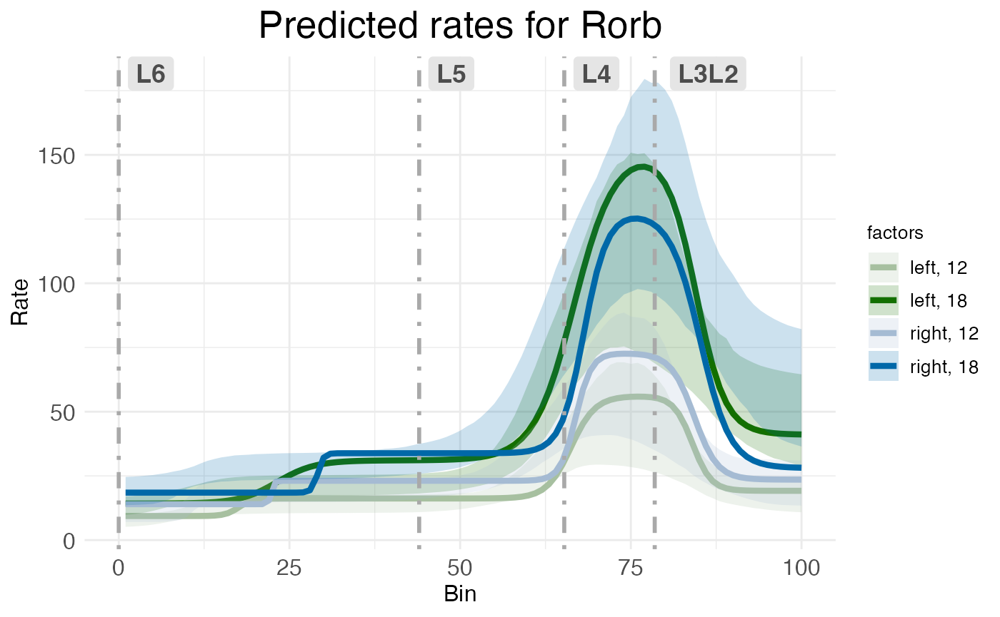
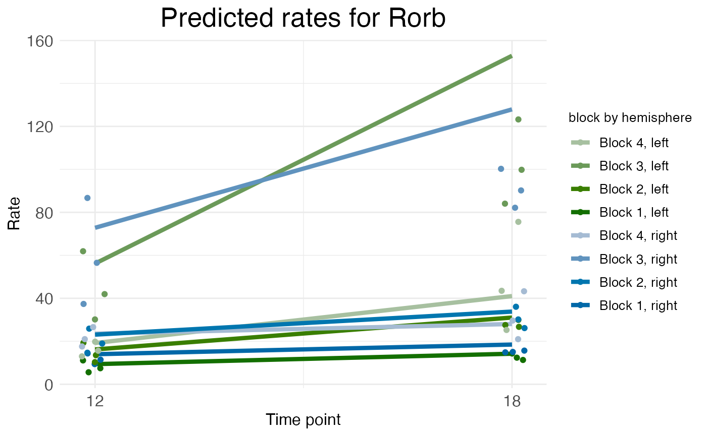

# RORB along the cortical laminar axis

## Introduction

The gene RORB plays a key role in the development of somatosensory
cortex in rodents. RORB expression leads axons from thalamic neurons to
innervate cortical layer 4 (L4). These thalamocortical projections
organize into discrete “barrel” formations, each barrel containing the
inputs from a single whisker.

While it’s sometimes assumed that there are no major differences in
barrel formations between the left and right hemispheres (i.e., no
*laterality*), over the years there have been several histological
studies suggesting age-dependent hemispheric differences. Given the
established role of RORB in barrel formation, one might want to test for
age-dependent laterality in RORB expression.

## Data preprocessing

This tutorial uses data collected from four male wild-type mice to test
for age effects on laterality in RORB expression. The mice are split
between two ages: postnatal day 12 (P12) and postnatal day 18 (P18). The
starting point was raw, non-normalized mRNA counts from the cells within
the primary somatosensory cortex (S1), both left and right hemispheres.

### Labeling the ROI

Before using any functions from wispack, S1 was identified in each
sample by manually fitting the entire slice to the
[CCFv3](https://doi.org/10.1016/j.cell.2020.04.007).


Left: Example horizontal slice as reconstructed from MERFISH data. Red
highlight indicates the right primary somatosensory cortex. Right: The
right somatosensory cortex, with RORB molecules in red and laminar and
columnar axes labeled.

### Coordinate transform

As wisp can only model one dimension of spatial variation (at least, as
of v2.1), this axis must be identified and the RORB molecule coordinates
must be transformed into it. As the primary concern is with how RORB is
distributed across cortical layers, the laminar axis is the obvious
candidate. Coordinate transformation into an axis of interest must be
done outside of wispack. For this case, a custom coordinate
transformation, described in this
[preprint](https://doi.org/10.1101/2025.06.11.659209) (and available as
code via the wispack function cortical_coordinate_transform\<\>), was
written.


Visualization of coordinate transform steps from initial CCFv3
registration to laminar and columnar axes.

Note that the laminar axis is encoded as *y*, with 0 being the bottom of
L6b, 100 the top of L2/3. The columnar axis is encoded as *x*, with 0
being the most posterior point, 100 the most anterior point. L1 was
removed from the analysis, as it contains very few cells.

## Model setup

Wispack contains a csv file with the results of this coordinate
transformation applied to the raw data. Let’s set up a wisp model for
it.

### Data format

To start, load this data and print its first few rows:

``` r
countdata <- read.csv(
  system.file(
      "extdata", 
      "S1_laminar_countdata_demo.csv", 
      package = "wispack"
    )
  )

print(head(countdata))
```

``` scroll-output
##   count bin context   gene mouse hemisphere age
## 1     0 100  cortex Bcl11b     1       left  12
## 2     0  99  cortex Bcl11b     1       left  12
## 3     0  93  cortex Bcl11b     1       left  12
## 4     0  98  cortex Bcl11b     1       left  12
## 5     0  94  cortex Bcl11b     1       left  12
## 6     0  94  cortex Bcl11b     1       left  12
```

As can be seen, the imported data has the columns: count, bin, context,
gene, mouse, hemisphere, and age. Although the focus is on RORB, these
first few rows show that there are other genes in the data as well. How
many?

``` r
num_genes <- length(unique(countdata$gene))
cat("Number of genes:", num_genes, "\n")
```

``` scroll-output
## Number of genes: 6
```

Which genes?

``` r
cat("Gene names:", paste0(unique(countdata$gene), collapse = ", "))
```

``` scroll-output
## Gene names: Bcl11b, Fezf2, Satb2, Nxph3, Cux2, Rorb
```

Just as RORB is known to be localized to L4, the other genes are also
known to be localized to specific layers.

| Abbreviation  | Name                                       | Layer |
|:--------------|:-------------------------------------------|:------|
| BCL11B, CTIP2 | B-cell CLL/lymphoma 11b                    | 5/6   |
| FEZF2         | FEZ Family Zinc Finger 2                   | 5     |
| SATB2         | SATB Homeobox 2                            | 2/3   |
| NXPH3         | Neurexophilin 3                            | 6     |
| CUX2          | Cut like homeobox 2                        | 2/3/4 |
| RORB          | Retinoic acid-related orphan receptor beta | 4     |

So, the modeling results can be compared to known biology in all cases.
To facilitate this comparison, we can load the layer boundaries gotten
from the CCFv3 registration for use later. Note that these boundaries
are only used for this comparison, not to fit the model.

``` r
layer.boundary.bins <- read.csv(
  system.file(
      "extdata", 
      "S1_layer_boundary_bins.csv", 
      package = "wispack"
    )
  )
```

Each row in the data frame represents a cell from the left or right S1
region of one of the four mice. Each cell is represented in multiple
rows, one row per gene. Hence, the number of cells can be found by
dividing the number of rows by the number of genes.

``` r
num_cells <- nrow(countdata)/num_genes
cat("Number of cells:", num_cells, "\n")
```

``` scroll-output
## Number of cells: 54116
```

The count column thus gives the number of molecules of the RNA species
listed in the gene column, found in the cell represented by a given row.
Each cell, of course, comes from a specific mouse and brain hemisphere,
information given in the correspondingly named columns. The age column
gives the age of the mouse.

This leaves two columns to explain: context and bin. “Context” refers to
the biological context of the cell. In this case, all the cells are
simply labeled as “cortex”, thus making context a dummy variable. An
obvious use of the context variable would be to label the type of each
cell, e.g., glutamatergic vs. GABAergic neurons (see [Modeling
celltypes](https://michaelbarkasi.github.io/wispack/articles/tutorial_multicontext.md)).

The bin column gives the position of the cell along the axis of interest
(in this case, the laminar axis), in units of “bins”. Any position
coordinates could be used, including ones with non-integer values such
as microns. However, we have binned the position coordinates into 100
(roughly) equal-width bins to allow for bootstrapping (see [Customizing
statistical
analyses](https://michaelbarkasi.github.io/wispack/articles/tutorial_stats.md)).

## Effects structure

The goal is to test for interacting effects of age and laterality, with
mouse as a random-effect grouping factor. A linear model from the
well-known R package lme4 with the appropriate effects structure could
be gotten with the following call:

``` r
model <- lme4::lmer(
    count ~ age * hemisphere + (age * hemisphere|mouse), 
    data = countdata
  )
```

The problem with this linear model is that it makes no use of the bin
variable and thus loses all spatial information. A second problem is
that the model makes no use of the gene variable, although this problem
could be addressed by subsetting countdata to just a single gene of
interest. (Gene should not be treated as another fixed-effect factor
along with age and hemisphere, as there’s no reason to think age or
hemisphere have any effect independent of RNA species.) Nevertheless,
this model shows the basic effects structure wisp aims to capture.

A wisp captures this effects structure without discarding spatial
information, and while segregating counts by gene. Unlike a
mixed-effects linear model from the lme4 package, there is no model
formula to specify in wispack. Instead of using a syntactic description
(a formula), the effects structure in wispack is set semantically, i.e.,
by specifying which variables in the data frame correspond to which
roles in the model. The roles are:

1.  count: either a non-negative integer giving the number of RNA
    molecules of a given species in a given cell, or a non-negative real
    number giving normalized or log-transformed expression values.
2.  bin: the position of the cell along the axis of interest (whether or
    not the actual unit is “bin”).
3.  context: the biological context of the cell, typically a cell-type
    label.
4.  species: the RNA species (gene) being modeled.
5.  ran: the random-effect grouping factor, typically a sample or animal
    ID.
6.  timeseries: a fixed-effects factor to treat as a time series (if
    any), typically developmental or experimental time points.
7.  fixedeffects: a vector of fixed-effect factors, typically biological
    or experimental conditions.

Note that wisps are intended to model [Poisson
processes](https://michaelbarkasi.github.io/wispack/articles/tutorial_Poisson.md),
and so both the underlying optimization and [statistical parameter
estimation](https://michaelbarkasi.github.io/wispack/articles/tutorial_stats.md)
assume the count variable is a Poisson-distributed integer. However, the
code will accept and attempt to fit normalized and log-transformed
real-valued expression data as well, albeit with care needed in
interpreting the results.

The timeseries variable is optional. If none is provided, wisp will not
treat any fixed effects as time series. However, if a variable is
flagged as a time series, wisp will model it as a [discrete additive
effect](https://michaelbarkasi.github.io/wispack/articles/tutorial_timeseries.md).

In the data frame loaded above, the count, bin, and context columns
match the names of the roles to which they correspond. Wispack will find
those columns automatically. However, the species and ran roles have
different names in the data frame, and thus wispack needs to know which
data columns carry these variables. While wispack has no default names
for fixed effects, if no fixed effects are specified, all columns not
identified as one of the other roles will be treated as fixed effects.
Unless flagged as a time series, all fixed effects must have at most two
levels.

``` r
# Specify variables for wisp
data.variables <- list(
    species = "gene",
    ran = "mouse",
    timeseries = "age"
  )
```

As the data contains only two ages, it’s not technically necessary to
flag the age column as a time series. However, doing so triggers the
wisp function to make plots showing rate changes over time.

It would be redundant, but all roles would be specified as follows:

``` r
# Specify all variables for wisp
data.variables <- list(
    count = "count",
    bin = "bin", 
    context = "context", 
    species = "gene",
    ran = "mouse",
    timeseries = "age",
    fixedeffects = c("hemisphere", "age")
  )
```

### Model parameters

In wisp, a semantic specification of the variable roles suffices
because, with respect to those roles, all wisp models have the same
effects structure. This effects structure is defined over a
parameterization of the spatial distribution of RNA molecules. Wisp
models describe the distribution of RNA molecules along a
one-dimensional axis (the bin variable) as a log-transformed rate that
is constant across space, except for transition points where the rate
changes with a slope given by a logistic function. Within this [spatial
parameterization](https://michaelbarkasi.github.io/wispack/articles/tutorial_Poisson.md),
fixed effects from fixed-effect factors or their interactions are simple
linear effects, being multiplicative on rates and additive on transition
points and slopes. The multiplicative effects on rate are log-fold
changes, and so mesh nicely with standard practice. (Note that while all
interactions of fixed-effect factors are included by default,
interactions can be removed from the model using the trtKO argument in
model.settings.)


(Top) The logistic function, used to model a single change point in gene
expression. (Bottom) The wisp poly-sigmoid function, built from three
logistic components, representing three change points.

Random effects from the random-effect grouping factor are a [nonlinear
warping](https://michaelbarkasi.github.io/wispack/articles/tutorial_warping.md)
of the three spatial parameters.


(Top) The warping function used to represent random effects, e.g.,
variation due to differences between individual animals or due to
measurement noise. (Bottom) The wisp poly-sigmoid with warping function
applied.

## Fitting a wisp

Thus, the goal of fitting a wisp model to spatial transcriptomics data
is to estimate, for each gene:

1.  The number of transition points.
2.  The spatial parameters (expression rates, transition-point
    locations, and transition-point slopes) in the reference condition.
3.  The linear effects of fixed-effect factors and their interactions on
    the spatial parameters.
4.  The nonlinear warping effects of the random-effect grouping factor
    on spatial parameters.

Although wispack includes many settings for fine-tuning the modeling
process, fitting a wisp model and estimating its parameters is done with
a single R function, wisp. This function only needs one argument, the
data to be modeled (count.data). If, as above, the variable roles are
filled by data columns with with different names, then the variables
must be provided via another argument (variables).

The following code fits a wisp model to the data loaded above, with
verbose output. Plots are suppressed, as by default many are generated
in the fitting process. As noted above, layer boundaries are provided to
the model, but are used only in making plots so that the model fit and
parameter estimates can be compared to the laminar boundaries estimated
by the CCFv3 registration.

``` r
# Set random seed for reproducibility
set.seed(123)
# Load wispack
library(wispack, quietly = TRUE)
# Fit model
model <- wisp(
    count.data = countdata,
    variables = data.variables,
    plot.settings = list(
        print.plots = FALSE, 
        dim.bounds = colMeans(layer.boundary.bins)
      ),
    verbose = TRUE
  )
```

``` scroll-output
## 
## 
## Parsing data and settings for wisp model
## ----------------------------------------
## 
## Model settings:
##  buffer_factor: 0.05
##  ctol: 1e-06
##  max_penalty_at_distance_factor: 0.01
##  LROcutoff: 2
##  LROwindow_factor: 1.25
##  rise_threshold_factor: 0.8
##  max_evals: 1000
##  rng_seed: 42
##  warp_precision: 1e-07
##  round_none: TRUE
##  trtKO: none
##  inf_warp: 450359962.73705
## 
## Plot settings:
##  print.plots: FALSE
##  dim.bounds: 78.5, 65.25, 44, 0
##  log.scale: FALSE
##  splitting_factor: 
##  CI_style: TRUE
##  label_size: 5.5
##  title_size: 20
##  axis_size: 12
##  legend_size: 10
##  count_size: 1.5
##  count_jitter: 0.5
##  count.alpha.ran: 0.25
##  count.alpha.none: 0.25
##  pred.alpha.ran: 0.9
##  pred.alpha.none: 1
## 
## MCMC settings:
##  MCMC.burnin: 100
##  MCMC.steps: 1000
##  MCMC.step.size: 0.5
##  MCMC.prior: 1
##  MCMC.neighbor.filter: 1
## 
## Variable dictionary:
##  count: count
##  bin: bin
##  context: context
##  species: gene
##  ran: mouse
##  timeseries: age
##  fixedeffects: hemisphere, age
## 
## Parsed data (head only):
## ------------------------------
##   count bin context species ran hemisphere timeseries
## 1     0 100  cortex  Bcl11b   1       left         12
## 2     0  99  cortex  Bcl11b   1       left         12
## 3     0  93  cortex  Bcl11b   1       left         12
## 4     0  98  cortex  Bcl11b   1       left         12
## 5     0  94  cortex  Bcl11b   1       left         12
## 6     0  94  cortex  Bcl11b   1       left         12
## ----
## 
## Initializing Cpp (wspc) model
## ----------------------------------------
## 
## Infinity handling:
## machine epsilon: (eps_): 2.22045e-16
## pseudo-infinity (inf_): 1e+100
## warp_precision: 1e-07
## implied pseudo-infinity for unbounded warp (inf_warp): 4.5036e+08
## 
## Extracting variables and data information:
## Found max bin: 100.000000
## Fixed effects:
## "hemisphere" "timeseries"
## Ref levels:
## "left" "12"
## Time series detected:
## "12" "18"
## Created treatment levels:
## "ref" "right" "18" "right18"
## Constructed weight_row matrix
## Context grouping levels:
## "cortex"
## Species grouping levels:
## "Bcl11b" "Cux2" "Fezf2" "Nxph3" "Rorb" "Satb2"
## Random-effect grouping levels:
## "none" "1" "2" "3" "4"
## Total rows in summed count data table: 12000
## Number of rows with unique model components: 120
## 
## Creating summed-count data columns and weight matrix:
## Random level 0, 1/5 complete
## Random level 1, 2/5 complete
## Random level 2, 3/5 complete
## Random level 3, 4/5 complete
## Random level 4, 5/5 complete
## 
## Making extrapolation pool:
## row: 480/2400
## row: 960/2400
## row: 1440/2400
## row: 1920/2400
## row: 2400/2400
## 
## Making initial parameter estimates:
## Extrapolated 'none' rows
## Took log of observed counts
## Estimated gamma dispersion of raw counts
## Estimated change points
## Found average log counts for each context-species combination
## Estimated initial parameters for fixed-effect treatments
## Built initial beta (ref and fixed-effects) matrices
## Initialized random-effect warping factors
## Made and mapped parameter vector
## Number of parameters: 300
## Constructed grouping variable IDs
## Size of boundary vector: 1260
## 
## Estimating model parameters
## ----------------------------------------
## 
## Running MCMC stimulations
## Checking feasibility of provided parameters
## ... no tpoints below buffer
## ... no NAN rates predicted
## ... no negative rates predicted
## Provided parameters are feasible
## Initial boundary distance (want > 0): 0.247647
## Performing initial fit of full data
## Penalized neg_loglik: 11975.6
## step: 1/1100
## step: 110/1100
## step: 220/1100
## step: 330/1100
## step: 440/1100
## step: 550/1100
## step: 660/1100
## step: 770/1100
## step: 880/1100
## step: 990/1100
## All complete!
## Acceptance rate (aim for 0.2-0.3): 0.283432
## 
## MCMC simulation complete... 
## MCMC run time (total), minutes: 0.806
## MCMC run time (per retained step), seconds: 0.044
## MCMC run time (per step), seconds: 0.044
## 
## Setting full-data fit as parameters... 
## Checking feasibility of provided parameters
## ... no tpoints below buffer
## ... no NAN rates predicted
## ... no negative rates predicted
## Provided parameters are feasible
## Initial boundary distance (want > 0): 0.164251
## 
## Running stats on simulation results
## ----------------------------------------
## 
## Grabbing sample results... 
## Grabbing parameter values... 
## Computing 95% confidence intervals... 
## Estimating p-values from resampled parameters... 
## 
## Recommended resample size for alpha = 0.05, 171 tests
## with bootstrapping/MCMC: 3420
## Actual resample size: 1001
## 
## Stat summary (head only):
## ------------------------------
##                                  parameter      estimate       CI.low      CI.high     p.value p.value.adj    alpha.adj significance
## 1       baseline_cortex_Rt_Bcl11b_Tns/Blk1  3.3874762662 3.2423579199 3.6060658268          NA          NA           NA             
## 2   beta_Rt_cortex_Bcl11b_right_X_Tns/Blk1 -0.0002723492 0.0002701605 0.0009564635 0.000999001  0.04495504 0.0011111111            *
## 3      beta_Rt_cortex_Bcl11b_18_X_Tns/Blk1  0.6059294086 0.4971755126 0.6552261694 0.000000000  0.00000000 0.0002923977          ***
## 4 beta_Rt_cortex_Bcl11b_right18_X_Tns/Blk1  0.0476934492 0.0324878078 0.0563049808 0.000000000  0.00000000 0.0002941176          ***
## 5       baseline_cortex_Rt_Bcl11b_Tns/Blk2  2.2516514786 1.9117544868 2.6135187197          NA          NA           NA             
## 6   beta_Rt_cortex_Bcl11b_right_X_Tns/Blk2  0.1004792278 0.0504651545 0.0951689705 0.000000000  0.00000000 0.0002958580          ***
## ----
## 
## Computing 95% CI for predicated values by bin
## ----------------------------------------
## 
## Grabbing sample results... 
## Computing predicted values for each sampled parameter set... 
## Computing 95% CIs... 
## 
## Analyzing residuals
## ----------------------------------------
## 
## Computing residuals... 
## Making masks... 
## Making plots and saving stats... 
## 
## Log-residual summary by grouping variables (head only):
## ------------------------------
##          group      mean        sd   variance
## 1          all 0.2387532 0.3908161 0.15273719
## 2 ran_lvl_none 0.2323705 0.3161788 0.09996903
## 3    ran_lvl_1 0.2381996 0.3967808 0.15743503
## 4    ran_lvl_2 0.2130804 0.3931356 0.15455562
## 5    ran_lvl_3 0.2747967 0.4583713 0.21010427
## 6    ran_lvl_4 0.2417013 0.4391963 0.19289335
## ----
## 
## Making MCMC walks plots... 
## Making effect parameter distribution plots... 
## Making rate-count plots... 
## Making time series plots... 
## Making parameter plots... 
## Making parameter plots... 
## Making parameter plots... 
## Making parameter plots... 
## Making parameter plots... 
## Making parameter plots...
```

## Results

As can be seen in the print out above, wisp models typically have
hundreds (or even thousands) of parameters, which means that they
usually lack the kind of brief-yet-informative summary familiar from R
packages for linear models.

### Extracting results

The most flat-footed way to extract desired results is to hunt through
the output. The output of wisp is a list with the following named
components:

``` r
for (n in names(model)) cat(n, ": ", paste0(class(model[[n]]), collapse = ", "), "\n", sep = "")
```

``` scroll-output
## model.component.list: character
## count.data.summed: data.frame
## fitted.parameters: numeric
## gamma.dispersion: matrix, array
## param.names: character
## fix: list
## treatment: list
## weight.matrix: matrix, array
## grouping.variables: list
## param.idx0: list
## token.pool: list
## settings: list
## Cpp_model: Rcpp_wspc
## sample.params: matrix, array
## sample.params.MCMC: matrix, array
## diagnostics.MCMC: data.frame
## variables: list
## plot.settings: list
## stats: list
## plots: list
```

Within the stats object (another list itself), the following is found:

``` r
for (n in names(model$stats)) cat(n, ": ", paste0(class(model$stats[[n]]), collapse = ", "), "\n", sep = "")
```

``` scroll-output
## parameters: data.frame
## tps: data.frame
## residuals: data.frame
## residuals.log: data.frame
## variance: data.frame
```

The parameter object stats\$parameter is a data frame the rows of which
are the model parameters, the columns of which are various statistical
results of interest, e.g., confidence intervals and p-values:

``` r
print(head(model$stats$parameter))
```

``` scroll-output
##                                  parameter      estimate       CI.low      CI.high     p.value p.value.adj    alpha.adj significance
## 1       baseline_cortex_Rt_Bcl11b_Tns/Blk1  3.3874762662 3.2423579199 3.6060658268          NA          NA           NA             
## 2   beta_Rt_cortex_Bcl11b_right_X_Tns/Blk1 -0.0002723492 0.0002701605 0.0009564635 0.000999001  0.04495504 0.0011111111            *
## 3      beta_Rt_cortex_Bcl11b_18_X_Tns/Blk1  0.6059294086 0.4971755126 0.6552261694 0.000000000  0.00000000 0.0002923977          ***
## 4 beta_Rt_cortex_Bcl11b_right18_X_Tns/Blk1  0.0476934492 0.0324878078 0.0563049808 0.000000000  0.00000000 0.0002941176          ***
## 5       baseline_cortex_Rt_Bcl11b_Tns/Blk2  2.2516514786 1.9117544868 2.6135187197          NA          NA           NA             
## 6   beta_Rt_cortex_Bcl11b_right_X_Tns/Blk2  0.1004792278 0.0504651545 0.0951689705 0.000000000  0.00000000 0.0002958580          ***
```

All fixed-effects of hemisphere (i.e., laterality) on the expression
rate of RORB can be extracted by masking with the treatment variable
name for the factor hemisphere (which is “right”, with “left” as the
reference level), the name of the gene of interest (“RORB”), and the
type of parameter (fixed effect on rate, which is “beta” on “Rt”):

``` r
mask <- grepl("Rorb", model$stats$parameters$parameter) &    # just this gene
  grepl("right", model$stats$parameters$parameter) &         # just the effect of hemisphere
  grepl("beta", model$stats$parameters$parameter) &          # just the fixed effects of the above factor
  grepl("Rt", model$stats$parameters$parameter)              # just the effects on rate
print(model$stats$parameter[mask, ])
```

``` scroll-output
##                                 parameter   estimate        CI.low     CI.high     p.value p.value.adj    alpha.adj significance
## 66   beta_Rt_cortex_Rorb_right_X_Tns/Blk1  0.3675538  0.2549638213 0.405098281 0.000000000  0.00000000 0.0003472222          ***
## 68 beta_Rt_cortex_Rorb_right18_X_Tns/Blk1 -0.1202368  0.0226205964 0.057872150 0.000999001  0.02897103 0.0017241379            *
## 70   beta_Rt_cortex_Rorb_right_X_Tns/Blk2  0.3366749  0.1872820676 0.342245184 0.000000000  0.00000000 0.0003521127          ***
## 72 beta_Rt_cortex_Rorb_right18_X_Tns/Blk2 -0.2536468 -0.0264334049 0.002955359 0.000999001  0.02797203 0.0017857143            *
## 74   beta_Rt_cortex_Rorb_right_X_Tns/Blk3  0.2557962  0.2014214573 0.367680590 0.000000000  0.00000000 0.0003571429          ***
## 76 beta_Rt_cortex_Rorb_right18_X_Tns/Blk3 -0.4326966 -0.0001465364 0.050469691 0.000999001  0.02697303 0.0018518519            *
## 78   beta_Rt_cortex_Rorb_right_X_Tns/Blk4  0.1952882  0.1495461129 0.327293014 0.000000000  0.00000000 0.0003623188          ***
## 80 beta_Rt_cortex_Rorb_right18_X_Tns/Blk4 -0.5650512  0.0045191349 0.041503420 0.000999001  0.02597403 0.0019230769            *
```

Notice that all of the parameter names end in “Tns/Blk1”, “Tns/Blk2”,
“Tns/Blk3”, or “Tns/Blk4”. This is because the model fit found three
transition points, thus dividing the laminar axis into four blocks of
roughly constant expression rate. The estimated effect of hemisphere on
rate is given for each of the four blocks. Each block lists two
estimates, one for the effect at the reference age (P12), and one for
the interaction of hemisphere with age (the effect of laterality at
P18). As can be seen, RORB expression is up-regulated in the right
hemisphere (compared to left) across all blocks, but the interaction of
hemisphere with age decreases that up-regulation, i.e., the laterality
effect is less pronounced at P18 than at P12.

### Plotting results

It’s difficult to get a handle on the results as pure effect numbers. A
better way to understand the results is through visualization. Wispack
provides a number of functions for [making intuitive spatial
plots](https://michaelbarkasi.github.io/wispack/articles/tutorial_wispplots.md).
Indeed; a strength of wisp models is their use of concrete spatial
parameters.

The standard way to visualize a fitted wisp model, for an individual
gene, is to plot gene expression level (e.g., total count per bin) on
the y-axis and spatial position (bin) on the x-axis, with effects
conditions represented by different colors. The wisp function
automatically generates these plots and stores them in plots\$ratecount.
Here, for example, is the plot for RORB:

``` r
print(model$plots$ratecount$plot_pred_context_cortex_fixEff_Rorb)
```



The shading shows 95% confidence intervals for the rate estimates. Note
that while the p-values and confidence intervals for the model
parameters are corrected for multiple-comparisons (by default, using
Holm-Bonferroni), the confidence intervals shown in these plots are not
corrected for multiple comparisons. This is because the confidence
intervals on this plot are for predicted rate, not for model parameters.
Model parameter estimates can be adjusted for multiple comparisons
because they each constitute a well-defined single hypothesis test.
However, predicted rates at different spatial positions are not
independent of one another and so do not constitute distinct hypothesis
tests; hence, there’s no well-defined way to correct for multiple
comparisons.

Regarding what this particular plot shows for RORB, as expected there is
a large peak in RORB expression in L4. This peak is present for both
left (green) and right (blue) hemispheres. However, the plot suggests
that there is laterality at both ages, albeit with a swap in
up-regulation. Specifically, at P12 the plot shows up-regulation in the
right hemisphere (light blue) compared to the left (light green), while
at P18 there is up-regulation in the left hemisphere (dark green)
compared to the right (dark blue).

This swap is easy to see on a time-series plot. When a time series is
provided (via the variables argument), the wisp function automatically
generates time-series plots for each gene.

``` r
print(model$plots$timeseries$plot_pred_context_cortex_timeseries_Rorb)
```



The time-series plot puts the time points on the x-axis, with rate (as
before) on the y-axis. However, the rate value is not the expected value
at a given bin, but rather the rate parameter itself. As each block has
a different rate parameter, the time-series plot shows the rate for each
block. If the data also includes a single additional covariate (fixed
effect) besides the time series, that variable is used as a splitting
factor to generate separate lines for each level of that variable. Here,
the splitting factor is hemisphere, and so we see separate lines for
left (green) and right (blue) hemispheres. Notice how the rate counts
are relatively low and bunched at the bottom for all but one block. This
exception is block 3, the block overlapping L4. Here we see the swap
clearly: right (blue) higher at P12, left (green) higher at P18.

Along with the lines representing block rate, the (jittered) dots at
each age represent the mean observed count per bin within that block.
Notice that sometimes these dots will be lower than the line, as is the
case here at P18 in block 3. This is because the predicted rate is not
just the rate parameter for the block, but is also a function of the
slopes and transition points. The rate parameter is only a good
approximation of the expected rate far from transition points and
assuming relatively steep slopes. When slopes are shallow and most bins
in a block are near a transition point, we can expect the mean observed
(and predicted) rate per bin within a block to be appreciably lower than
the block rate parameter. This is not a poor fit of the model, but a
limit of the visualization.
