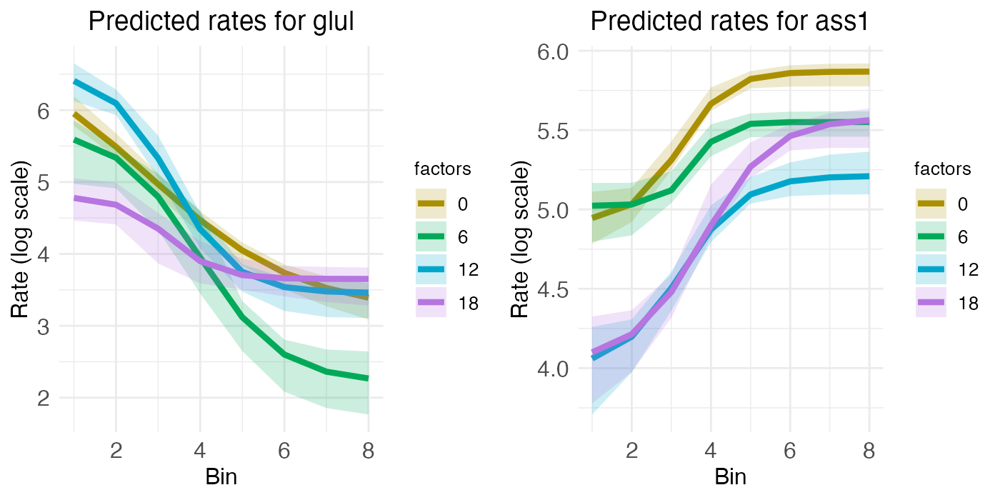
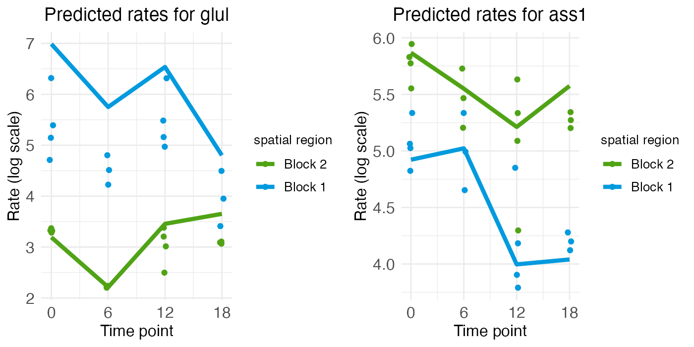
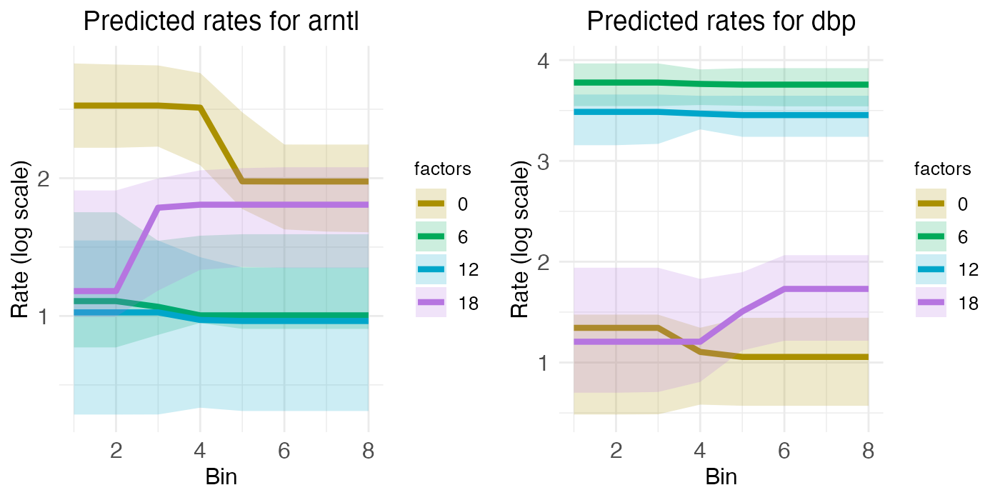
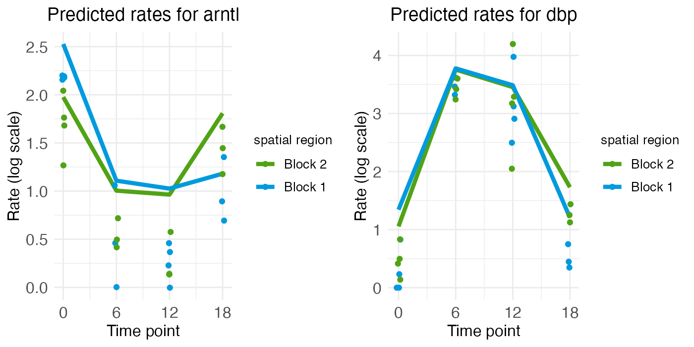
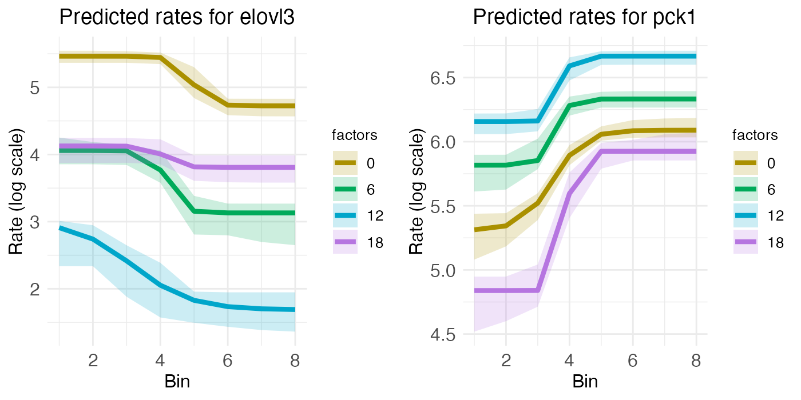
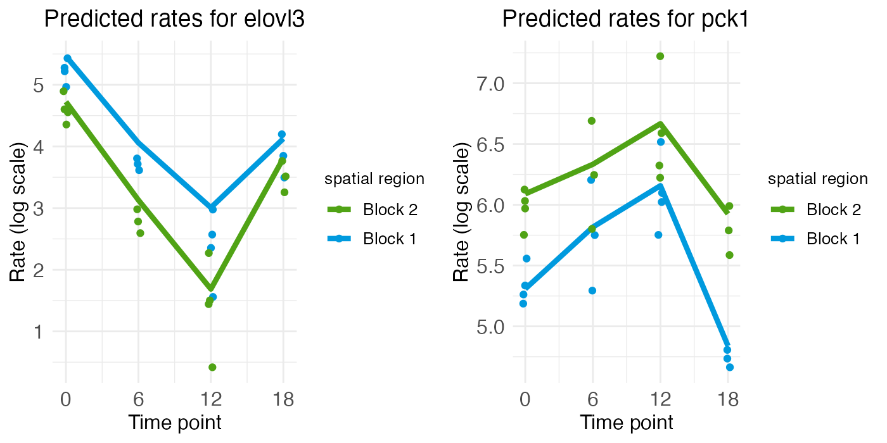

# Radial zonation in liver lobules

## Introduction

Mammalian liver tissue is organized into concentric rings of cells
called *lobules*. These lobules are filled with capillaries which carry
blood to an interior central vein. The rings, or *zones*, of the lobules
are functionally distinct. As [Droin et
al. (2021)](https://doi.org/10.1038/s42255-020-00323-1) explain, this
functional zonation “is accompanied by gradients of gene expression
along the portal-central axis, with some genes expressed more strongly
near the central vein, and vice versa for portally expressed genes”
(p. 43). In addition, “liver physiology is also highly temporally
dynamic”, with rhythmic cycles driven by “the complex interplay among
the endogenous circadian liver oscillator, rhythmic systemic signals and
feeding-fasting cycles” (*ibid*).


Liver-lobule organization. Red annotation added. Original figure from
the Human Reference Atlas. (12/18/2024). Liver Lobule. [NIAID NIH
BIOART](https://bioart.niaid.nih.gov/bioart/565) (CC BY 4.0).

Thus, the zonated expression of genes in the liver is a good candidate
for functionally relevant spatial gene variation, and hence rhythmic
oscillations in gene expression which potentially interact with this
spatial variation are good candidates for functional spatial effects
(FSE). To investigate this question, albeit not using the jargon “FSE”,
[Droin et al.](https://doi.org/10.1038/s42255-020-00323-1) used a linear
mixed-effects model with second-degree polynomials to represent spatial
variation and harmonic terms to represent temporal rhythm. Specifically,
after normalizing transcript counts y, they log-transformed those
counts: y \mapsto \log_2(y + \Delta) - B such that “the offset \Delta =
1\times 10^{-4} buffers variability in genes with low expression, while
the shift B = -\log_2(11\times 10^{-3}) changes the scale so that y=0
corresponds to about 10 mRNA copies per cell” (p. 55). They then modeled
the transformed counts y\_{x,t,i} for spatial position x, time t, and
individual mouse i as: y\_{x,t,i} = \mu_i + \mu(x) +
a(x)\mathrm{cos}(\omega t) + b(x)\mathrm{sin}(\omega t) +
\epsilon\_{x,t,i} with: \begin{aligned} \mu(x) &= \mu_0 + \mu_1P_1(x) +
\mu_2P_2(x) \\ a(x) &= a_0 + a_1P_1(x) + a_2P_2(x) \\ b(x) &= b_0 +
b_1P_1(x) + b_2P_2(x) \end{aligned}

for P_1(x) and P_2(x) the first- and second-degree Legendre polynomials.
Statistical testing showing significant coefficients \mu_1 or \mu_2
(terms of pure spatial variation) and a_0 or b_0 (terms of pure temporal
variation) would indicate *additive* spatial zonation and temporal
rhythm, while significant coefficients a_1, a_2, b_1, or b_2 (terms for
position-dependent temporal variation) would indicate *interacting*
spatial and temporal effects. These model coefficients are, of course,
log2 fold changes (L2FC).

Whether or not interaction is required for a FSE, or if instead the
combination of additive zonation and temporal rhythm suffices, is a
conceptual question we can set aside here. What’s important is that this
model allowed [Droin et al.](https://doi.org/10.1038/s42255-020-00323-1)
to test for FSEs by first:

- testing for significant model coefficients, then
- searching for KEGG pathways enriched with genes having these
  significant model coefficients.

They found enriched KEGG pathways for many of their additive genes.
Depending on one’s perspective, this finding is either evidence that
temporal rhythm has a FSE, or (if interaction is necessary) evidence
that temporal rhythm has no FSE. Either way, their model afforded a
principled test for FSEs.

This same analysis can be run with a wisp. Wisp models are, of course,
built explicitly for modeling effects on one-dimensional spatial
variation, including temporal effects from a time series. While wisp
models represent time as a [discrete additive
effect](https://michaelbarkasi.github.io/wispack/articles/tutorial_timeseries.md)
rather than as a harmonic oscillation (and thus lack a period term
\omega which could be used to test for period length), known or expected
oscillations can be represented by indexing times to some repeating
point in the series (“zeitgeber time”). In this case, effects of
circadian rhythms or feed-fast cycles can be modeled by indexing times
to the start of each day. (Indeed; even Droin et al. exploited this fact
by fixing \omega=2\pi/24\mathrm{ hr}, instead of estimating \omega from
the data.)

## Processing the data

Droin et al. have made some of their data available in an easily
accessible form in a [GitHub
repo](https://github.com/naef-lab/Circadian-zonation/tree/master/Datasets/Profiles).
The data consists of ten MatLab (.mat) files, one for each mouse used in
the study. Transcriptome sequencing was performed on each mouse at one
of four zeitgeber time points (ZT): 0 hr, 6 hr, 12 hr, and 18 hr. The ZT
for each sample is included in the file name. This particular data set
was actually generated via bulk sequencing, not with spatial
transcriptomics. However, using previously validated marker genes, Droin
et al. assigned to each cell a probability of zone membership, for each
zone along a discrete one-dimensional axis of eight liver portal-central
zones (the Pmat matrix). These probabilities were then multiplied by
normalized count values for each gene in each cell (the mat.norm matrix)
and log-transformed using the transform shown above.

It would not be a good idea to reconstruct this data and give it to the
wisp function directly. Wisp is intended to model raw counts from
[Poisson
processes](https://michaelbarkasi.github.io/wispack/articles/tutorial_Poisson.md),
meaning positive integers without weighting or normalization. The
concern raised by weighting and normalization is that wisp parameters
are fit by maximizing the likelihood of the data, under the assumption
that the data comes from a gamma-distributed Poisson process. Data may
no longer fit this distribution after it has been weighted or
normalized.

Hence, instead of reconstructing the Droin et al. data directly, we will
use it to simulate raw counts suitable for wisp modeling. For each cell
with normalized pseudo-count y and probabilities p_1,\ldots,p_8 of
membership in zones 1 to 8, counts will be drawn from a Poisson
distribution, for i=1,\ldots,8: y_i\sim \mathrm{Pois}(y\times
1\mathrm{e}3) The multiplication by 1\mathrm{e}3 is to denormalize the
pseudo-count to a realistic expression rate. Next, draws are made from a
binomial distribution b_i\sim \mathrm{Binom}(1, p_i) Finally, for each
zone i, a cell is added to the data with count y_ib_i.

For the actual execution, we first load the MatLab files:

``` r

library(R.matlab)
files <- list.files(
    path       = "Droin_data", 
    pattern    = "\\.mat$", 
    full.names = TRUE
  )
Droin_data        <- lapply(files, readMat)
names(Droin_data) <- basename(files)
```

Droin et al. bulk-sequenced thousands of genes. For this demonstration,
we will model just a few with known zonation and temporal rhythm:

| Abbreviation | Name | Zonation | Rhythm |
|----|----|----|----|
| GLUL | Glutamine synthethase | Central |  |
| ASS1 | Urea cycle gene argininosuccinate synthetase | Portal |  |
| ARNTL, BMAL1 | Basic helix-loop-helix ARNT like 1 |  | Circadian |
| DBP | PAR bZip transcription factor |  | Circadian |
| ELOVL3 | ELOVL fatty acid elongase 3 | Central | Circadian |
| PCK1 | Phosphoenolpyruvate carboxykinase 1 | Portal | Circadian |

We can subset the data as follows:

``` r

# List of genes to keep
genes_to_keep <- c("glul", "ass1", "arntl", "dbp", "elovl3", "pck1")

# For each loaded MatLab file, subset to the above genes
for (fn in basename(files)) {
    # Check that the desired genes are in the file
    gene_idx      <- which(unlist(Droin_data[[fn]][["all.genes"]]) %in% genes_to_keep)
    genes_to_keep <- unlist(Droin_data[[fn]][["all.genes"]])[gene_idx]
    # Subset file components to just these genes
    Droin_data[[fn]][["seq.data"]]    <- Droin_data[[fn]][["seq.data"]][gene_idx,]
    Droin_data[[fn]][["mat.norm"]]    <- Droin_data[[fn]][["mat.norm"]][gene_idx,]
    Droin_data[[fn]][["MeanGeneExp"]] <- Droin_data[[fn]][["MeanGeneExp"]][gene_idx,]
    Droin_data[[fn]][["SE"]]          <- Droin_data[[fn]][["SE"]][gene_idx,]
    Droin_data[[fn]][["q.vals"]]      <- Droin_data[[fn]][["q.vals"]][gene_idx,]
    # Rename data rows with gene names
    rownames(Droin_data[[fn]][["seq.data"]])    <- genes_to_keep
    rownames(Droin_data[[fn]][["mat.norm"]])    <- genes_to_keep
    rownames(Droin_data[[fn]][["MeanGeneExp"]]) <- genes_to_keep
    rownames(Droin_data[[fn]][["SE"]])          <- genes_to_keep
    names(Droin_data[[fn]][["q.vals"]])         <- genes_to_keep
    Droin_data[[fn]][["all.genes"]]             <- genes_to_keep
  }
```

Finally, we can build a data frame of simulated counts suitable for the
wisp function. As described in more detail in the tutorial on [modeling
the laminar cortical
axis](https://michaelbarkasi.github.io/wispack/articles/tutorial_corticallaminar.html#data-format),
wisp expects a data frame with the same structure used by well-known R
functions for linear modeling, such as
[lme4::lmer](https://cran.r-project.org/web/packages/lme4/index.html) or
[stats::lm](https://stat.ethz.ch/R-manual/R-devel/library/stats/html/lm.html).
Each row should be a cell, with columns for the count (count), spatial
coordinate (bin), RNA species (gene), random variable (mouse), and any
fixed-effects (in this case, ZT).

``` r

# Create count_data frame for use with wisp()
count_data <- data.frame()

# For each subsetted MatLab file ...
for (i in seq_along(Droin_data)) {
    
    # Grab gene list and data dimensions
    gene_list          <- rownames(Droin_data[[i]][["mat.norm"]])
    n_genes            <- length(gene_list)
    n_cells            <- ncol(Droin_data[[i]][["mat.norm"]])
    n_bins             <- ncol(Droin_data[[i]][["Pmat"]])
    # Grab row sums for renormalization of probability to 1
    Pmat_row_sums      <- rowSums(Droin_data[[i]][["Pmat"]])
    # De-normalize transcript counts to realistic rates
    denormalized_rates <- Droin_data[[i]][["mat.norm"]] * 1e3
    
    # ... for each gene
    for (g in c(1:n_genes)) {
      # ... for each zone (i.e., spatial coordinate, or bin)
      for (b in c(1:n_bins)) {
        
        # Simulate count of gene g in each cell, for mouse i
        sim_counts  <- rpois(n_cells, denormalized_rates[g,])
        # Get probability of bin membership for each cell, for mouse i 
        mem_prob    <- Droin_data[[i]][["Pmat"]][,b] / Pmat_row_sums
        # Randomly select whether each cell is in this bin
        cell_weight <- rbinom(n = n_cells, size = 1, prob = mem_prob)
        
        count_data <- rbind(
          count_data,
          data.frame(
            # add mouse number
            mouse = rep(i, n_cells),
            # extract ZT from file name and add
            ZT    = rep(as.numeric(gsub("\\D", "", names(Droin_data)[i])), n_cells),
            # add bin number
            bin   = rep(b, n_cells),
            # add gene name
            gene  = rep(gene_list[g], n_cells),
            # compute and log-transform the zone-weighted normalized gene counts
            count = sim_counts * cell_weight
          )
        )
        
        # Note: to reconstruct the Droin et al. data, use: 
        #       count = transform_data(Droin_data[[i]][["mat.norm"]][g,] * Droin_data[[i]][["Pmat"]][,b])
        #   with the function: 
        #       transform_data <- function(x) {
        #           log2(x + 1e-4) - log2(11e-5)
        #         }
        
      }
    }
    
  }
```

## Fitting a wisp

For the purpose of this tutorial, the above preprocessing code is not
run. Instead, the simulated data is saved to a CSV file available with
this package. We will load it directly.

``` r

count_data <- read.csv(
  system.file(
      "extdata", 
      "Droin_radial_count_data_sim.csv", 
      package = "wispack"
    )
  )
```

The first step is to set the variables to be modelled:

``` r

data.variables <- list(
  count      = "count",
  bin        = "bin", 
  context    = "liver", 
  species    = "gene",
  ran        = "mouse",
  timeseries = "ZT"
)
```

There are only eight coordinates in the spatial dimension (bins 1 to 8).
Ideally we would have more, but we can compensate by adjusting the model
settings. Potentially needed adjustments include lowering buffer_factor
(which controls minimum distance between rate-transition points),
LROwindow_factor (which controls the range of rate-transition slopes
detected when searching for rate-transition points), and LROcutoff
(which controls the sensitivity of rate-transition point detection).
Previous testing (not shown here) suggests that all that’s necessary is
lowering the LROcutoff from the default 2.0 to 1.5.[^1]

``` r

model.settings <- list(
  LRO_cost  = "none",
  LROcutoff = 1.5
)
```

Next, we need to adjust a few of the plot settings. First, we want to
print plots selectively at the end, so print.plots is set to FALSE.
Second, count_size and count_jitter are adjusted to account for the low
number of spatial coordinates. Finally, we adjust the alpha
(transparency) values to focus on the fixed-effect predictions rather
than the random-effect predictions.

``` r

plot.settings <- list(
  print.plots      = FALSE,
  title_size       = 14,
  log.scale        = TRUE,
  count_size       = 2.5,
  count_jitter     = 0.0,
  count.alpha.none = 0.8,
  count.alpha.ran  = 0.5,
  pred.alpha.ran   = 0.0
)
```

Finally, we can fit the model.[^2] For the purpose of estimating the
parameters, we will use bootstraps instead of MCMC sampling. So, we set
the number of MCMC steps to zero and the number of bootstraps to 1,000.

``` r

# Load wispack
library(wispack, quietly = TRUE)

# Set random seed for reproducibility
ran.seed <- 123
set.seed(ran.seed)

# Fit model
radial.model <- wisp(
  count.data     = count_data,
  variables      = data.variables,
  bootstraps.num = 1e3,
  max.fork       = 10,
  model.settings = model.settings,
  MCMC.settings  = list(MCMC.steps = 0),
  plot.settings  = plot.settings
)
```

``` scroll-output
## 
## Parsing data and settings for wisp model
## ----------------------------------------
## 
## Model settings:
##  buffer_factor: 0.05
##  ctol: 1e-06
##  max_penalty_at_distance_factor: 0.01
##  LRO_cost: none
##  LROcutoff: 1.5
##  LROwindow_factor: 1.25
##  rise_threshold_factor: 0.8
##  max_evals: 1000
##  rng_seed: 42
##  warp_precision: 1e-07
##  round_none: TRUE
##  trtKO: none
##  max_bin: 0
##  inf_warp: 450359962.73705
## 
## Plot settings:
##  print.plots: FALSE
##  dim.bounds: 
##  log.scale: TRUE
##  splitting_factor: 
##  CI_style: TRUE
##  splitting_factor_colors: 120, 240
##  label_size: 5.5
##  title_size: 14
##  axis_size: 12
##  legend_size: 10
##  count_size: 2.5
##  count_jitter: 0
##  count.alpha.ran: 0.5
##  count.alpha.none: 0.8
##  pred.alpha.ran: 0
##  pred.alpha.none: 1
## 
## MCMC settings:
##  MCMC.burnin: 100
##  MCMC.steps: 0
##  MCMC.step.size: 0.5
##  MCMC.prior: 1
##  MCMC.neighbor.filter: 1
## 
## Variable dictionary:
##  count: count
##  bin: bin
##  context: liver
##  species: gene
##  ran: mouse
##  timeseries: ZT
##  fixedeffects: ZT
## 
## Parsed data (head only):
## ------------------------------
##   count bin context species ran timeseries
## 1     0   1   liver   arntl   1          0
## 2     0   1   liver   arntl   1          0
## 3     0   1   liver   arntl   1          0
## 4     0   1   liver   arntl   1          0
## 5     0   1   liver   arntl   1          0
## 6     0   1   liver   arntl   1          0
## ----
## 
## Initializing Cpp (wspc) model
## ----------------------------------------
## Context grouping levels: "liver"
## Species grouping levels: "arntl" "ass1" "dbp" "elovl3" "glul" "pck1"
## Random-effect grouping levels: "none" "1" "10" "2" "3" "4" "5" "6" "7" "8" "9"
## 
## Infinity handling:
## machine epsilon: (eps_): 2.22045e-16
## pseudo-infinity (inf_): 1e+100
## warp_precision: 1e-07
## implied pseudo-infinity for unbounded warp (inf_warp): 4.5036e+08
## 
## Extracting variables and data information:
## Max bin: 8
## Fixed effects: "timeseries"
## Ref levels: "0"
## Time series detected: "0" "6" "12" "18"
## Created treatment levels: "ref" "6" "12" "18"
## Total rows in summed count data table: 2112
## Number of rows with unique model components: 264
## 
## Running LRO change-point detection and setting initial parameters
## ----------------------------------------
## 
## Estimated change points
## Estimated initial parameters
## Number of parameters: 276
## Size of boundary vector: 1320
## 
## Estimating model parameters
## ----------------------------------------
## 
## Running bootstrap fits
## Performing initial fit of full data
## Penalized nll: 1047.02
## Batch: 1/100, 0.0363976 sec/bs
## Batch: 10/100, 0.0379782 sec/bs
## Batch: 20/100, 0.0366889 sec/bs
## Batch: 30/100, 0.0321997 sec/bs
## Batch: 40/100, 0.0379793 sec/bs
## Batch: 50/100, 0.0334089 sec/bs
## Batch: 60/100, 0.0348776 sec/bs
## Batch: 70/100, 0.0361681 sec/bs
## Batch: 80/100, 0.0378 sec/bs
## Batch: 90/100, 0.0389041 sec/bs
## All complete!
## 
## Bootstrap simulation complete... 
## Bootstrap run time (total), minutes: 0.631
## Bootstrap run time (per sample), seconds: 0.038
## Bootstrap run time (per sample, per thread), seconds: 0.378
## 
## Computing p-values and CI for model parameters
## ----------------------------------------
## 
## Grabbing sample results, only resamples with converged fit... 
## Computing 95% confidence intervals... 
## Estimating p-values from resampled parameters... 
## 
## Recommended resample size for alpha = 0.05, 72 tests
## with bootstrapping/MCMC: 1440
## Actual resample size: 1000
## 
## Stat summary (head only):
## ------------------------------
##                           parameter    estimate    CI.low   CI.high p.value p.value.adj    alpha.adj significance
## 1  baseline_liver_Rt_arntl_Tns/Blk1  2.52684863  2.220644 2.8326115      NA          NA           NA             
## 2  beta_Rt_liver_arntl_6_X_Tns/Blk1 -1.41889072 -2.231822 0.7150526   0.003       0.141 0.0010638298           ns
## 3 beta_Rt_liver_arntl_12_X_Tns/Blk1 -0.08184242 -1.491263 0.7511152   0.797       3.985 0.0100000000           ns
## 4 beta_Rt_liver_arntl_18_X_Tns/Blk1  0.15458139 -0.745237 1.5204742   0.657       6.570 0.0050000000           ns
## 5  baseline_liver_Rt_arntl_Tns/Blk2  1.97591238  1.597982 2.2438646      NA          NA           NA             
## 6  beta_Rt_liver_arntl_6_X_Tns/Blk2 -0.97127627 -1.553045 0.1792734   0.000       0.000 0.0006944444          ***
## ----
## 
## Computing 95% CI for predicated values by bin... 
## 
## Analyzing residuals
## ----------------------------------------
## 
## Computing residuals... 
## Making masks... 
## Making plots and saving stats... 
## 
## Log-residual summary by grouping variables (head only):
## ------------------------------
##          group      mean        sd  variance
## 1          all 0.3746902 0.4507157 0.2031447
## 2 ran_lvl_none 0.3441262 0.3702542 0.1370882
## 3    ran_lvl_1 0.4233707 0.4981900 0.2481933
## 4   ran_lvl_10 0.4186227 0.5533833 0.3062331
## 5    ran_lvl_2 0.3407059 0.4497382 0.2022644
## 6    ran_lvl_3 0.3925379 0.5294915 0.2803612
## ----
## 
## Making plots
## ----------------------------------------
## 
## Making effect parameter distribution plots... 
## Making rate-count plots... 
## Making time series plots... 
## Making parameter plots...
```

## Examining results

The wisp function produces both a [rate-count
plot](https://michaelbarkasi.github.io/wispack/articles/tutorial_wispplots.md)
with space along the x-axis and a [time-series
plot](https://michaelbarkasi.github.io/wispack/articles/tutorial_timeseries.md)
with time along the x-axis. By examining the plots of the the model fit
for each gene, we can assess how well wisp has captured zonation and
temporal rhythm. The below plots align with the expectations in the
above table, and are a near match for the plots produced by the bespoke
model of [Droin et
al. (2021)](https://doi.org/10.1038/s42255-020-00323-1) and shown in
figure 1 of their paper. (However, note that the colors used in the
plots here differ from those used in the paper figure.)

### Zonated genes

To begin, consider GLUL and ASS1, which are expected to be primarily
zonated, with GLUL being higher in the central region and ASS1 being
higher in the portal region. Their respective spatial gradients are easy
to see in the rate-count plot:

``` r

rc_plots <- radial.model[["plots"]][["ratecount"]]
plt_glul <- rc_plots[["plot_pred.log_context_liver_fixEff_glul"]]
plt_ass1 <- rc_plots[["plot_pred.log_context_liver_fixEff_ass1"]]
g        <- arrangeGrob(plt_glul, plt_ass1, ncol = 2)  
grid.draw(g)
```



While the rate-count plots make clear the spatial gradients of GLUL and
ASS1, temporal information can only be read off implicitly. For ASS1, we
seem to see a slight decrease in gene expression over the day, from ZT0
to ZT18. For GLUL, expression seems constant across the day, except
perhaps for some minor interaction between zone and time that has the
central region decreasing in expression as the portal region increases.
These temporal patterns can be seen more clearly by looking at the
time-series plots.

``` r

ts_plots <- radial.model[["plots"]][["timeseries"]]
plt_glul <- ts_plots[["plot_pred.log_context_liver_timeseries_glul"]]
plt_ass1 <- ts_plots[["plot_pred.log_context_liver_timeseries_ass1"]]
g <- arrangeGrob(plt_glul, plt_ass1, ncol = 2)  
grid.draw(g)
```



The time-series plot for ASS1 shows some variation (generally downward)
over time, but the magnitude of that variation is smaller and noisy
compared to the difference in expression level between the blocks (i.e.,
over space). The same holds true for GLUL, although again we see the
more portal region (block 2) seeming to increase in expression while the
more central region (block 1) decreases.

### Rhythmic genes

For the two rhythmic genes, the spatial rate-count plots show two times
with relatively low and flat expression, along with two times with
relatively high expression, although the central region of ARNTL shows a
bit of a spatial gradient. For the portal region of ARNTL, ZT0 and ZT18
are elevated (yellow and purple), while for DBP it’s ZT6 and ZT12 (green
and blue) that are elevated.

``` r

plt_arntl <- rc_plots[["plot_pred.log_context_liver_fixEff_arntl"]]
plt_dbp   <- rc_plots[["plot_pred.log_context_liver_fixEff_dbp"]]
g         <- arrangeGrob(plt_arntl, plt_dbp, ncol = 2)  
grid.draw(g)
```



These temporal dynamics are made more clear in the time-series plots,
which clearly show the mid-ZT dip in ARNTL and the mid-ZT bump in DBP.

``` r

plt_arntl <- ts_plots[["plot_pred.log_context_liver_timeseries_arntl"]]
plt_dbp   <- ts_plots[["plot_pred.log_context_liver_timeseries_dbp"]]
g         <- arrangeGrob(plt_arntl, plt_dbp, ncol = 2)  
grid.draw(g)
```



### Zonated and rhythmic genes

Finally, we have ELOVL3 and PCK1, two genes with both spatial zonation
and temporal rhythm. Spatially, ELOVL3 has the same profile as GLUL.
Both are expressed more in the central region. PCK1, on the other hand,
is expressed more in the portal region, just like ASS1.

``` r

plt_elovl3 <- rc_plots[["plot_pred.log_context_liver_fixEff_elovl3"]]
plt_pck1   <- rc_plots[["plot_pred.log_context_liver_fixEff_pck1"]]
g          <- arrangeGrob(plt_elovl3, plt_pck1, ncol = 2)  
grid.draw(g)
```



However, unlike GLUL and PCK1, ELOVL3 and PCK1 have notable temporal
rhythm. ELOVL3 is similar to ARNTL, with a mid-ZT dip. PCK1 is similar
to DBP, with a mid-ZT bump.

``` r

plt_elovl3 <- ts_plots[["plot_pred.log_context_liver_timeseries_elovl3"]]
plt_pck1   <- ts_plots[["plot_pred.log_context_liver_timeseries_pck1"]]
g          <- arrangeGrob(plt_elovl3, plt_pck1, ncol = 2)  
grid.draw(g)
```



## Advantages of wisp

The advantage of using a wisp is that it eliminates the need to build a
bespoke model, both in the first place and for extending the analysis.
The approach of Droin et al. depends on the assumption that liver
zonation is well-modeled by second-degree polynomials and that temporal
effects on this zonation are rhythmic. If we want to extend this
analysis to test for other potential FSEs besides temporal rhythm, such
as gene mutation, drug treatment, or disease state, we would need to
build new models for each of these effects. Wisp, on the other hand, can
model other fixed-effects directly, without needing to change the model
structure. In addition, wisp is not limited to the assumption that the
random effect is linear.

[^1]: This sentence reflects v2.0 of wispack. As of v2.2, wispack now by
    default runs a grid search to find the window factor and cutoff for
    the LRO algorithm which minimizes a cost function, by default AIC,
    but BIC and negative log-likelihood are also options. For the
    purpose of this demo, we will reserve the original settings by
    setting LRO_cost to “none”.

[^2]: As explained in the previous footnote, changes have been made to
    the LRO change-point detection algorithm since this tutorial was
    written. This tutorial was written for wispack v2.0 and reproduces
    an analysis originally done in the published
    [paper](https://doi.org/10.1093/nar/gkag466) introducing wisps.
    However, improvements in the LRO algorithm have lend to slightly
    different results as of the last compiling of this tutorial for v2.4
    of wispack. So, the discrepancy between the results presented here
    and those presented in the
    [paper](https://doi.org/10.1093/nar/gkag466) are due to changes in
    the LRO algorithm.
