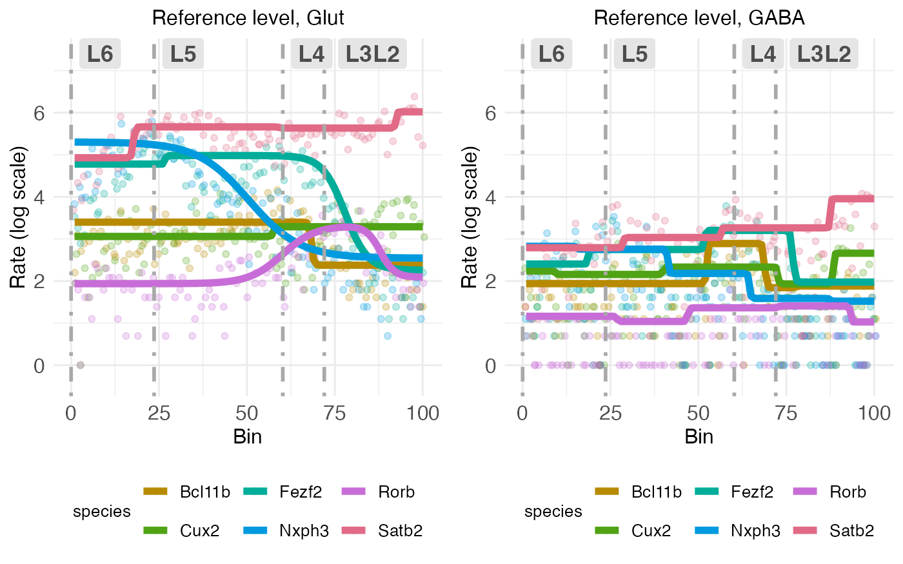
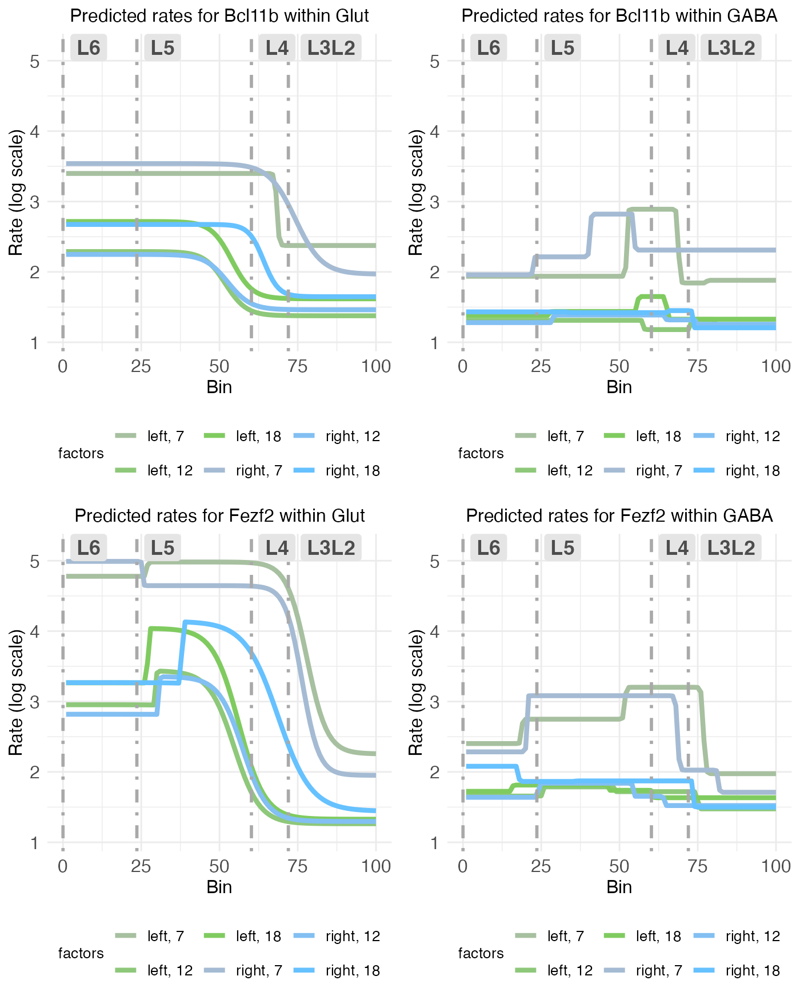
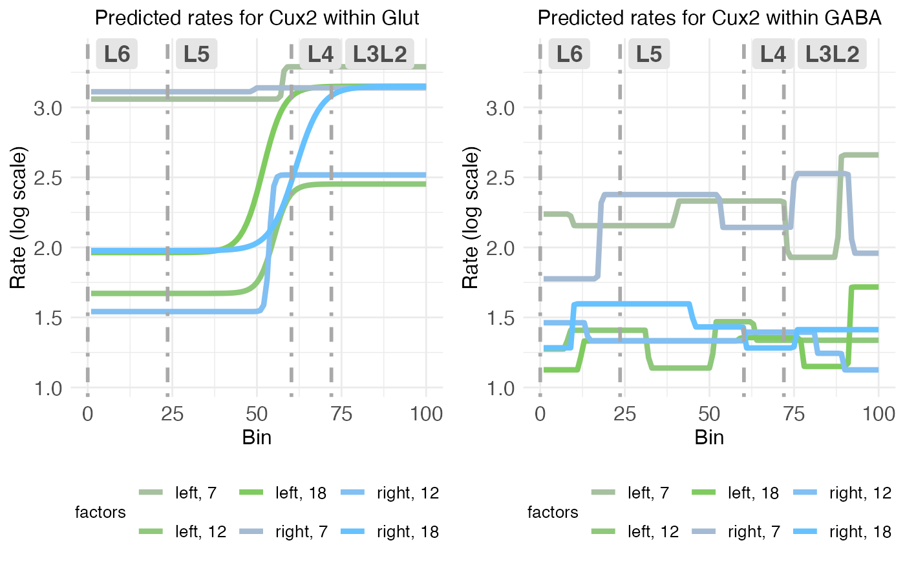
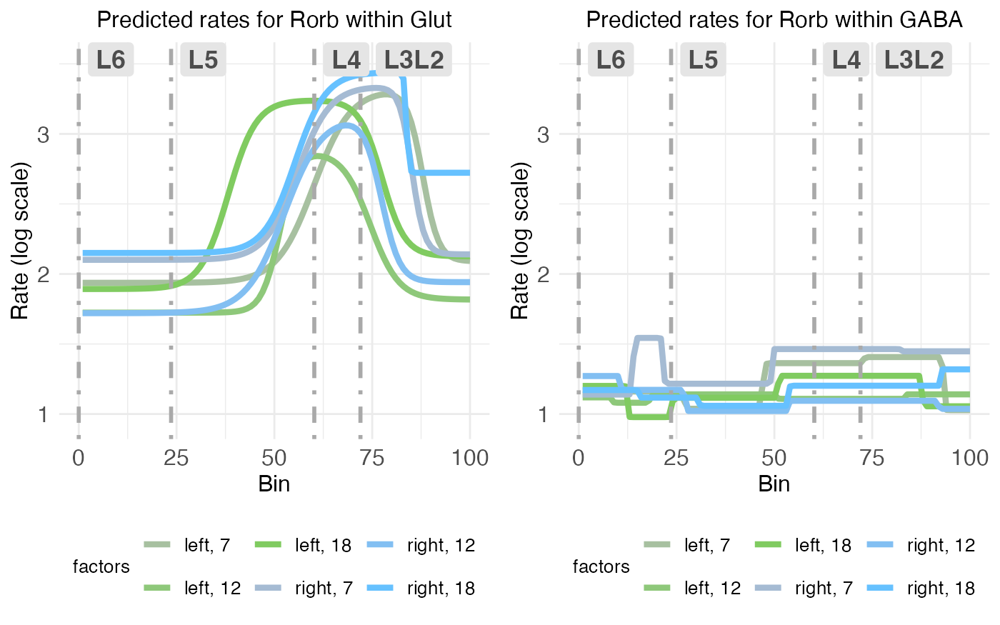
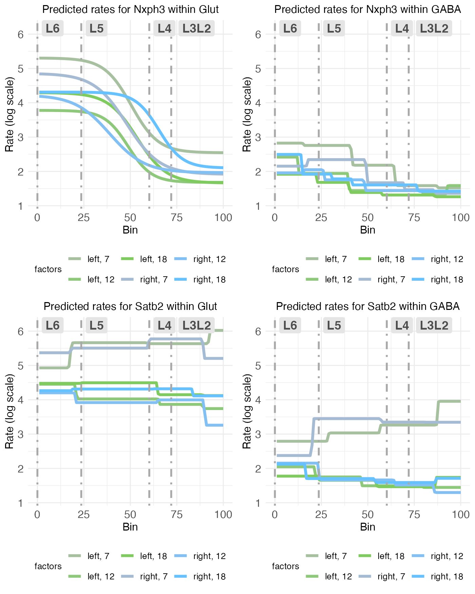
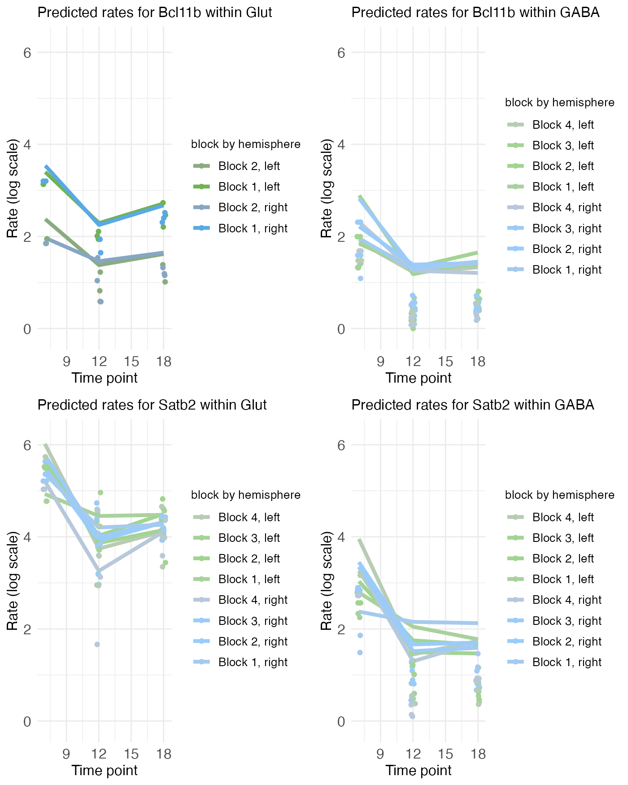
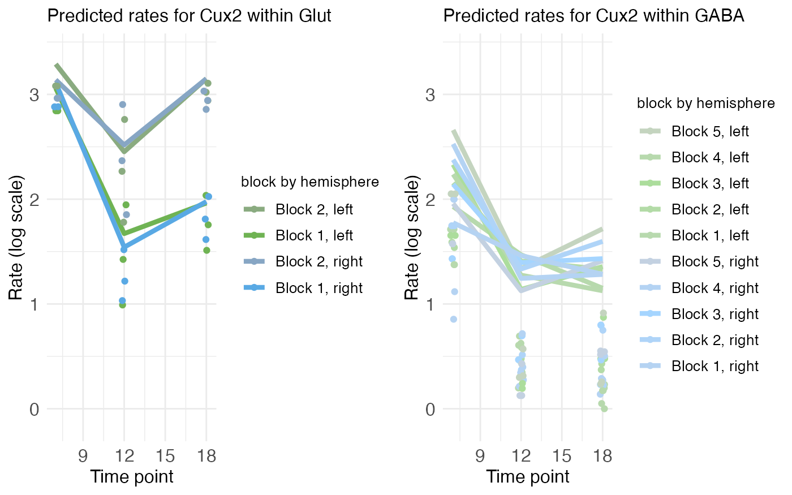
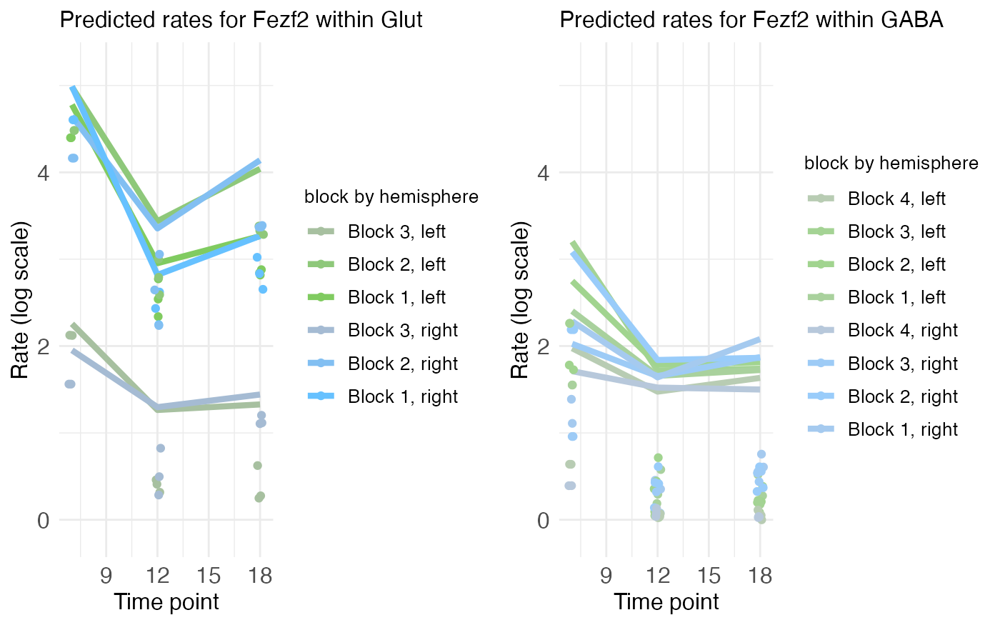
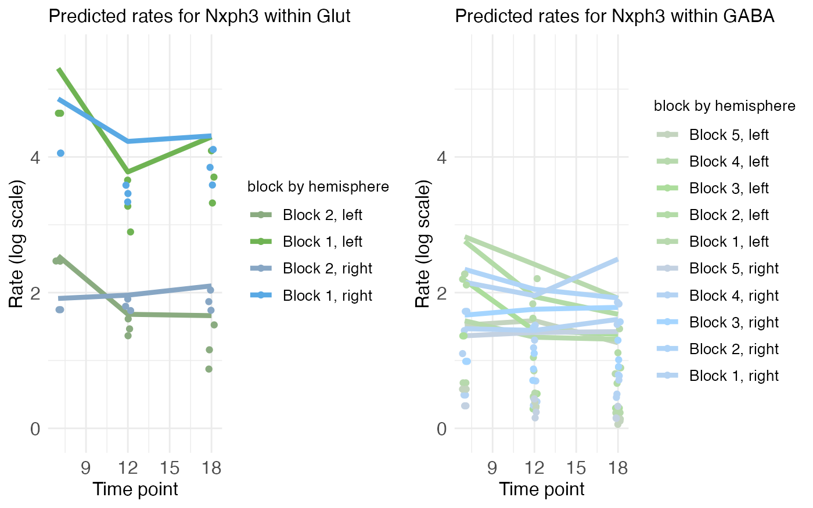
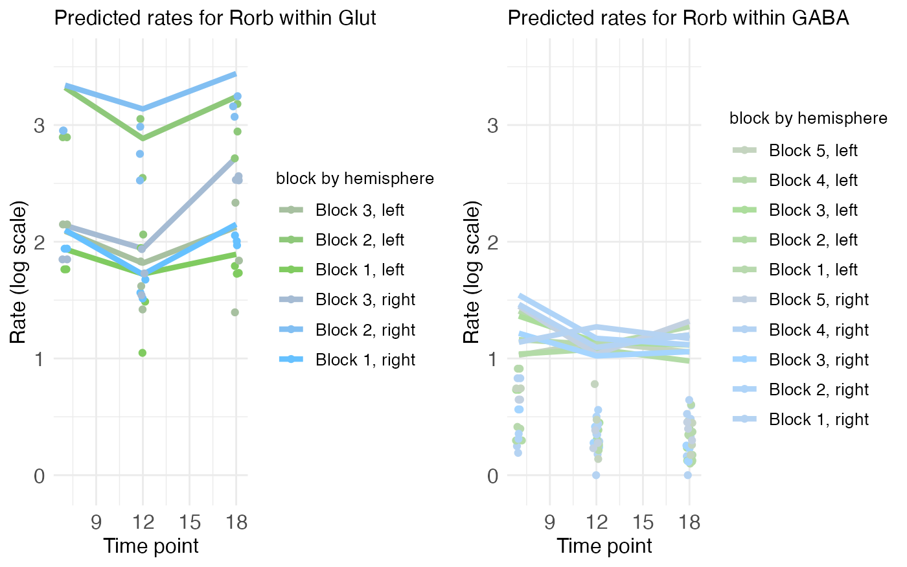

# Modeling cell types

## Introduction

Most biological tissue will contain many different cell types. As all
cells have the same DNA, what distinguishes cell types is the set of
genes they express. Hence, when analyzing the spatial distribution of
gene transcripts, it’s important to consider the kinds of cells
producing those transcripts. Wisp is able to model different cell types
using the **context** variable.

## Data and cell-typing

This tutorial will use MERFISH data collected from the auditory cortex
of mice. The data has been preprocessed into laminar coordinates as
described in [the
tutorial](https://michaelbarkasi.github.io/wispack/articles/tutorial_corticallaminar.md)
on modeling the cortical-laminar axis (see also [this
preprint](https://doi.org/10.1101/2025.06.11.659209)). As with all data
appropriate for wispack, and in line with well-known modeling functions
in R (e.g.,
[lme4::lmer()](https://cran.r-project.org/web/packages/lme4/index.html)
and
[stats::lm()](https://stat.ethz.ch/R-manual/R-devel/library/stats/html/lm.html)),
the data must be in long format. That is, each row must correspond to a
single observation, which when modeling spatial transcriptomics data
will typically be a count of transcripts from an RNA species in a single
cell.

``` r
countdata <- read.csv(
  system.file(
      "extdata", 
      "ACx_laminar_countdata_demo_with_celltype.csv", 
      package = "wispack"
    )
  )

print(head(countdata))
```

``` scroll-output
##   count bin celltype_MMC   gene mouse hemisphere age
## 1     0  96          OEC Bcl11b     1       left  12
## 2     0  95       Immune Bcl11b     1       left  12
## 3     0  98      MB Glut Bcl11b     1       left  12
## 4     0 100   Astro-Epen Bcl11b     1       left  12
## 5     0  99   IT-ET Glut Bcl11b     1       left  12
## 6     0  99      MB GABA Bcl11b     1       left  12
```

Notice that this data is the same as the data used in the [time series
tutorial](https://michaelbarkasi.github.io/wispack/articles/tutorial_timeseries.md),
except that instead of the **context** column filled with the
placeholder “cortex”, there is a **celltype_MMC** column filled with the
following cell type annotations:

``` r
unique_celltypes <- unique(countdata$celltype_MMC)
cat(
  "\nNumber of unique cell types:", length(unique_celltypes), "\n", 
  "\nCell types:", paste0(unique_celltypes, collapse = ", "))
```

``` scroll-output
## 
## Number of unique cell types: 31 
##  
## Cell types: OEC, Immune, MB Glut, Astro-Epen, IT-ET Glut, MB GABA, Vascular, CNU-HYa Glut, OPC-Oligo, NP-CT-L6b Glut, CTX-MGE GABA, CB Glut, TH Glut, MY GABA, MY Glut, CNU-MGE GABA, HY GABA, P Glut, MH-LH Glut, OB-CR Glut, OB-IMN GABA, Pineal Glut, CTX-CGE GABA, LSX GABA, P GABA, CNU-HYa GABA, CNU-LGE GABA, DG-IMN Glut, HY Glut, CB GABA, MB Dopa
```

These annotations were determined using the Allen Institute’s
[MapMyCells](https://portal.brain-map.org/atlases-and-data/bkp/mapmycells)
tool, although the purpose of this tutorial is not to explain how to do
cell typing.

As thirty-one cell types is too many for demonstration purposes, let’s
simplify to just two: “Glut” and “GABA”.

``` r
# Make masks
Glut_mask <- grepl("Glut", countdata$celltype_MMC)
GABA_mask <- grepl("GABA", countdata$celltype_MMC)

# Apply new annotations
countdata$celltype_MMC[Glut_mask] <- "Glut"
countdata$celltype_MMC[GABA_mask] <- "GABA"

# Remove other cell types
countdata <- countdata[Glut_mask | GABA_mask, ]

# Print results
unique_celltypes <- unique(countdata$celltype_MMC)
cat(
  "\nNumber of unique cell types:", length(unique_celltypes), "\n", 
  "\nCell types:", paste0(unique_celltypes, collapse = ", "))
```

``` scroll-output
## 
## Number of unique cell types: 2 
##  
## Cell types: Glut, GABA
```

Cutting down to three cell types will both make the results more easy to
visualize and speed up model fitting. Unfortunately, the number of model
parameters related to fixed effects is a multiple of the number of
contexts being modeled. This is because each species is treated as
independent across contexts, e.g., expression of SLC17A7 (a gene
producing the protein vGLUT which loads glutamate into synaptic
vesicles) in glutamatergic neurons is presumably independent of its
expression in GABAergic neurons. So, for example, if there are 8
fixed-effect treatment levels and 10 genes being modeled, that will be
8\times 10=80 parameters per model component. There are three model
component types (rate, transition point, and transition point slope) and
the precise number of model components depends on the number of
transition points per gene. Suppose all genes have one transition point,
so, two rate values and one transition point and slope value. In that
case, there are 80\times 4=320 parameters. If instead of one context
(the tissue sample) we have 10 contexts (e.g., 10 cell types), that
raises the number of parameters related to fixed effects to 320\times 10
= 3,200.

Fortunately, the number of random-effect parameters is independent of
the number of contexts, as random effects are consistent across contexts
while varying between species. For example, if one mouse expresses more
SLC17A7 than another mouse, that effect is assumed to be the same
regardless of cell type. This is because the modeling of random effects
by warping factors is intended to capture variation from external noise
(e.g., tissue preparation), rather than from internal biological
variation (e.g., cell type differences).

Lastly, we’re modeling [layer-specific
genes](https://michaelbarkasi.github.io/wispack/articles/tutorial_corticallaminar.md),
so it’s also useful to grab cortical layer boundaries estimated for this
data independent of wisp (using manual
[CCFv3](https://doi.org/10.1016/j.cell.2020.04.007) registration). These
boundary estimates will only be used for plotting and visualization
after fitting the model, not for fitting the model itself.

``` r
boundary_path <- system.file(
    "extdata", 
    "ACx_layer_boundary_bins.csv", 
    package = "wispack"
  )
layer.boundary.bins <- read.csv(boundary_path)
```

## Fitting a wisp with cell types

The data frame **countdata** has no column named “context”, so the
context column needs to be specified along with the names for the
**species**, **ran**, and **timeseries** variables.

``` r
# Define variables in the dataframe for the model
data.variables <- list(
    context = "celltype_MMC",
    species = "gene",
    ran = "mouse",
    timeseries = "age"
  )
```

With data loaded and variables set, we can fit the wisp model. As it’s
not necessary for demonstrating cell-type modeling, we’ll only fit the
model (**fit_only = TRUE**) without running any [statistical parameter
estimation](https://michaelbarkasi.github.io/wispack/articles/tutorial_stats.md).

``` r
library(wispack, quietly = TRUE)

model <- wisp(
    count.data = countdata,
    variables = data.variables,
    fit_only = TRUE,
    model.settings = list(LROcutoff = 2.0, LROwindow_factor = 2.0),
    plot.settings = list(
        print.plots = FALSE, 
        dim.bounds = colMeans(layer.boundary.bins),
        title_size = 12,
        log.scale = TRUE,
        count.alpha.ran = 0.0,
        pred.alpha.ran = 0.0
      ),
    verbose = TRUE
  )
```

``` scroll-output
## 
## 
## Parsing data and settings for wisp model
## ----------------------------------------
## 
## Model settings:
##  buffer_factor: 0.05
##  ctol: 1e-06
##  max_penalty_at_distance_factor: 0.01
##  LROcutoff: 2
##  LROwindow_factor: 2
##  rise_threshold_factor: 0.8
##  max_evals: 1000
##  rng_seed: 42
##  warp_precision: 1e-07
##  round_none: TRUE
##  inf_warp: 450359962.73705
## 
## Plot settings:
##  print.plots: FALSE
##  dim.bounds: 72, 60.2, 23.6, 0
##  log.scale: TRUE
##  splitting_factor: 
##  CI_style: TRUE
##  label_size: 5.5
##  title_size: 12
##  axis_size: 12
##  legend_size: 10
##  count_size: 1.5
##  count_jitter: 0.5
##  count.alpha.ran: 0
##  count.alpha.none: 0.25
##  pred.alpha.ran: 0
##  pred.alpha.none: 1
## 
## Variable dictionary:
##  count: count
##  bin: bin
##  context: celltype_MMC
##  species: gene
##  ran: mouse
##  timeseries: age
##  fixedeffects: hemisphere, age
## 
## Parsed data (head only):
## ------------------------------
##    count bin context species ran hemisphere timeseries
## 3      0  98    Glut  Bcl11b   1       left         12
## 5      0  99    Glut  Bcl11b   1       left         12
## 6      0  99    GABA  Bcl11b   1       left         12
## 9      0  95    Glut  Bcl11b   1       left         12
## 11     0  98    Glut  Bcl11b   1       left         12
## 12     0  98    Glut  Bcl11b   1       left         12
## ----
## 
## Initializing Cpp (wspc) model
## ----------------------------------------
## 
## Infinity handling:
## machine epsilon: (eps_): 2.22045e-16
## pseudo-infinity (inf_): 1e+100
## warp_precision: 1e-07
## implied pseudo-infinity for unbounded warp (inf_warp): 4.5036e+08
## 
## Extracting variables and data information:
## Found max bin: 100.000000
## Fixed effects:
## "hemisphere" "timeseries"
## Ref levels:
## "left" "7"
## Time series detected:
## "7" "12" "18"
## Created treatment levels:
## "ref" "right" "12" "18" "right12" "right18"
## Context grouping levels:
## "GABA" "Glut"
## Species grouping levels:
## "Bcl11b" "Cux2" "Fezf2" "Nxph3" "Rorb" "Satb2"
## Random-effect grouping levels:
## "none" "1" "2" "3" "4" "5"
## Total rows in summed count data table: 43200
## Number of rows with unique model components: 432
## 
## Creating summed-count data columns and weight matrix:
## Random level 0, 1/6 complete
## Random level 1, 2/6 complete
## Random level 2, 3/6 complete
## Random level 3, 4/6 complete
## Random level 4, 5/6 complete
## Random level 5, 6/6 complete
## 
## Making extrapolation pool:
## row: 1440/7200
## row: 2880/7200
## row: 4320/7200
## row: 5760/7200
## row: 7200/7200
## 
## Making initial parameter estimates:
## Extrapolated 'none' rows
## Took log of observed counts
## Estimated gamma dispersion of raw counts
## Estimated change points
## Found average log counts for each context-species combination
## Estimated initial parameters for fixed-effect treatments
## Built initial beta (ref and fixed-effects) matrices
## Initialized random-effect warping factors
## Made and mapped parameter vector
## Number of parameters: 720
## Constructed grouping variable IDs
## Size of boundary vector: 4212
## 
## Fitting model to data
## ----------------------------------------
## 
## Setting boundary penalty coefficients
## Initial neg_loglik: 23295.3
## Initial neg_loglik with penalty: 23528.2
## Initial min boundary distance: 0.0364665
## Final neg_loglik: 21444.6
## Final neg_loglik with penalty: 21574.4
## Final min boundary distance: 0.10638
## Number of evaluations: 372
## Checking feasibility of provided parameters
## ... no tpoints below buffer
## ... no NAN rates predicted
## ... no negative rates predicted
## Provided parameters are feasible
## Initial boundary distance (want > 0): 0.10638
## 
## Making rate-count plots... 
## Making time series plots...
```

## Results

When given different contexts, wisp will make different rate-count and
time-series plots for each context. For the big picture, let’s compare
the reference levels for all gene between glutamatergic and GABAergic
neurons.

``` r
plt_Glut <- model[["plots"]][["ratecount"]][["plot_pred.log_context_Glut"]] + theme(legend.position = "bottom")
plt_GABA <- model[["plots"]][["ratecount"]][["plot_pred.log_context_GABA"]] + theme(legend.position = "bottom")
ylims <- ggplot_build(plt_Glut)$layout$panel_params[[1]]$y.range
ylims <- range(c(ylims, ggplot_build(plt_GABA)$layout$panel_params[[1]]$y.range))
plt_Glut <- plt_Glut + coord_cartesian(ylim = ylims)
plt_GABA <- plt_GABA + coord_cartesian(ylim = ylims)
g <- arrangeGrob(plt_Glut, plt_GABA, ncol = 2)  
grid.draw(g)
```



There are a few things to notice, which exemplify how gene expression
varies between cell types.

- Expression levels for these six genes are much higher in glutamatergic
  neurons compared with GABAergic neurons.
- The characteristic bump in [RORB
  expression](https://michaelbarkasi.github.io/wispack/articles/tutorial_corticallaminar.md)
  in L4 is only there is glutamatergic neurons; it is gone in GABAergic
  neurons.
- Conversely, there appears to be a bump in BCL11B expression in L4 of
  GABAergic neurons which is absent in glutamatergic neurons.
- NXPH3 and SATB2 expression takes on roughly the same shape in both
  cell types, with higher expression in deeper layers for NXPH3 and
  higher expression in surface layers in SATB2, but the expression
  levels are dramatically higher overall in glutamatergic neurons.

### Fixed-effect structure

These are trends in the reference level, which is the left hemisphere at
postnatal day (P) 7. What about the fixed effects of age and hemisphere?
To compare these across cell types, we can look at rate-count plots of
individual genes showing predicted expression rates at all treatment
levels.

``` r
plt_Glut1 <- model[["plots"]][["ratecount"]][["plot_pred.log_context_Glut_fixEff_Bcl11b"]] + theme(legend.position = "bottom") 
plt_GABA1 <- model[["plots"]][["ratecount"]][["plot_pred.log_context_GABA_fixEff_Bcl11b"]] + theme(legend.position = "bottom") 
plt_Glut2 <- model[["plots"]][["ratecount"]][["plot_pred.log_context_Glut_fixEff_Fezf2"]] + theme(legend.position = "bottom") 
plt_GABA2 <- model[["plots"]][["ratecount"]][["plot_pred.log_context_GABA_fixEff_Fezf2"]] + theme(legend.position = "bottom") 
ylims <- ggplot_build(plt_Glut1)$layout$panel_params[[1]]$y.range
ylims <- range(c(ylims, ggplot_build(plt_GABA1)$layout$panel_params[[1]]$y.range))
ylims <- range(c(ylims, ggplot_build(plt_Glut2)$layout$panel_params[[1]]$y.range))
ylims <- range(c(ylims, ggplot_build(plt_GABA2)$layout$panel_params[[1]]$y.range))
plt_Glut1 <- plt_Glut1 + coord_cartesian(ylim = ylims)
plt_GABA1 <- plt_GABA1 + coord_cartesian(ylim = ylims)
plt_Glut2 <- plt_Glut2 + coord_cartesian(ylim = ylims)
plt_GABA2 <- plt_GABA2 + coord_cartesian(ylim = ylims)
g <- arrangeGrob(plt_Glut1, plt_GABA1, plt_Glut2, plt_GABA2, ncol = 2)  
grid.draw(g)
```



Starting with BCL11b, we see that the bump in L4 at P7 isn’t confined to
the left hemisphere in GABAergic cells, but also appears (perhaps
shifted down into L5) in the right as well. Curiously, not only do
expression levels drop with age (P12, P18), but the bump seems to
disappear in both hemispheres. In contrast, the up-regulation of BCL11b
in deep layers (L5 and L6) in glutamatergic neurons is stable across age
and hemisphere, albeit with a notable drop after P7.

Similar to BCL11B, FEZF2 expression in GABAergic cells seems to show a
bilateral bump, this time across all of L5 and L4, which disappears
after P7. In glutamatergic neurons, FEZF2 expression parallels BCL11b
just as closely, albeit with higher overall expression and, perhaps,
with retained up-regulation in L5 after P7.

``` r
plt_Glut <- model[["plots"]][["ratecount"]][["plot_pred.log_context_Glut_fixEff_Cux2"]] + theme(legend.position = "bottom")
plt_GABA <- model[["plots"]][["ratecount"]][["plot_pred.log_context_GABA_fixEff_Cux2"]] + theme(legend.position = "bottom") 
ylims <- ggplot_build(plt_Glut)$layout$panel_params[[1]]$y.range
ylims <- range(c(ylims, ggplot_build(plt_GABA)$layout$panel_params[[1]]$y.range))
plt_Glut <- plt_Glut + coord_cartesian(ylim = ylims)
plt_GABA <- plt_GABA + coord_cartesian(ylim = ylims)
g <- arrangeGrob(plt_Glut, plt_GABA, ncol = 2)  
grid.draw(g)
```



In CUX2 we see relatively flat expression across layers in GABAergic
neurons, with an overall drop in expression level after P7. In contrast,
while expression is constant across layers in glutamatergic neurons at
P7, it only drops selectively, in deep layers (L5 and L6) after P7.

``` r
plt_Glut <- model[["plots"]][["ratecount"]][["plot_pred.log_context_Glut_fixEff_Rorb"]] + theme(legend.position = "bottom") 
plt_GABA <- model[["plots"]][["ratecount"]][["plot_pred.log_context_GABA_fixEff_Rorb"]] + theme(legend.position = "bottom") 
ylims <- ggplot_build(plt_Glut)$layout$panel_params[[1]]$y.range
ylims <- range(c(ylims, ggplot_build(plt_GABA)$layout$panel_params[[1]]$y.range))
plt_Glut <- plt_Glut + coord_cartesian(ylim = ylims)
plt_GABA <- plt_GABA + coord_cartesian(ylim = ylims)
g <- arrangeGrob(plt_Glut, plt_GABA, ncol = 2)  
grid.draw(g)
```



A closer look at [RORB
expression](https://michaelbarkasi.github.io/wispack/articles/tutorial_corticallaminar.md)
confirms the expected up-regulation in L4 in glutamatergic neurons. The
absence of this bump in L4 in GABAergic neurons seems to hold
bilaterally and across ages. In fact, there’s little (if any)
interesting up-regulation in GABAergic neurons, except perhaps a small
bump in L6 in the right hemisphere at P7.

``` r
plt_Glut1 <- model[["plots"]][["ratecount"]][["plot_pred.log_context_Glut_fixEff_Nxph3"]] + theme(legend.position = "bottom") 
plt_GABA1 <- model[["plots"]][["ratecount"]][["plot_pred.log_context_GABA_fixEff_Nxph3"]] + theme(legend.position = "bottom") 
plt_Glut2 <- model[["plots"]][["ratecount"]][["plot_pred.log_context_Glut_fixEff_Satb2"]] + theme(legend.position = "bottom") 
plt_GABA2 <- model[["plots"]][["ratecount"]][["plot_pred.log_context_GABA_fixEff_Satb2"]] + theme(legend.position = "bottom") 
ylims <- ggplot_build(plt_Glut1)$layout$panel_params[[1]]$y.range
ylims <- range(c(ylims, ggplot_build(plt_GABA1)$layout$panel_params[[1]]$y.range))
ylims <- range(c(ylims, ggplot_build(plt_Glut2)$layout$panel_params[[1]]$y.range))
ylims <- range(c(ylims, ggplot_build(plt_GABA2)$layout$panel_params[[1]]$y.range))
plt_Glut1 <- plt_Glut1 + coord_cartesian(ylim = ylims)
plt_GABA1 <- plt_GABA1 + coord_cartesian(ylim = ylims)
plt_Glut2 <- plt_Glut2 + coord_cartesian(ylim = ylims)
plt_GABA2 <- plt_GABA2 + coord_cartesian(ylim = ylims)
g <- arrangeGrob(plt_Glut1, plt_GABA1, plt_Glut2, plt_GABA2, ncol = 2)  
grid.draw(g)
```



Finally, as observed in the reference level, NXPH3 and SATB2 expression
is extremely similar across glutamatergic and GABAergic neurons, albeit
with higher levels across the board in glutamatergic neurons.

### Time-series plots

Temporal trajectories of the count (y-axis) across age (x-axis) can be
visualized with the [time-series
plots](https://michaelbarkasi.github.io/wispack/articles/tutorial_timeseries.md).
These show some interesting patterns on their own. For example, while
BCL11B shares spatial pattern with FEZF2, its temporal pattern is more
similar to that of SATB2.

``` r
plt_Glut1 <- model[["plots"]][["timeseries"]][["plot_pred.log_context_Glut_timeseries_Bcl11b"]] + theme(plot.title = element_text(hjust = 0.0))
plt_GABA1 <- model[["plots"]][["timeseries"]][["plot_pred.log_context_GABA_timeseries_Bcl11b"]] + theme(plot.title = element_text(hjust = 0.0))
plt_Glut2 <- model[["plots"]][["timeseries"]][["plot_pred.log_context_Glut_timeseries_Satb2"]] + theme(plot.title = element_text(hjust = 0.0))
plt_GABA2 <- model[["plots"]][["timeseries"]][["plot_pred.log_context_GABA_timeseries_Satb2"]] + theme(plot.title = element_text(hjust = 0.0))
ylims <- ggplot_build(plt_Glut1)$layout$panel_params[[1]]$y.range
ylims <- range(c(ylims, ggplot_build(plt_GABA1)$layout$panel_params[[1]]$y.range))
ylims <- range(c(ylims, ggplot_build(plt_Glut2)$layout$panel_params[[1]]$y.range))
ylims <- range(c(ylims, ggplot_build(plt_GABA2)$layout$panel_params[[1]]$y.range))
plt_Glut1 <- plt_Glut1 + coord_cartesian(ylim = ylims)
plt_GABA1 <- plt_GABA1 + coord_cartesian(ylim = ylims)
plt_Glut2 <- plt_Glut2 + coord_cartesian(ylim = ylims)
plt_GABA2 <- plt_GABA2 + coord_cartesian(ylim = ylims)
g <- arrangeGrob(plt_Glut1, plt_GABA1, plt_Glut2, plt_GABA2, ncol = 2)  
grid.draw(g)
```



The similar trajectories of the count (y-axis) across age (x-axis) for
glutamatergic and GABAergic neurons for BCL11B and SATB2 suggest a
similar effect from age, regardless of cell type, hemisphere, or
cortical layer (block). What is different between the cell types,
however, is that while BCL11B expression in glutamatergic neurons varies
by cortical layer in glutamatergic neurons (with higher expression in
the deeper layers, block 1), it is constant across cortical layers in
GABAergic neurons.

``` r
plt_Glut <- model[["plots"]][["timeseries"]][["plot_pred.log_context_Glut_timeseries_Cux2"]] + theme(plot.title = element_text(hjust = 0.0))
plt_GABA <- model[["plots"]][["timeseries"]][["plot_pred.log_context_GABA_timeseries_Cux2"]] + theme(plot.title = element_text(hjust = 0.0))
ylims <- ggplot_build(plt_Glut)$layout$panel_params[[1]]$y.range
ylims <- range(c(ylims, ggplot_build(plt_GABA)$layout$panel_params[[1]]$y.range))
plt_Glut <- plt_Glut + coord_cartesian(ylim = ylims)
plt_GABA <- plt_GABA + coord_cartesian(ylim = ylims)
g <- arrangeGrob(plt_Glut, plt_GABA, ncol = 2)  
grid.draw(g)
```



Similar trajectories of the count (y-axis) across age (x-axis) are also
seen for glutamatergic and GABAergic neurons for CUX2, albeit the
similarity only holds for the deeper block (block 1) of the
glutamatergic cells. The more superficial block (block 2) of
glutamatergic neurons shows a trajectory different from that found in
GABAergic neurons, with expression levels dipping at P12 before
recovering at P18.

``` r
plt_Glut <- model[["plots"]][["timeseries"]][["plot_pred.log_context_Glut_timeseries_Fezf2"]] + theme(plot.title = element_text(hjust = 0.0))
plt_GABA <- model[["plots"]][["timeseries"]][["plot_pred.log_context_GABA_timeseries_Fezf2"]] + theme(plot.title = element_text(hjust = 0.0))
ylims <- ggplot_build(plt_Glut)$layout$panel_params[[1]]$y.range
ylims <- range(c(ylims, ggplot_build(plt_GABA)$layout$panel_params[[1]]$y.range))
plt_Glut <- plt_Glut + coord_cartesian(ylim = ylims)
plt_GABA <- plt_GABA + coord_cartesian(ylim = ylims)
g <- arrangeGrob(plt_Glut, plt_GABA, ncol = 2)  
grid.draw(g)
```



While the GABAergic neurons show a temporal trajectory for FEZF2
expression that is similar to that seen for BCL11B and CUX2, the
glutamatergic neurons show variation across cortical layers (blocks),
but no real lateralization in temporal trajectory.

``` r
plt_Glut <- model[["plots"]][["timeseries"]][["plot_pred.log_context_Glut_timeseries_Nxph3"]] + theme(plot.title = element_text(hjust = 0.0))
plt_GABA <- model[["plots"]][["timeseries"]][["plot_pred.log_context_GABA_timeseries_Nxph3"]] + theme(plot.title = element_text(hjust = 0.0))
ylims <- ggplot_build(plt_Glut)$layout$panel_params[[1]]$y.range
ylims <- range(c(ylims, ggplot_build(plt_GABA)$layout$panel_params[[1]]$y.range))
plt_Glut <- plt_Glut + coord_cartesian(ylim = ylims)
plt_GABA <- plt_GABA + coord_cartesian(ylim = ylims)
g <- arrangeGrob(plt_Glut, plt_GABA, ncol = 2)  
grid.draw(g)
```



NXPH3, on the other hand, shows lateralization of the temporal
trajectory in both glutamatergic and GABAergic neurons. While the
patterns in GABAergic neurons are hard to discern visually, there is a
clear pattern in the glutamatergic neurons, with a dip in expression at
P12 with recovery at P18, in the left but not the right hemisphere.

``` r
plt_Glut <- model[["plots"]][["timeseries"]][["plot_pred.log_context_Glut_timeseries_Rorb"]] + theme(plot.title = element_text(hjust = 0.0))
plt_GABA <- model[["plots"]][["timeseries"]][["plot_pred.log_context_GABA_timeseries_Rorb"]] + theme(plot.title = element_text(hjust = 0.0))
ylims <- ggplot_build(plt_Glut)$layout$panel_params[[1]]$y.range
ylims <- range(c(ylims, ggplot_build(plt_GABA)$layout$panel_params[[1]]$y.range))
plt_Glut <- plt_Glut + coord_cartesian(ylim = ylims)
plt_GABA <- plt_GABA + coord_cartesian(ylim = ylims)
g <- arrangeGrob(plt_Glut, plt_GABA, ncol = 2)  
grid.draw(g)
```



RORB is perhaps the most difficult to interpret visually, at least for
glutamatergic neurons, which possibly have complex temporal trajectories
interacting with both cortical layer and hemisphere. GABAergic neurons,
on the other hand, show little variation along any dimension.
