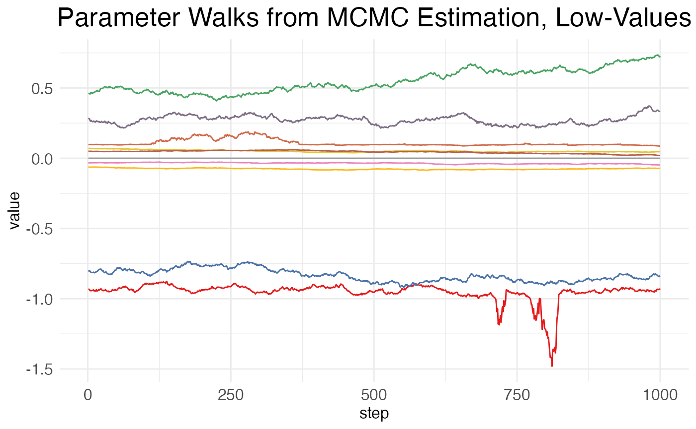
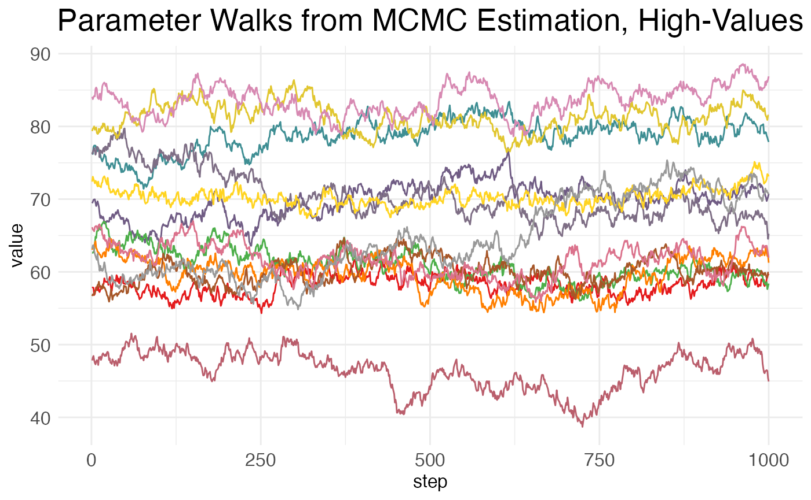
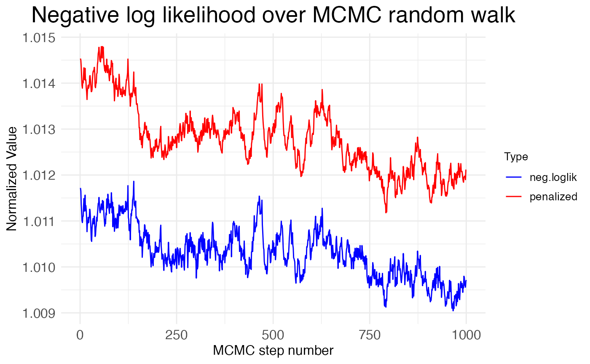
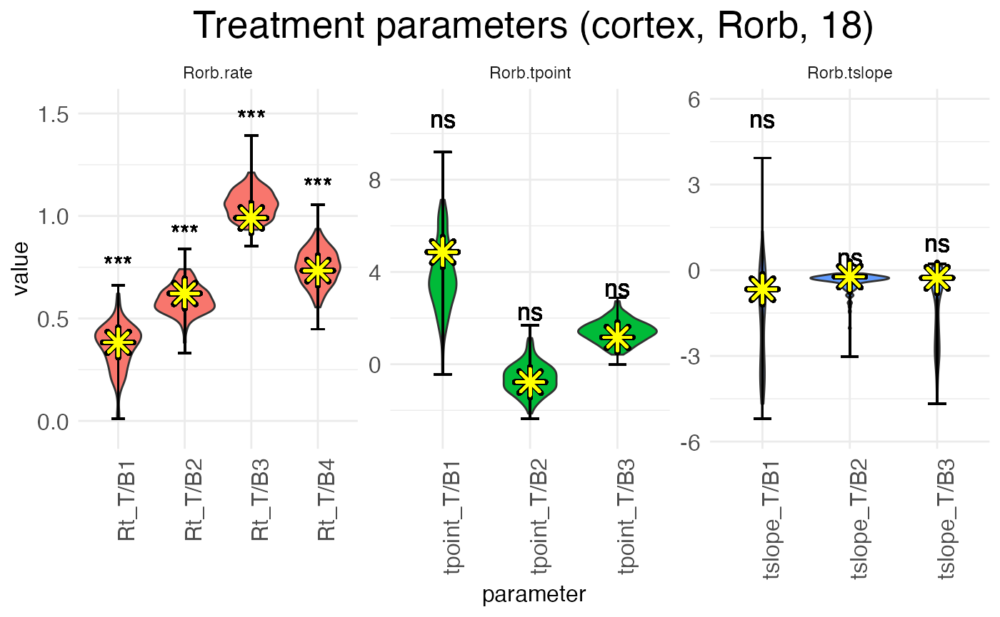
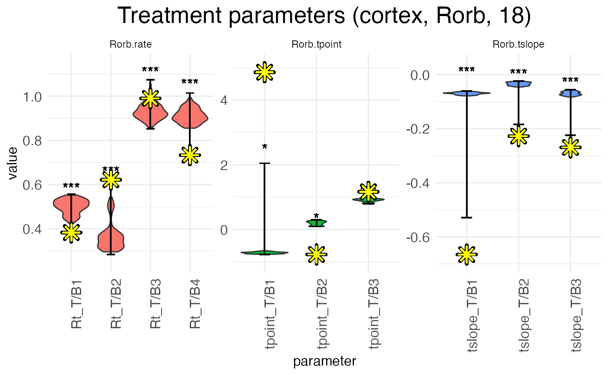
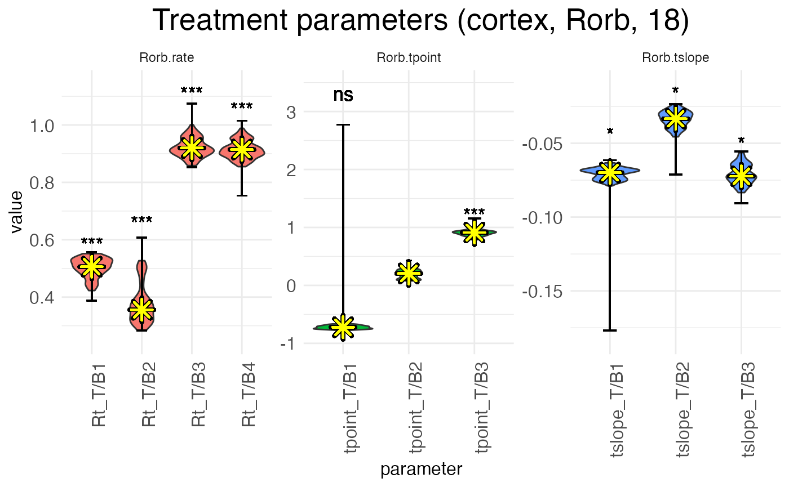
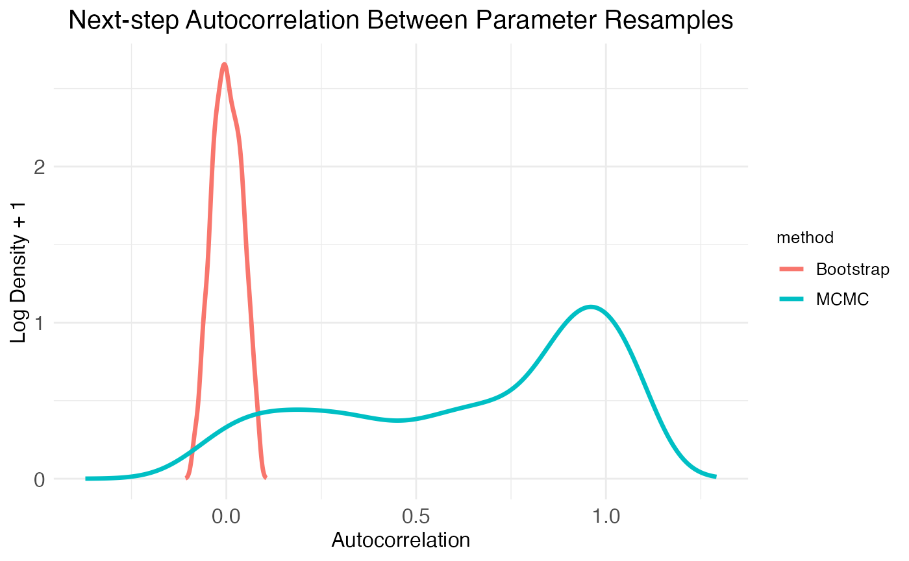
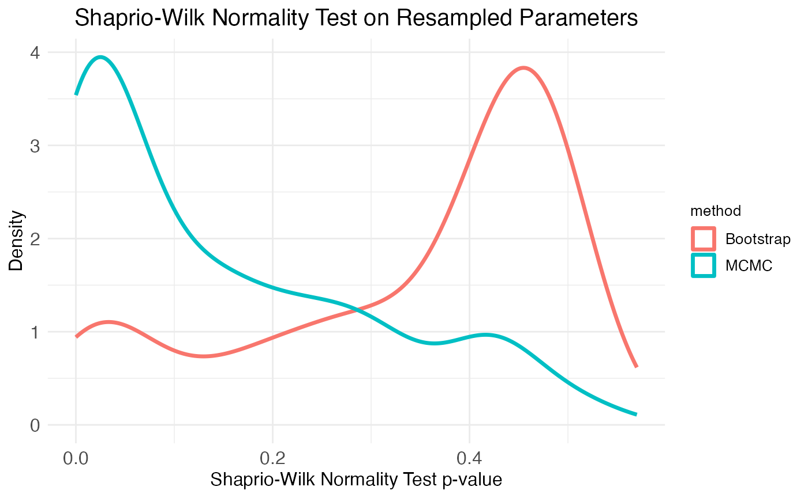
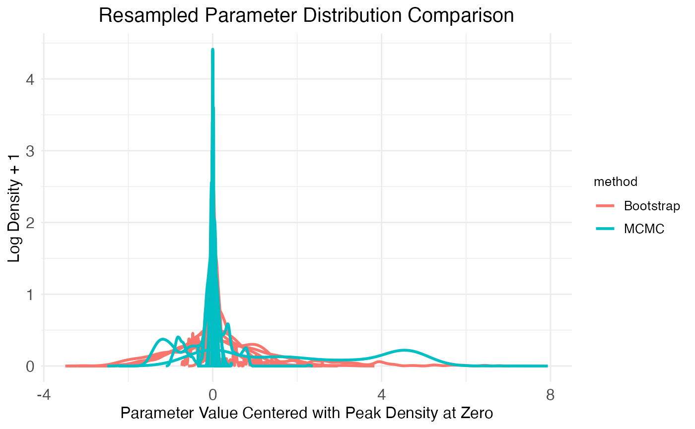

# Customizing statistical analyses

## Introduction

The purpose of a wisp model is to test whether a factor \xi has an
effect \beta\_\xi (such that \beta\_\xi \neq 0) on the spatial
distribution of a gene’s expression, that distribution being
parameterized in terms of expression rate, expression-rate transition
points, and transition slopes. The true value of \beta\_\xi is estimated
by resampling, either using a Markov chain Monte Carlo (MCMC) algorithm,
or by refitting the model to resamples of the data (bootstrapping). This
tutorial will not explain how the MCMC walk or bootstrap resampling is
performed; these details are covered in the [paper introducing
wisp](https://doi.org/10.1101/2025.06.11.659209). Instead, this tutorial
will focus on how p-values and confidence intervals (CI) are computed
from the sampling (i.e., hypothesis testing), how the MCMC and
bootstrapping approaches compare, and how to adjust various key settings
in wispack.

## Hypothesis testing

Suppose for each spatial parameter z, gene g, context c, and factor \xi
we have some set of resamples of the associated effect \beta, either
generated via MCMC walk or bootstrapping.

### Computations

Let \bar{\Phi} be the matrix of all of these values \beta, with rows I
corresponding to resamples and rows J corresponding to the various
combinations of z, g, c, and \xi. Let \Phi\_{IJ} be an element of this
matrix, \langle\Phi\rangle_J be a column of the matrix, and
\langle\Phi\rangle_I be a row of the matrix. Then a CI for significance
level \alpha can be computed for each parameter J via the quantiles of
the sampled values:

\text{CI}(J,\alpha) = \langle Q_J(\alpha/2), Q_J(1-\alpha/2)\rangle

In wispack, the quantiles Q_J are computed using type 7 linear
interpolation (the default for R) over \langle\Phi\rangle_J.

To compute p-values, we use the empirical cumulative distribution
function:

\text{ecdf}(X,X^\prime) = \frac{\|\\X\leq
X^\prime\\\|\_{\\}}{\|X\|\_{\\}}

with \|\cdot\|\_{\\} being the cardinality operator. First, for each
parameter J, we compute the two-sided p-value by first recentering the
sampled values \langle\Phi\rangle_J around the null hypothesis of zero
effect (i.e., \mu = 0):

\langle\Phi\rangle_J^{\mu=0} = \langle\Phi_J -
\mu(\langle\Phi\rangle_J)\rangle_J

for \Phi_J the scalar value of the effect \beta of parameter J to be
tested. Next, the probability of observing a value of at least
\|\Phi\_{IJ}\|\_{\text{abs}} for the effect \beta of parameter J,
assuming the true value is zero, is computed as:

p(\Phi\_{IJ}) = 1 - \text{ecdf}(\langle\Phi\rangle_J^{\mu=0},
\|\Phi\_{IJ}\|\_{\text{abs}}) +
\text{ecdf}(\langle\Phi\rangle_J^{\mu=0}, -\|\Phi\_{IJ}\|\_{\text{abs}})

with \|\cdot\|\_{\text{abs}} being absolute value. Wispack uses either
Holm-Bonferroni or Bonferroni corrections for multiple comparisons, with
Holm-Bonferroni the default.

### Implementation

Suppose we have the results from a run of wisp, such as this one which
matches the example from the RORB
[tutorial](https://michaelbarkasi.github.io/wispack/articles/tutorial_corticallaminar.md),
except that in addition to the default thousand-step MCMC walk with a
hundred-step burn-in, it also performs a thousand bootstrap resamples:

``` r
model <- wisp(
    count.data = countdata,
    variables = data.variables,
    plot.settings = list(
        print.plots = FALSE, 
        dim.bounds = colMeans(layer.boundary.bins)
      ),
    bootstraps.num = 1000, 
    max.fork = 5,
    verbose = TRUE
  )
```

The result of this run comes with wispack and can be loaded as follows:

``` r
# Set random seed for reproducibility
set.seed(123)
# Load wispack
library(wispack, quietly = TRUE)
# Load demo model
model <- readRDS(
  system.file(
      "extdata", 
      "corticallaminar_model.rds", 
      package = "wispack"
    )
  )
```

The function wisp will automatically compute p-values and CIs, unless
its option fit_only is set to true (by default, it’s false). However,
wisp does not allow for customizing the computations for p-values and
CIs. By default, it uses \alpha = 0.05 and a Holm-Bonferroni correction.

This default analysis can be accessed from the output of wisp via its
object stats and sub-object parameters:

``` r
print(head(model$stats$parameters))
```

``` scroll-output
##                                  parameter      estimate      CI.low    CI.high   p.value p.value.adj    alpha.adj significance
## 1       baseline_cortex_Rt_Bcl11b_Tns/Blk1  3.3874762662  3.30569175 3.40219340        NA          NA           NA             
## 2   beta_Rt_cortex_Bcl11b_right_X_Tns/Blk1 -0.0002723492 -0.07161064 0.07342381 0.9920080    1.984016 0.0250000000           ns
## 3      beta_Rt_cortex_Bcl11b_18_X_Tns/Blk1  0.6059294086  0.53617581 0.74222905 0.0000000    0.000000 0.0002923977          ***
## 4 beta_Rt_cortex_Bcl11b_right18_X_Tns/Blk1  0.0476934492 -0.09456036 0.16707228 0.2447552   13.951049 0.0008771930           ns
## 5       baseline_cortex_Rt_Bcl11b_Tns/Blk2  2.2516514786  1.99915464 2.53133579        NA          NA           NA             
## 6   beta_Rt_cortex_Bcl11b_right_X_Tns/Blk2  0.1004792278 -0.42595429 0.51137301 0.5404595   18.375624 0.0014705882           ns
```

To customize the computations for p-values and CIs, we can use the
function sample.stats. This function assumes that resamples have already
been generated, by either MCMC walk or bootstrapping. It itself does not
run these resamples; it merely extracts p-values and CIs from them. The
function sample.stats allows for setting a new alpha level and for
switching between Holm-Bonferroni and Bonferroni corrections. It returns
the data frame which populates model\$stats\$parameters:

``` r
model$stats$parameters <- sample.stats(
    model,
    alpha = 0.01,
    Bonferroni = TRUE,
    verbose = TRUE
  )
```

``` scroll-output
## 
## Running stats on simulation results
## ----------------------------------------
## 
## Grabbing sample results, only resamples with converged fit... 
## Grabbing parameter values... 
## Computing 95% confidence intervals... 
## Estimating p-values from resampled parameters... 
## 
## Recommended resample size for alpha = 0.01, 171 tests
## with bootstrapping/MCMC: 17100
## Actual resample size: 1001
## 
## Stat summary (head only):
## ------------------------------
##                                  parameter      estimate     CI.low    CI.high   p.value p.value.adj    alpha.adj significance
## 1       baseline_cortex_Rt_Bcl11b_Tns/Blk1  3.3874762662  3.2789558 3.43808630        NA          NA 5.847953e-05             
## 2   beta_Rt_cortex_Bcl11b_right_X_Tns/Blk1 -0.0002723492 -0.1249142 0.09502461 0.9920080   169.63337 5.847953e-05           ns
## 3      beta_Rt_cortex_Bcl11b_18_X_Tns/Blk1  0.6059294086  0.5361412 0.74281736 0.0000000     0.00000 5.847953e-05          ***
## 4 beta_Rt_cortex_Bcl11b_right18_X_Tns/Blk1  0.0476934492 -0.1029796 0.16720287 0.2447552    41.85315 5.847953e-05           ns
## 5       baseline_cortex_Rt_Bcl11b_Tns/Blk2  2.2516514786  1.7743039 2.71545562        NA          NA 5.847953e-05             
## 6   beta_Rt_cortex_Bcl11b_right_X_Tns/Blk2  0.1004792278 -0.4328437 0.52219934 0.5404595    92.41858 5.847953e-05           ns
## ----
```

Above we switched from \alpha = 0.05 to \alpha = 0.01 and from a
Holm-Bonferroni to a Bonferroni correction. As can be seen in the print
out, if verbose is set to true, sample.stats will print out both the
head of model\$stats\$parameters and also information about the
threshold \alpha and the number of hypothesis tests run. In this case,
\alpha = 0.01 and 171 tests are fun. In addition, the function
summary.stats estimates the number of resamples needed for threshold
\alpha and outputs both this number and the actual number of resamples
used. In this case, it’s recommended that 17,100 resamples are used, but
only 1,001 are given (the thousand bootstraps, plus the original fit of
the model to the data). Hence, if this were a real analysis, either
\alpha should be increased (e.g., back up to 0.05), or the number of
bootstraps increased.

## MCMC

By default, wispack resamples effects \beta using a MCMC walk of a
thousand steps with a hundred-step burn-in.

### Adjusting settings

The settings for the MCMC walk can be adjusted with the MCMC.settings
argument of the wisp function:

``` r
# Set new MCMC values 
MCMC.settings.new <- list(
      MCMC.burnin = 1e2,
      MCMC.steps = 1e3,
      MCMC.step.size = 0.5,
      MCMC.prior = 1.0, 
      MCMC.neighbor.filter = 1
    )

# Use new settings in wisp
model <- wisp(
    count.data = countdata,
    variables = data.variables,
    MCMC.settings = MCMC.settings.new,
    plot.settings = list(
        print.plots = FALSE, 
        dim.bounds = colMeans(layer.boundary.bins)
      ),
    bootstraps.num = 1000, 
    max.fork = 5,
    verbose = TRUE
  )
```

This code chunk is just for demonstration; it is not run. Also, the
values shown are the defaults.

- **MCMC.burnin**: Number of initial steps to discard as burn-in. This
  is the number of steps it’s expected to take to find a reasonable fit
  of the data.
- **MCMC.steps**: Total number of MCMC steps to run after burn-in. These
  are the steps used for estimating the effects \beta.
- **MCMC.step.size**: Step size for the MCMC walk. Larger values lead to
  larger jumps in parameter space, which can help escape local minima,
  but can also lead to lower acceptance rates.
- **MCMC.prior**: For a given effect value \beta, a random step
  \beta^\prime is accepted or rejected based on the ratio
  \text{P}(\beta^\prime) / \text{P}(\beta), where the probabilities
  \text{P}(\cdot) are computed using Bayes rule from the product of the
  likelihood \text{P}(y\|\beta) and the prior \text{P}(\beta). The
  likelihoods are straightforward to compute; the priors are not. For
  transition-points, it’s assumed that all positions – and hence all
  effects \beta are equally likely. Thus, the prior drops out. For rates
  and slopes, however, the prior is assumed to be a normal distribution
  centered at zero. The value of MCMC.prior sets the standard deviation
  of this normal distribution. Currently this variable must be a single
  numeric value.
- **MCMC.neighbor.filter**: If this value is \>1, then only every
  MCMC.neighbor.filter-th step is saved for statistical analysis. This
  can help reduce autocorrelation between samples.

### Plotting walks

Wispack includes the function plot.MCMC.walks for visualizing MCMC
walks.

``` r
MCMC_walk_plots <- plot.MCMC.walks(
 model, 
 print.plots = FALSE, 
 verbose = FALSE, 
 low_samples = 10
)
```

This function returns three plots: one showing the walks taken by
high-valued parameters (i.e., mean \>20), one showing the walks taken by
low-valued parameters (i.e., mean \leq 20), and one showing the negative
log-likelihood (NLL) across the MCMC steps. It’s assumed that the vast
majority of model parameters will be low-valued. Thus, it’s impractical
to plot them all. So, the low_samples argument sets the number of
low-value parameters to plot. Parameters are chosen at random, as a
sampling to see how the MCMC walk behaves.

``` r
print(MCMC_walk_plots$plot.walks.parameters_low)
```



As can be seen, there is high autocorrelation between steps, i.e., the
value at a given point is much closer to the values of its neighbors
than to the values of more distant points. This is undesirable, as it
means that many of the samples are not independent. A higher value for
MCMC.neighbor.filter may help, as it essentially skips nearby samples.

Now, for the walks from the high-value parameters (which will generally
include only the baseline values for transition points):

``` r
print(MCMC_walk_plots$plot.walks.parameters_high)
```



Here again we see high amounts of autocorrelation.

Finally, we can inspect the neglative log-likelihood (NLL) across the
MCMC steps:

``` r
print(MCMC_walk_plots$plot.walks.nll)
```



Notice that the NLL is generally decreasing across the MCMC steps, but
only by about \sim 0.2\\. This suggests that the MCMC walk is exploring
a minima without much chance of escaping. This is good if it’s the
global minima, but bad if it’s a local minima. We can get some insight
into whether the MCMC walk has found the global minima by looking at how
its NLL values compare to the NLL value found by the gradient-descent
optimization (L-BFGS) used to fit the model to the data initially. The
function plot.MCMC.walks makes this comparison easy, as it normalizes
the NLL values from the MCMC walk by dividing them by the NLL value from
the initial fit. The plot shows these values hover around 1.01, meaning
that the MCMC walk stays around 1\\ worse than the initial fit. Hence,
the walk is caught in a local minima.

### Reconciling MCMC and L-BFGS

Despite being the default, MCMC walks are often a poor choice for all
but the simplest wisp models, given the high autocorrelation and
tendency to get trapped in local minima. MCMC walks are the default
because they are computationally much faster and can be run on a single
core. However, using them often requires throwing out the initial fit
from L-BFGS. To see why, first note that the wisp function returns three
matrices of parameter resamples:

``` r
paste0(names(model)[grep("sample.params", names(model))], collapse = ", ")
```

``` scroll-output
## [1] "sample.params, sample.params.bs, sample.params.MCMC"
```

The matrices sample.params.bs and sample.params.MCMC contain the
bootstrap and MCMC resamples, respectively. The matrix sample.params is
used by the sample.stats function. If sample.params.bs is not present,
then sample.params is a copy of sample.params.MCMC. If sample.params.bs
is present, then sample.params is a copy of it. Thus, when both MCMC
walks and bootstrap resamples are run, sample.params ignores the MCMC
walks and uses the bootstrap resamples.

Let’s make a copy of our model that uses the MCMC walks and re-run the
statistical analysis on it:

``` r
model_MCMC <- model
model_MCMC$sample.params <- model_MCMC$sample.params.MCMC
model_MCMC$stats$parameters <- sample.stats(model_MCMC)
```

``` scroll-output
## 
## Running stats on simulation results
## ----------------------------------------
## 
## Grabbing sample results, only resamples with converged fit... 
## Grabbing parameter values... 
## Computing 95% confidence intervals... 
## Estimating p-values from resampled parameters... 
## 
## Recommended resample size for alpha = 0.05, 171 tests
## with bootstrapping/MCMC: 3420
## Actual resample size: 1001
## 
## Stat summary (head only):
## ------------------------------
##                                  parameter      estimate       CI.low      CI.high     p.value p.value.adj    alpha.adj significance
## 1       baseline_cortex_Rt_Bcl11b_Tns/Blk1  3.3874762662 3.2423579199 3.6060658268          NA          NA           NA             
## 2   beta_Rt_cortex_Bcl11b_right_X_Tns/Blk1 -0.0002723492 0.0002701605 0.0009564635 0.000999001  0.04495504 0.0011111111            *
## 3      beta_Rt_cortex_Bcl11b_18_X_Tns/Blk1  0.6059294086 0.4971755126 0.6552261694 0.000000000  0.00000000 0.0002923977          ***
## 4 beta_Rt_cortex_Bcl11b_right18_X_Tns/Blk1  0.0476934492 0.0324878078 0.0563049808 0.000000000  0.00000000 0.0002941176          ***
## 5       baseline_cortex_Rt_Bcl11b_Tns/Blk2  2.2516514786 1.9117544868 2.6135187197          NA          NA           NA             
## 6   beta_Rt_cortex_Bcl11b_right_X_Tns/Blk2  0.1004792278 0.0504651545 0.0951689705 0.000000000  0.00000000 0.0002958580          ***
## ----
```

Now, let’s plot the values \beta for RORB for the effect of age in the
left hemisphere. We will highlight the value found by the L-BFGS fit
with a large yellow asterisk. Here are the distributions from the
bootstrap resamples:

``` r
plots.param <- plot.parameters(model, species = "Rorb", verbose = FALSE) 
print(
  plots.param$plot_treatment_18_cortex_Rorb + 
    scale_y_continuous(expand = expansion(mult = 0.1)) +
    geom_point(aes(y = means), shape = 8, size = 4, stroke = 2, color = "black", na.rm = TRUE) + 
    geom_point(aes(y = means), shape = 8, size = 4, stroke = 1, color = "yellow", na.rm = TRUE)
  )
```



Notice that the L-BFGS fits mostly fall near the medians (i.e., peaks)
of the distributions. The L-BFGS fits are certainly all *within* the
distributions found by the bootstraps. This is to be expected, as the
bootstrapped resamples are got by performing new L-BFGS fits to
resamples of the count data.

In contrast, by plotting the distributions from the MCMC walks, we can
see that the L-BFGS fits never fall near the median, and often fall well
outside the range of MCMC walk values. Within the MCMC walk results, the
L-BFGS fit is often an outlier.

``` r
plots.param_MCMC <- plot.parameters(model_MCMC, species = "Rorb", verbose = FALSE)
print(
  plots.param_MCMC$plot_treatment_18_cortex_Rorb + 
    scale_y_continuous(expand = expansion(mult = 0.1)) +
    geom_point(aes(y = means), shape = 8, size = 4, stroke = 2, color = "black", na.rm = TRUE) + 
    geom_point(aes(y = means), shape = 8, size = 4, stroke = 1, color = "yellow", na.rm = TRUE)
  )
```



The reason for this mismatch is that the MCMC walk gets stuck in a local
minima and cannot properly explore the parameter space. Both the L-BFGS
gradient descent and the MCMC walk start from the same set of initial
parameters, but they don’t end up in the same place.

Three possible solutions suggest themselves:

1.  Increase the value of MCMC.step.size to allow for more exploration
    of the parameter space.
2.  Set MCMC.burnin to zero and start the walk from the L-BFGS fit.
3.  Discard the L-BFGS fit and use the median of the MCMC walk as the
    estimate of each effect \beta.

Each of these options have downsides. In practical terms, (1) is often
unworkable, as significantly larger step sizes tend to lead to
acceptance rates near (or at) zero. Option (2), interestingly, has the
same problem, unless step size is so small that acceptance rate is very
high, leaving the space around the L-BFGS fit underexplored. (As to
implementing this option, if the number of burn-in steps is set to zero,
wispack will automatically switch to starting the walk at the L-BGGS
fit.) In both cases, the root issue is presumably the non-linearity of
the model: small changes to viable parameters often produce large
changes in predictions, leading to a worse fit with the data. The L-BFGS
fit gets around this issue because following the gradient allows for
navigating around these non-linearities.

We’re left with option (3), which is unsatisfactory (of course) because
it leaves us with final estimates that are known to be suboptimal fits.
Still, if we wish to implement it, the argument use.median in the wisp
function allows for doing so. If this argument is set to true, then the
median of the MCMC walk is used as the estimate of each effect \beta,
rather than the L-BFGS fit. As an example, we can re-run the model:

``` r
# Grab data 
countdata <- read.csv(
  system.file(
      "extdata", 
      "S1_laminar_countdata_demo.csv", 
      package = "wispack"
    )
  )

# Specify variables for wisp
data.variables <- list(
    species = "gene",
    ran = "mouse",
    timeseries = "age"
  )

# Run with median
model_median <- wisp(
    count.data = countdata,
    variables = data.variables,
    use.median = TRUE,
    plot.settings = list(print.plots = FALSE),
    bootstraps.num = 0, 
    verbose = TRUE
  )
```

``` scroll-output
## 
## 
## Parsing data and settings for wisp model
## ----------------------------------------
## 
## Model settings:
##  buffer_factor: 0.05
##  ctol: 1e-06
##  max_penalty_at_distance_factor: 0.01
##  LROcutoff: 2
##  LROwindow_factor: 1.25
##  rise_threshold_factor: 0.8
##  max_evals: 1000
##  rng_seed: 42
##  warp_precision: 1e-07
##  round_none: TRUE
##  inf_warp: 450359962.73705
## 
## Plot settings:
##  print.plots: FALSE
##  dim.bounds: 
##  log.scale: FALSE
##  splitting_factor: 
##  CI_style: TRUE
##  label_size: 5.5
##  title_size: 20
##  axis_size: 12
##  legend_size: 10
##  count_size: 1.5
##  count_jitter: 0.5
##  count.alpha.ran: 0.25
##  count.alpha.none: 0.25
##  pred.alpha.ran: 0.9
##  pred.alpha.none: 1
## 
## MCMC settings:
##  MCMC.burnin: 100
##  MCMC.steps: 1000
##  MCMC.step.size: 0.5
##  MCMC.prior: 1
##  MCMC.neighbor.filter: 1
## 
## Variable dictionary:
##  count: count
##  bin: bin
##  context: context
##  species: gene
##  ran: mouse
##  timeseries: age
##  fixedeffects: hemisphere, age
## 
## Parsed data (head only):
## ------------------------------
##   count bin context species ran hemisphere timeseries
## 1     0 100  cortex  Bcl11b   1       left         12
## 2     0  99  cortex  Bcl11b   1       left         12
## 3     0  93  cortex  Bcl11b   1       left         12
## 4     0  98  cortex  Bcl11b   1       left         12
## 5     0  94  cortex  Bcl11b   1       left         12
## 6     0  94  cortex  Bcl11b   1       left         12
## ----
## 
## Initializing Cpp (wspc) model
## ----------------------------------------
## 
## Infinity handling:
## machine epsilon: (eps_): 2.22045e-16
## pseudo-infinity (inf_): 1e+100
## warp_precision: 1e-07
## implied pseudo-infinity for unbounded warp (inf_warp): 4.5036e+08
## 
## Extracting variables and data information:
## Found max bin: 100.000000
## Fixed effects:
## "hemisphere" "timeseries"
## Ref levels:
## "left" "12"
## Time series detected:
## "12" "18"
## Created treatment levels:
## "ref" "right" "18" "right18"
## Context grouping levels:
## "cortex"
## Species grouping levels:
## "Bcl11b" "Cux2" "Fezf2" "Nxph3" "Rorb" "Satb2"
## Random-effect grouping levels:
## "none" "1" "2" "3" "4"
## Total rows in summed count data table: 12000
## Number of rows with unique model components: 120
## 
## Creating summed-count data columns and weight matrix:
## Random level 0, 1/5 complete
## Random level 1, 2/5 complete
## Random level 2, 3/5 complete
## Random level 3, 4/5 complete
## Random level 4, 5/5 complete
## 
## Making extrapolation pool:
## row: 480/2400
## row: 960/2400
## row: 1440/2400
## row: 1920/2400
## row: 2400/2400
## 
## Making initial parameter estimates:
## Extrapolated 'none' rows
## Took log of observed counts
## Estimated gamma dispersion of raw counts
## Estimated change points
## Found average log counts for each context-species combination
## Estimated initial parameters for fixed-effect treatments
## Built initial beta (ref and fixed-effects) matrices
## Initialized random-effect warping factors
## Made and mapped parameter vector
## Number of parameters: 300
## Constructed grouping variable IDs
## Size of boundary vector: 1260
## 
## Estimating model parameters
## ----------------------------------------
## 
## Running MCMC stimulations
## Checking feasibility of provided parameters
## ... no tpoints below buffer
## ... no NAN rates predicted
## ... no negative rates predicted
## Provided parameters are feasible
## Initial boundary distance (want > 0): 0.247647
## Performing initial fit of full data
## Penalized neg_loglik: 11975.6
## step: 1/1100
## step: 110/1100
## step: 220/1100
## step: 330/1100
## step: 440/1100
## step: 550/1100
## step: 660/1100
## step: 770/1100
## step: 880/1100
## step: 990/1100
## All complete!
## Acceptance rate (aim for 0.2-0.3): 0.283432
## 
## MCMC simulation complete... 
## MCMC run time (total), minutes: 1.176
## MCMC run time (per retained step), seconds: 0.064
## MCMC run time (per step), seconds: 0.064
## Setting median parameter samples as final parameters... 
## Checking feasibility of provided parameters
## ... no tpoints below buffer
## ... no NAN rates predicted
## ... no negative rates predicted
## Provided parameters are feasible
## Initial boundary distance (want > 0): 0.176668
## 
## Running stats on simulation results
## ----------------------------------------
## 
## Grabbing sample results... 
## Grabbing parameter values... 
## Computing 95% confidence intervals... 
## Estimating p-values from resampled parameters... 
## 
## Recommended resample size for alpha = 0.05, 171 tests
## with bootstrapping/MCMC: 3420
## Actual resample size: 1001
## 
## Stat summary (head only):
## ------------------------------
##                                  parameter     estimate       CI.low      CI.high     p.value p.value.adj    alpha.adj significance
## 1       baseline_cortex_Rt_Bcl11b_Tns/Blk1 3.4171645316 3.2423579199 3.6060658268          NA          NA           NA             
## 2   beta_Rt_cortex_Bcl11b_right_X_Tns/Blk1 0.0008409778 0.0001214079 0.0009566762 0.000999001  0.06193806 0.0008064516           ns
## 3      beta_Rt_cortex_Bcl11b_18_X_Tns/Blk1 0.5789275569 0.4971755126 0.6552261694 0.000000000  0.00000000 0.0002923977          ***
## 4 beta_Rt_cortex_Bcl11b_right18_X_Tns/Blk1 0.0459829185 0.0324878078 0.0563049808 0.000000000  0.00000000 0.0002941176          ***
## 5       baseline_cortex_Rt_Bcl11b_Tns/Blk2 2.2148115952 1.9117544868 2.6135187197          NA          NA           NA             
## 6   beta_Rt_cortex_Bcl11b_right_X_Tns/Blk2 0.0571963983 0.0504651545 0.0951689705 0.000000000  0.00000000 0.0002958580          ***
## ----
## 
## Computing 95% CI for predicated values by bin
## ----------------------------------------
## 
## Grabbing sample results... 
## Computing predicted values for each sampled parameter set... 
## Computing 95% CIs... 
## Analyzing residuals
## ----------------------------------------
## 
## Computing residuals... 
## Making masks... 
## Making plots and saving stats... 
## 
## Log-residual summary by grouping variables (head only):
## ------------------------------
##          group         mean        sd  variance
## 1          all  0.200397489 0.5218355 0.2723122
## 2 ran_lvl_none  0.204318220 0.3651730 0.1333513
## 3    ran_lvl_1 -0.238834690 0.4570011 0.2088500
## 4    ran_lvl_2  0.009588838 0.4834547 0.2337285
## 5    ran_lvl_3  0.544623373 0.5043003 0.2543188
## 6    ran_lvl_4  0.478370970 0.4958014 0.2458191
## ----
## 
## Making MCMC walks plots... 
## Making effect parameter distribution plots... 
## Making rate-count plots... 
## Making time series plots... 
## Making parameter plots... 
## Making parameter plots... 
## Making parameter plots... 
## Making parameter plots... 
## Making parameter plots... 
## Making parameter plots...
```

Now, let’s plot the age-effect parameters again, this time with the
median estimate from the MCMC walk highlighted:

``` r
print(
  model_median$plots$parameters$plot_treatment_18_cortex_Rorb + 
    scale_y_continuous(expand = expansion(mult = 0.1)) +
    geom_point(aes(y = means), shape = 8, size = 4, stroke = 2, color = "black", na.rm = TRUE) + 
    geom_point(aes(y = means), shape = 8, size = 4, stroke = 1, color = "yellow", na.rm = TRUE)
  )
```



As can be seen, we have more-or-less the same distributions as the first
MCMC walk, except now the estimates (yellow asterisks) fall exactly at
the median, by design. Note also that without the outlier of the L-BFGS
fit, the significance levels are different.

## Bootstraps

Given the above issues with MCMC walks, it is usually preferable to
perform hypothesis testing with bootstrap resamples. Using bootstrapping
to do the resampling ensures that the samples come from a fit that’s at
least as good as the fit found by L-BFGS optimization, because each
bootstrap refits the model to a resample of the data using L-BFGS.

### Adjusting settings

Unlike MCMC walks, there aren’t any technical settings for
bootstrapping. The only options available are directly in the wisp
function: bootstraps.num sets the number of bootstrap resamples to
perform, max.fork sets the number of CPU cores to use in parallel for
performing the bootstraps, converged.resamples.only controls whether
only parameters from resampled with a converged fit are used for
statistical analysis, and use.median will also work with bootstrapping.

### Limitations

There are two important limitations to note about the bootstrapping
implemented by wispack. The first concerns parallelization. Wispack uses
process forking (via custom Rcpp code) to run fits of bootstrapped data
in parallel. Forking is only available on Unix-based systems such as Mac
and Linux. It’s not possible on Windows. A value for max.fork greater
than one on Windows will trigger a warning and the value will be
automatically reset to one.

The second limitation is that the data supplied to wisp via the
count.data must be resamplable. For any row in the count data, a
resampled value for count is choosen from the set of rows with matching
values for the variables bin, context, species, ran, as well as any
other variables specified in the fixedeffects argument of variables
input. Hence, if there is only one observation for a given combination
of modeling variables, bootstrapping will not be possible. From a
mathematical point of view, the nature of these observations is
irrelevant; however, a typical application would be for each row to
represent a cell or sub-bin spatial region, with multiple observations
per variable combination coming from multiple cells or sub-bins.

### Comparison with MCMC

Beyond the comparisons already made, wispack provides the function
plot.MCMC.bs.comparison for visualizing autocorrelation and normality in
the resampled parameters.

``` r
bs_comp_plots <- plot.MCMC.bs.comparison(
  model, 
  verbose = FALSE
)
```

The function plot.MCMC.bs.comparison returns three plots in a list,
labeled plot_sample_correlations, plot_comparison_Shaprio, and
plot_comparison_density. The first plot shows next-step autocorrelation
for both MCMC walks and bootstrap resamples. The plot shows density of
autocorrelation values over the population of resampled model
parameters. As expected from plots of the MCMC walks, there are a high
number of parameters with autocorrelation \>0.5. In contrast, the
bootstrap resamples show essentially zero autocorrelation.

``` r
print(
  bs_comp_plots$plot_sample_correlations + 
    theme(plot.title = element_text(hjust = 0.5, size = model$plot.settings$title_size*0.75))
)
```



Another important consideration is the distribution of the resampled
parameter values. The plots of the age effect show this distribution
(for each parameter separately) as a violin plot. From these it’s clear
that the bootstrap resamples are more normal than the MCMC walk
resamples. We can get a more complete picture by looking at the
distribution of Shapiro-Wilk normality test p-values across all
parameters, which is the second plot provided by the
plot.MCMC.bs.comparison function. As seen in the plot, the two
resampling methods produce mirror results: MCMC walks produce many
parameter distributions with low p-values (i.e., non-normal
distributions), while bootstrap resamples produce many parameter
distributions with high p-values (i.e., normal distributions).

``` r
print(
  bs_comp_plots$plot_comparison_Shaprio +
    theme(plot.title = element_text(hjust = 0.5, size = model$plot.settings$title_size*0.75))
)
```



Finally, the third plot of the plot.MCMC.bs.comparison function provides
another look at the parameter distributions produced by each method by
plotting a few randomly chosen distributions:

``` r
print(
  bs_comp_plots$plot_comparison_density +
    theme(plot.title = element_text(hjust = 0.5, size = model$plot.settings$title_size*0.75))
)
```



A natural question to ask concerns the false-positive rate,
false-discovery rate, and power of the bootstrap-based hypothesis
testing. This question is addressed in the [benchmarking
tutorial](https://michaelbarkasi.github.io/wispack/articles/tutorial_benchmarks.md).
