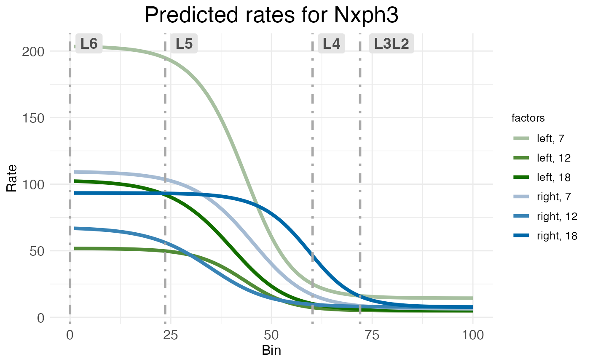
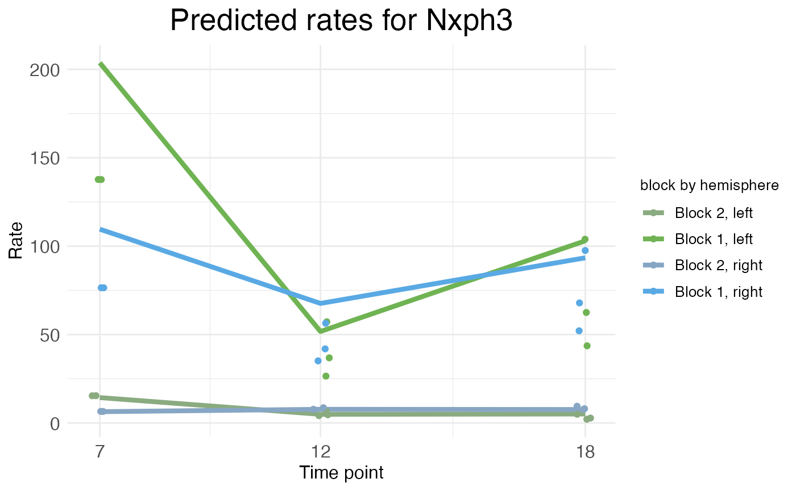

# Time-series data

## Introduction

Wisps naturally model between-group effects describable as two-valued
categorical factors, e.g., comparing controls vs a treatment or male vs
female. Coarse-grain comparisons over time, such as pre-hearing-onset vs
post-hearing-onset or postnatal day PX vs postnatal day PY, can be
shoehorned into this framework. However, it’s often desirable to model
longer time series T.

## Time series as factor series

While wisps are limited to binary covariate fixed-effect factors \xi,
i.e., \xi\in\\0,1\\, the number of factor levels can be increased to
accommodate more time points by modeling time factors \xi_T as an
ordered series of factors \xi\_{T_m} with additive effects \beta\_{T_m}.
Given a series of time points: T_1 \< T_2 \< \cdots \< T_n a
corresponding time-factor series \xi_T is defined with n ordered binary
factors: \xi\_{T_1} \< \xi\_{T_2} \< \cdots \< \xi\_{T_n} For binary
factors \xi with corresponding effect term \beta, the effect on a model
parameter z is: z \mapsto z + \beta + \text{interaction terms} To
achieve the cumulative effect of time, the effect of a time factor
\xi\_{T_m}, for m\leq n, is given by summing the series of effects
\beta\_{T_l} from time factors \xi\_{T_l} for T_l\leq T_m: z \mapsto z +
\sum\_{l=1}^{m} (\beta\_{T_l} + \text{interaction terms for }i) For a
rigorous definition, suppose that in addition to the time factor \xi_T,
there are other fixed-effect factors \xi_F each with effect \beta_F. The
effect of some time \xi\_{T_m} from \xi_T will include not only
\beta\_{T_m} and an interaction term \beta\_{T_m\times\xi_F} for all
\xi_F, but also effects \beta\_{T_l} from times \xi\_{T_l} for all l\<m
and their respective interaction terms \beta\_{T_l\times\xi_F}. Thus,
the effect of \xi\_{T_m} can be defined to be: z \mapsto z +
\sum\_{l=1}^{n} \left(\beta\_{T_l}\xi\_{T_l} +
\sum\_{F}\beta\_{T_l\times\xi_F}\xi\_{T_l}\xi_F\right) with the
stipulation that, if \xi\_{T_m}=1 for some sampled data point, then for
that data point \xi\_{T_l}=1 for all i\<m.

## Example data: postnatal age

This tutorial will use MERFISH data collected from the auditory cortex
of mice. The data has been preprocessed into laminar coordinates as
described in [the
tutorial](https://michaelbarkasi.github.io/wispack/articles/tutorial_corticallaminar.md)
on modeling the cortical-laminar axis (see also [this
preprint](https://doi.org/10.1101/2025.06.11.659209)). As with all data
appropriate for wispack, and in line with well-known modeling functions
in R (e.g.,
[lme4::lmer()](https://cran.r-project.org/web/packages/lme4/index.html),
[stats::lm()](https://stat.ethz.ch/R-manual/R-devel/library/stats/html/lm.html)),
the data must be in long format. That is, each row must correspond to a
single observation, which when modeling spatial transcriptomics data
will typically be a count of transcripts from an RNA species in a single
cell.

``` r
countdata <- read.csv(
  system.file(
      "extdata", 
      "ACx_laminar_countdata_demo.csv", 
      package = "wispack"
    )
  )

print(head(countdata))
```

``` scroll-output
##   count bin context   gene mouse hemisphere age
## 1     0  96  cortex Bcl11b     1       left  12
## 2     0  95  cortex Bcl11b     1       left  12
## 3     0  98  cortex Bcl11b     1       left  12
## 4     0 100  cortex Bcl11b     1       left  12
## 5     0  99  cortex Bcl11b     1       left  12
## 6     0  99  cortex Bcl11b     1       left  12
```

The data includes a placeholder [context
variable](https://michaelbarkasi.github.io/wispack/articles/tutorial_multicontext.md)
filled with “cortex”, a variable giving the hemisphere of each
observation:

``` r
print(unique(countdata$hemisphere))
```

``` scroll-output
## [1] "left"  "right"
```

A variable giving counts (by cell) for the following six layer specific
genes:

``` r
print(unique(countdata$gene))
```

``` scroll-output
## [1] "Bcl11b" "Fezf2"  "Satb2"  "Nxph3"  "Cux2"   "Rorb"
```

A variable giving the age (in postnatal days) of the mouse from which
each cell was collected:

``` r
for (m in unique(countdata$mouse)) {
  cat(
    paste0(
      "Mouse ", m, 
      " is age P", unique(countdata$age[countdata$mouse == m]), 
      "\n"
    )
  )
}
```

``` scroll-output
## Mouse 1 is age P12
## Mouse 2 is age P18
## Mouse 3 is age P7
## Mouse 4 is age P12
## Mouse 5 is age P18
```

Note that these three ages represent pre-hearing-onset (P7),
hearing-onset (P12), and post-hearing-onset (P18). Note also that the
genes in this data set are known to be localized to specific cortical
layers.

| Abbreviation  | Name                                       | Layer |
|:--------------|:-------------------------------------------|:------|
| BCL11B, CTIP2 | B-cell CLL/lymphoma 11b                    | 5/6   |
| FEZF2         | FEZ Family Zinc Finger 2                   | 5     |
| SATB2         | SATB Homeobox 2                            | 2/3   |
| NXPH3         | Neurexophilin 3                            | 6     |
| CUX2          | Cut like homeobox 2                        | 2/3/4 |
| RORB          | Retinoic acid-related orphan receptor beta | 4     |

Given that we have hemisphere and age data, we can thus model the
time-dependent lateralization of layer-specific gene expression of the
auditory cortex of developing mice.

## Modeling time series in wispack

The parts of a wisp model must be defined, relative to the column names
of the data. Wispack expects columns for the count to be modeled
(**count**), the spatial coordinate (**bin**), the context, e.g., brain
region or celltype (**context**), the species being counted, e.g., gene
(**species**), and the random effect factor (**ran**).

As the data includes explicit **count**, **bin**, and **context**
columns, these columns do not need to be redefined. As the names are
different, wispack does need to be told that the RNA species data is
included in the **gene** column and the random effect factor is given by
the **mouse** column. Wispack will assume any unrecognized and undefined
columns are fixed-effect columns, so **hemisphere** and **age** do not
need to be explicitly flagged as fixed-effects. However, wispack must be
told if a given fixed-effect column is to be treated as a time series
factor.

``` r
# Define variables in the dataframe for the model
data.variables <- list(
    species = "gene",
    ran = "mouse",
    timeseries = "age"
  )
```

As we’re modeling layer-specific genes, we can also grab cortical layer
boundaries which were estimated for this data independent of wisp (using
manual CCFv3 registration). These will only be used for plotting and
visualization after fitting the model, not for fitting the model itself.

``` r
boundary_path <- system.file(
    "extdata", 
    "ACx_layer_boundary_bins.csv", 
    package = "wispack"
  )
layer.boundary.bins <- read.csv(boundary_path)
```

With data loaded, variables set, and boundaries grabbed, we can fit the
wisp model. As it’s not necessary for demonstrating time-series
modeling, we’ll only fit the model (**fit_only = TRUE**) without running
any [statistical parameter
estimation](https://michaelbarkasi.github.io/wispack/articles/tutorial_stats.md).

``` r
library(wispack, quietly = TRUE)

model <- wisp(
    count.data = countdata,
    variables = data.variables,
    fit_only = TRUE,
    model.settings = list(LROwindow_factor = 2.0),
    plot.settings = list(
        print.plots = FALSE, 
        dim.bounds = colMeans(layer.boundary.bins)
      ),
    verbose = TRUE
  )
```

``` scroll-output
## 
## 
## Parsing data and settings for wisp model
## ----------------------------------------
## 
## Model settings:
##  buffer_factor: 0.05
##  ctol: 1e-06
##  max_penalty_at_distance_factor: 0.01
##  LROcutoff: 2
##  LROwindow_factor: 2
##  rise_threshold_factor: 0.8
##  max_evals: 1000
##  rng_seed: 42
##  warp_precision: 1e-07
##  round_none: TRUE
##  trtKO: none
##  inf_warp: 450359962.73705
## 
## Plot settings:
##  print.plots: FALSE
##  dim.bounds: 72, 60.2, 23.6, 0
##  log.scale: FALSE
##  splitting_factor: 
##  CI_style: TRUE
##  label_size: 5.5
##  title_size: 20
##  axis_size: 12
##  legend_size: 10
##  count_size: 1.5
##  count_jitter: 0.5
##  count.alpha.ran: 0.25
##  count.alpha.none: 0.25
##  pred.alpha.ran: 0.9
##  pred.alpha.none: 1
## 
## Variable dictionary:
##  count: count
##  bin: bin
##  context: context
##  species: gene
##  ran: mouse
##  timeseries: age
##  fixedeffects: hemisphere, age
## 
## Parsed data (head only):
## ------------------------------
##   count bin context species ran hemisphere timeseries
## 1     0  96  cortex  Bcl11b   1       left         12
## 2     0  95  cortex  Bcl11b   1       left         12
## 3     0  98  cortex  Bcl11b   1       left         12
## 4     0 100  cortex  Bcl11b   1       left         12
## 5     0  99  cortex  Bcl11b   1       left         12
## 6     0  99  cortex  Bcl11b   1       left         12
## ----
## 
## Initializing Cpp (wspc) model
## ----------------------------------------
## 
## Infinity handling:
## machine epsilon: (eps_): 2.22045e-16
## pseudo-infinity (inf_): 1e+100
## warp_precision: 1e-07
## implied pseudo-infinity for unbounded warp (inf_warp): 4.5036e+08
## 
## Extracting variables and data information:
## Found max bin: 100.000000
## Fixed effects:
## "hemisphere" "timeseries"
## Ref levels:
## "left" "7"
## Time series detected:
## "7" "12" "18"
## Created treatment levels:
## "ref" "right" "12" "18" "right12" "right18"
## Constructed weight_row matrix
## Context grouping levels:
## "cortex"
## Species grouping levels:
## "Bcl11b" "Cux2" "Fezf2" "Nxph3" "Rorb" "Satb2"
## Random-effect grouping levels:
## "none" "1" "2" "3" "4" "5"
## Total rows in summed count data table: 21600
## Number of rows with unique model components: 216
## 
## Creating summed-count data columns and weight matrix:
## Random level 0, 1/6 complete
## Random level 1, 2/6 complete
## Random level 2, 3/6 complete
## Random level 3, 4/6 complete
## Random level 4, 5/6 complete
## Random level 5, 6/6 complete
## 
## Making extrapolation pool:
## row: 720/3600
## row: 1440/3600
## row: 2160/3600
## row: 2880/3600
## row: 3600/3600
## 
## Making initial parameter estimates:
## Extrapolated 'none' rows
## Took log of observed counts
## Estimated gamma dispersion of raw counts
## Estimated change points
## Found average log counts for each context-species combination
## Context: cortex, Species: Bcl11b
## Context: cortex, Species: Cux2
## Context: cortex, Species: Fezf2
## Context: cortex, Species: Nxph3
## Context: cortex, Species: Rorb
## Context: cortex, Species: Satb2
## Estimated initial parameters for fixed-effect treatments
## Built initial beta (ref and fixed-effects) matrices
## Initialized random-effect warping factors
## Made and mapped parameter vector
## Number of parameters: 414
## Constructed grouping variable IDs
## Size of boundary vector: 2160
## 
## Fitting model to data
## ----------------------------------------
## 
## Setting boundary penalty coefficients
## Initial neg_loglik: 15281.4
## Initial neg_loglik with penalty: 15434.2
## Initial min boundary distance: 0.24777
## Final neg_loglik: 15013
## Final neg_loglik with penalty: 15120.1
## Final min boundary distance: 0.123085
## Number of evaluations: 189
## Checking feasibility of provided parameters
## ... no tpoints below buffer
## ... no NAN rates predicted
## ... no negative rates predicted
## Provided parameters are feasible
## Initial boundary distance (want > 0): 0.123085
## 
## Making rate-count plots... 
## Making time series plots...
```

## The weight matrix

Before examining the results, let’s look at the weight matrix.

``` r
print(head(model$weight.matrix))
```

``` scroll-output
##         ref right 12 18 right12 right18
## ref       1     0  0  0       0       0
## right     1     1  0  0       0       0
## 12        1     0  1  0       0       0
## 18        1     0  1  1       0       0
## right12   1     1  1  0       1       0
## right18   1     1  1  1       1       1
```

In this matrix, both rows and columns are labeled with the treatment
levels generated by the fixed-effect factors. The first, **ref**,
denotes no treatment, i.e., both factors are in their reference level.
For **hemisphere**, this is **left**, while for **age**, this is **P7**.
The other labels give the treatment level, if any, for each factor, with
the rest being in the reference level. For example, **right12** refers
to the right hemisphere at age P12, which is a treatment condition in
which both factors are in a treatment level. In contrast, **right**
refers to the right hemisphere at age P7, which is a treatment condition
in which only the **hemisphere** factor is in a treatment level.

This matrix is a *weight* matrix because the row and column labels are
also labels for weights w. Before
[warping](https://michaelbarkasi.github.io/wispack/articles/tutorial_warping.md),
the predicted count y of a sample is given by: y =
\beta\_{\text{ref}}w\_{\text{ref}} +
\beta\_{\text{right}}w\_{\text{right}} + \beta\_{12}w\_{12} +
\beta\_{18}w\_{18} + \beta\_{\text{right}12}w\_{\text{right}12} +
\beta\_{\text{right}18}w\_{\text{right}18} where \beta are the effect
parameters and w are the weights. The rows of the weight matrix give the
values of the weights w corresponding to the column labels under the
treatment conditions given by the row labels. For example, the
**right12** row specifies that w\_{\text{ref}}=1, w\_{\text{right}}=1,
w\_{12}=1, w\_{18}=0, w\_{\text{right}12}=1, and w\_{\text{right}18}=0
when in the treatment condition of the right hemisphere at age P12. That
is, when estimating a count y for a sample in the right hemisphere at
age P12, the effects \beta for the reference level, right hemisphere,
age P12, and the interaction between right hemisphere and age P12 will
all be included in the estimate, while the effects for age P18 and the
interaction between right hemisphere and age P18 will not be included.
What makes the time series additive is the way a treatment level like
**18** or **right18** include not only effects related to the age
**18**, but also effects related to all earlier ages, e.g., **12**.

## Visualizing time series

The [rate-count wisp
plot](https://michaelbarkasi.github.io/wispack/articles/tutorial_wispplots.md)
is made automatically with all calls of wisp() by an internal call to
plot.ratecount(). This style of plot conveys the spatial distribution of
a RNA species explicitly, by plotting space on the x-axis. It can only
convey changes over a time series indirectly, via coloring of the levels
of the **timeseries** factor. For example, consider the wisp plot for
NXPH3, which shows a temporally dynamic and lateralized profile in deep
layers (block 1), but almost no activity in superficial layers (block
2).

``` r
print(model$plots$ratecount$plot_pred_context_cortex_fixEff_Nxph3)
```



By default, when the **timeseries** factor is present, rate-count plots
use an HCL color space, plotting time series as graduated luminance and
the other factors as categorical levels of hue and chroma. In this case,
left-hemisphere treatment levels are in green and right-hemisphere
levels are in blue, with earlier time points dull and later time points
brighter. This makes the lateralization easy to see: the dull green line
for the left hemisphere at P7 is much higher than any of the blue lines
for the right hemisphere. However, the temporal dynamics are harder to
see and only shown implicitly. If you look closely, you should be able
to see that (for the deep layers) for both left (green) and right
(blue), the dullest line (P7) is the highest, the medium-brightness line
(P12) is the lowest, and the brightest line (P18) is in between. This
suggests that NXPH3 expression in deep layers dips at P12 relative to
P7, then rises again in P18.

While this trend can be discerned from the spatial wisp plot, wispack
offers another kind of plot for plotting time-series data which makes
the trend obvious at a glance while also clarifying it. These
time-series plots are made automatically by the wisp() function when a
time series is provided or detected, through an internal call to the
plot.timeseries() function.

``` r
print(model$plots$timeseries$plot_pred_context_cortex_timeseries_Nxph3)
```



Wisp time-series plots keep the y-axis a representation of rate, but
switch the x-axis to a representation of the time-series points.
However, the spatial aspect of the data is not completely lost. Instead
of plotting the predicted rate on the y-axis, which would include not
only the rate parameter but also the effects of transition-point
location and transition-point slope, the time-series plot instead plots
just the rate parameter itself. This parameter is a vector, each element
of which is the rate for a block of space defined by transition points.
In the NXPH3 time-series plot above, the dip in expression at P12 in the
deep layers (block 1) can be seen more clearly.

We could plot and discuss the rest of the layer-specific genes in this
data set, but the plots (as produced by these function calls) are messy.
This is because this analysis of the data does not account for how gene
expression depends on cell type. To properly analyze this data, we need
to include cell type in the model as well. This is explained in the
[cell type
tutorial](https://michaelbarkasi.github.io/wispack/articles/tutorial_multicontext.md),
which also includes all plots.
