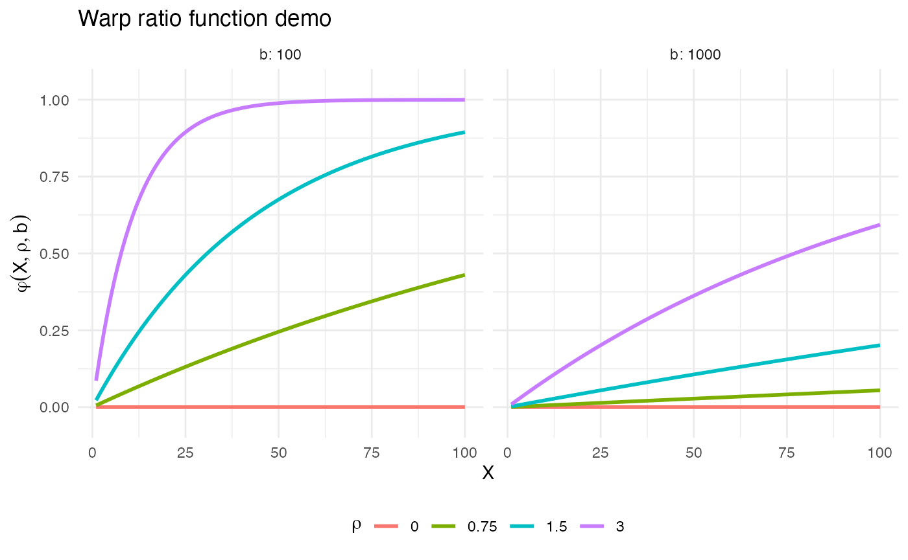
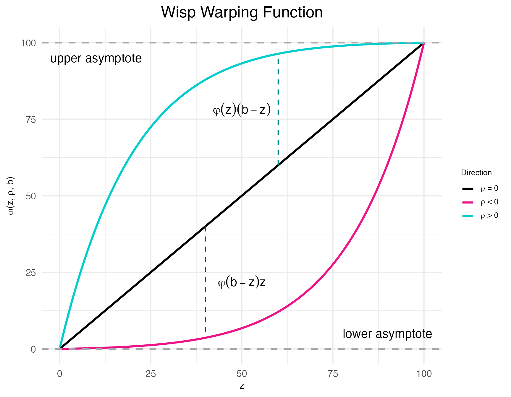
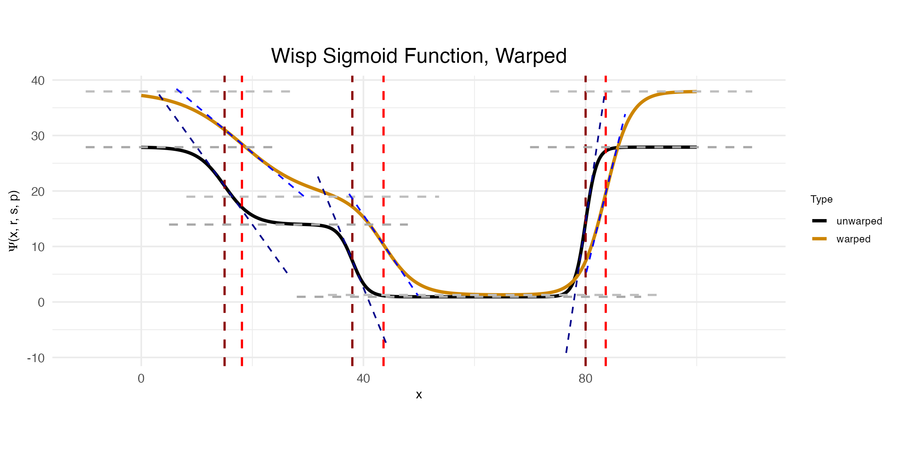

# Random effects and warping

## Introduction

Separating signal from noise is a central issue in science. Observations
of a variable reflect both the true expected population value *and*
random variation. The lower the sample size, the more random variation
will influence the observed values.

A common method for dealing with random variation is to normalize
observations. For example, with our [somatosensory cortex
data](https://michaelbarkasi.github.io/wispack/articles/tutorial_corticallaminar.md),
we could have tested the effect (if any) of hemisphere on transcript
spatial distribution by making the point of highest expression rate
equal across the hemispheres (e.g., both set to one), then rescaled the
other values accordingly. These rescaled, i.e., *normalized*, values
would then be used in our statistical tests or regression modeling.
Alternatively, instead of normalizing, we could model the raw data, but
use a regularization technique to prevent overfitting to the random
variation. For example,
[ELLA](https://michaelbarkasi.github.io/wispack/articles/tutorial_benchmarks.md)
uses L1 regression to good effect to control false-positive and
false-discovery rates.

In the context of spatially variable genes, regularization is a better
option than normalization, as normalization can wash out differences in
spatial distribution ([Salim et al
2025](https://doi.org/10.1186/s13059-025-03565-y), [Bhuva et al
2024](https://doi.org/10.1186/s13059-024-03241-7)). However, there is a
third approach to handling sample noise: explicitly modeling the random
variation as a *random effect*. Models with random-effect terms are
often called *mixed-effects models*, as they contain both fixed-effect
terms (e.g., the effect of hemisphere on expression rate) and
random-effect terms (e.g., the random variation in expression rate due
to sample-specific factors). Wisp models are mixed-effects models. They
employ a random-effect term to factor out individual variation.[^1]

Although we won’t use it right away, let’s load wispack awhile:

``` r

# Set random seed for reproducibility
set.seed(123)
# Load wispack
library(wispack, quietly = TRUE)
```

## Random-effect structure

In a traditional *linear* mixed-effects model, the observations y are
modeled as a function of some fixed effects \mathbf{X}\beta plus random
effects \mathbf{Z}\rho plus noise \epsilon, for covariate design
matrices \mathbf{X} and \mathbf{Z}, fixed-effect coefficients \beta, and
random-effect coefficients \rho: y = \mathbf{X}\beta + \mathbf{Z}\rho +
\epsilon
[Recall](https://michaelbarkasi.github.io/wispack/articles/tutorial_Poisson.md)
the logistic function: \psi(x,r,s) = \frac{r}{1 + \exp({sx})} Also
recall that a wisp models the log transform (plus one) of expression
rate \lambda as a function of the poly-sigmoid function: \Psi(x,r,s,p) =
r_1 + \sum\_{i=1}^n \psi(x - p_i, r\_{i+1} - r\_{i}, -s_i) of spatial
position x, rates r, slopes s, and transition points p.

A possible suggestion is to treat random effects for individual samples
k just as in the linear case, as an additive term: \log_e(\lambda + 1) =
\Psi(x,r,s,p) + \rho(k) However, this proposal is unworkable. From an
intuitive point of view, a constant value added across the entire space
could at best be a very rough approximation of the true random effect.
More importantly, there are bounds to consider. The predicted rate
\lambda must be positive. There will be many cases in which \lambda is
well above zero for some points x and near zero for other points x,
while some k has a negative random effect \rho(k) in the high-expression
region with a magnitude larger than the predicted rate in the
low-expression region. This situation could be avoided if \rho were also
a function of x, but that only raises the question of how to model
\rho(x,k). For example, a function \rho linear in x certainly would not
solve the problem.

Another potential solution would be to treat \rho as a function of \Psi
itself: \log_e(\lambda + 1) = \rho(\Psi(x,r,s,p), k) However, on this
proposal \rho would only be sensitive to changes in predicted rate. It
would be indifferent to the other spatial parameters (transition slopes
s and transition points p). This problem has an obvious solution: the
random-effects \rho should be applied directly to the spatial
parameters: \log_e(\lambda + 1) = \Psi(x, \rho_r(r,k), \rho_s(s,k),
\rho_p(p,k)) Still, it’s not clear what form \rho should take. In
addition, each spatial parameter comes with its own bounds. All three
spatial parameters have a lower bound of zero, while transition points
are bounded above by the maximum spatial position (e.g., bin 100 in our
cortex data). Thus, whatever form \rho takes, it must respect these
bounds.

## Warping

To solve our problem about the form of \rho, let’s distinguish between:

1.  some scalar value unique to sample k and parameter z which specifies
    how much the value of z for k is off what’s expected, and
2.  a function which transforms z according to this value, in a way that
    respects the bounds on z, consistent across all k.

Let’s reserve the symbol “\rho” for the scalar value (or a vector of
these scalar values) and use the symbol “\omega” for the transforming
function. Let’s also assume that \rho\geq 0 indicates values above (or
equal to) what’s expected, and \rho\<0 indicates values below what’s
expected. If \Delta(z,b) = b - z is the distance from z to the *upper*
boundary b and we assume that z\leq b, then: \begin{array}{l l} z \leq
\omega(z, b) \leq z + \Delta(z,b) & \text{ if } \rho\geq 0 \\ z \geq
\omega(z, b) \geq 0 & \text{ if } \rho \< 0 \end{array} Thus, a possible
form for \omega would use a ratio term \varphi between zero and one to
scale the distance to the upper boundary for positive \rho and to scale
z itself down towards zero for negative \rho: \omega(z, b) =
\begin{cases} z + \varphi(\rho)\Delta(z,b) & \text{if } \rho \geq 0 \\
z - \varphi(\rho)z & \text{if } \rho \< 0 \end{cases} What form could
this function \varphi take? There are a few constraints to consider:

1.  When \rho=0, \varphi should be zero, so that \omega(z,b)=z. That is:
    \varphi(0) = 0.
2.  \varphi is a smooth function for all values of \rho and b (allowing
    for well-defined gradients).
3.  For all inputs, 0\leq\varphi\leq 1.

Many functions could satisfy these requirements. The one used by wisp
models is: \varphi(X, \rho, b) = 1 - (e^{\rho^2})^{-X / b} Condition (1)
is clearly satisfied, give that e^{\rho^2}=1 when \rho=0. Condition (2)
is satisfied as well, as the exponential function is smooth everywhere.
That condition (3) is satisfied, so long as X\>0, can be seen by noting
three lemmas: first, e^{\rho^2X/b} is monotonically increasing in \rho
whenever X\>0 and b\>0. Second, if \rho = 0, then 1/e^{\rho^2X/b} = 1.
Third, 1/e^{\rho^2X/b} = 0 as \rho\rightarrow\infty.

What is X in the function \varphi(X, \rho, b) and how do we know it will
be positive? Let’s first examine a plot of the warp-ratio function
\varphi:

``` r

# Code the ratio function
warp_ratio <- function(X,rho,b) 1 - exp(rho^2)^(-X / b)

# Set some demo terms
rhos  <- c(0, 0.75, 1.5, 3)
bs    <- c(100, 1e3)
max_X <- 100

# Make data frame for plotting
demo_data <- data.frame(
  X     = rep(c(1:max_X), length(bs)*length(rhos)),
  rho   = factor(rep(rep(rhos, each = max_X), length(bs))),
  b     = factor(rep(bs, each = max_X*length(rhos))),
  ratio = c(
    vapply(bs, 
      function(j) c(
        vapply(
          rhos, 
          function(r) warp_ratio(c(1:max_X), r, j), 
          numeric(max_X)
          )
        ),
      numeric(max_X*length(rhos))
    )
  )
)

# Make plots
ggplot(demo_data) +
  geom_line(aes(x = X, y = ratio, color = rho), linewidth = 1) +
  scale_y_continuous(expand = expansion(mult = c(0.1, 0.1))) +
  facet_wrap(~b, labeller = label_both) +
  labs(
    title = "Warp ratio function demo",
    x     = "X",
    y     = expression(varphi(X, rho, b)),
    color = expression(rho)
  ) +
  theme_minimal() + 
  theme(legend.position = "bottom")
```



As the plots show, the closer X is to the upper bound b, the closer
\varphi is to 1, and the closer \text{max}(X) is to b, the steeper the
curve of \varphi. Thus, for the case when \rho \geq 0, it seems
reasonable to set X=z. That is, when z is small and needs to be
increased, it should only be increased a small amount of the total
possible distance \Delta(z,b). Conversely, the larger z is, the larger
the increase should be.

What about the case when \rho \< 0? The same logic would seem to hold,
suggesting that again X=z, except for one problem. When b is near the
maximum possible value of z, then \omega will send z towards zero as z
increases. To see why this behavior is a problem, consider the one case
in a wisp model in which b is not infinite: transition point locations
p. If the points p near the upper spatial boundary b can be pulled down
to zero, then they will bunch up on top of each other.

Thus, for the case when \rho \< 0, a natural suggestion is to set:
X=\Delta(z,\text{max}(z))=\text{max}(z)-z However, while this works when
b is near \text{max}(z), it fails when b=\infty. In that case,
\varphi\approx 0, and so \omega(z,b)\approx z. A better approach is to
set: X=\Delta(z,b)=b-z This achieves the same effect when b is near
\text{max}(z), but still works when b=\infty.

Thus, the final form of the random-effect term is: \omega(z, \rho, b) =
\begin{cases} z + \varphi(z,\rho,b)\Delta(z,b) & \text{if } \rho \geq 0
\\ z - \varphi(\Delta(z,b),\rho,b)z & \text{if } \rho \< 0 \end{cases} A
positive benefit of this approach is that when there is no upper bound,
i.e., b=\infty, \omega(z,b) is linear with respect to z. A proof of this
theorem is provided in appendix of both the original wisp
[preprint](https://doi.org/10.1101/2025.06.11.659209) and the final
published [paper](https://doi.org/10.1093/nar/gkag466).

Wispack provides a function demo.warp.plots for visualizing the function
\omega and its effect on the poly-sigmoid \Phi.

``` r

warp_plots <- demo.warp.plots(
    w            = 2,                      # warping factor for plot 1
    point_pos    = 60,
    point_neg    = 40,
    Rt           = c(6, 3, 0.2, 6) * 4.65, # rates for poly-sigmoid
    tslope       = c(0.4, 0.75, 1),        # slope scalars for poly-sigmoid
    tpoint       = c(15, 38, 80),          # transition points for poly-sigmoid
    w_factors    = c(0.6, -0.9, 0.5),      # warping factors for poly sigmoid (plot 2)
    return_plots = TRUE
  )
```

The function demo.warp.plot creates two plots. The first shows \omega
itself for specified warping factors \rho=\langle-w,0,w\rangle.

``` r

print(warp_plots$demo_plot_warpfunction)
```



As can be seen clearly in this plot, \omega is referred to as a “warping
function” because it warps the input z towards the upper and lower
bounds. Indeed; the “w” in “wisp” refers to this behavior: *warped*
sigmoidal Poisson-process mixed-effects models.

The second plot created by demo.warp.plot shows the effect of \omega on
\Phi. In this plot, model parameters are represented by colored dashed
lines: gray for rates, red for transition-point locations, and blue for
transition-point slopes. Darker shades represent the original, unwarped
parameters, while lighter shades represent the warped parameters.

``` r

print(warp_plots$demo_plot_warpedsigmoid)
```



Notice that to make this plot, three warping factors \rho were provided:
\langle 0.6, -0.9, 0.5\rangle. The first is the warping factor for the
rate parameter, the second is for the slope parameter, and the third is
for the transition point parameter. As can be seen in the plot, the
warping function \omega has the effect of increasing the rate,
decreasing the slope, and increasing the transition point location.

[^1]: As explained in the tutorial on [modeling cell
    types](https://michaelbarkasi.github.io/wispack/articles/tutorial_multicontext.md),
    as of v2.4, the random-effect term of a wisp model is primarily
    intended to capture variation from external noise (e.g., tissue
    preparation), rather than from internal biological variation (e.g.,
    cell type differences). This intention is baked into how the
    random-effect term interacts with the species and context variables.
    The random-effect term depends only on the former, not the latter.
