# Plotting wisp models

## Introduction

Wisp models can include thousands of parameters, each with their own
intuitive physical interpretation. At bottom, wisp models are
parameterized by a handful of [fixed-effect spatial
parameters](https://michaelbarkasi.github.io/wispack/articles/tutorial_Poisson.md)
– block rates, transition points, and transition slopes – plus
[random-effect
scalars](https://michaelbarkasi.github.io/wispack/articles/tutorial_warping.md)
for each of these fixed-effect spatial parameters. However, the
fixed-effect spatial parameters multiply with the number of species, the
number of
[contexts](https://michaelbarkasi.github.io/wispack/articles/tutorial_multicontext.md),
and the number of treatment conditions. The random-effect scalars
multiply by replicate count and species. The upshot is that a wisp model
will produce a dizzying array of parameter estimates and hypothesis test
results. To help with interpretation, wispack includes a number of
intuitive plotting options for visualizing wisp model results.

## Rate-count plots

The backbone of wisp visualization is the rate-count plot, as in
“predicted rate, observed count”. Rate-count plots come in two forms,
one giving confidence-intervals (CI) and the other giving a scatter plot
of observations.

### Confidence intervals

The CI rate-count plot is a simplified line plot showing predicted rate
as a function of spatial position, along with a 95% confidence interval
for the rate at each spatial location. As a demonstration, let’s grab
the model of the laminar axis of somatosensory cortex from the RORB
[tutorial](https://michaelbarkasi.github.io/wispack/articles/tutorial_corticallaminar.md):

``` r
# Set random seed for reproducibility
set.seed(123)
# Load wispack
library(wispack, quietly = TRUE)
# Load demo model
model <- readRDS(
  system.file(
      "extdata", 
      "corticallaminar_model.rds", 
      package = "wispack"
    )
  )
```

Note that the saved model just loaded was made under exactly the same
conditions as the original from the RORB
[tutorial](https://michaelbarkasi.github.io/wispack/articles/tutorial_corticallaminar.md),
except that the wisp function was set, as in the following code chunk,
to also run a thousand bootstraps in addition to the default MCMC walk.
We want bootstraps because we will be plotting the model parameters
below, and bootstraps generate more reliable [parameter
estimates](https://michaelbarkasi.github.io/wispack/articles/tutorial_stats.md)
than the MCMC walk.

``` r
model <- wisp(
    count.data = countdata,
    variables = data.variables,
    plot.settings = list(
        print.plots = FALSE, 
        dim.bounds = colMeans(layer.boundary.bins)
      ),
    bootstraps.num = 1000, 
    max.fork = 5,
    verbose = TRUE
  )
```

For now, for the rate-count plots, we can also grab the layer-boundary
points from the [CCFv3](https://doi.org/10.1016/j.cell.2020.04.007)
registration for comparison:

``` r
layer.boundary.bins <- read.csv(
  system.file(
      "extdata", 
      "S1_layer_boundary_bins.csv", 
      package = "wispack"
    )
  )
```

Let’s use the plot.ratecount function to reproduce the RORB plot that
was made and shown in the previous tutorial:

``` r
plot.ratecount(
  model,
  dim.boundaries = colMeans(layer.boundary.bins),
  species = "Rorb" 
  )
```

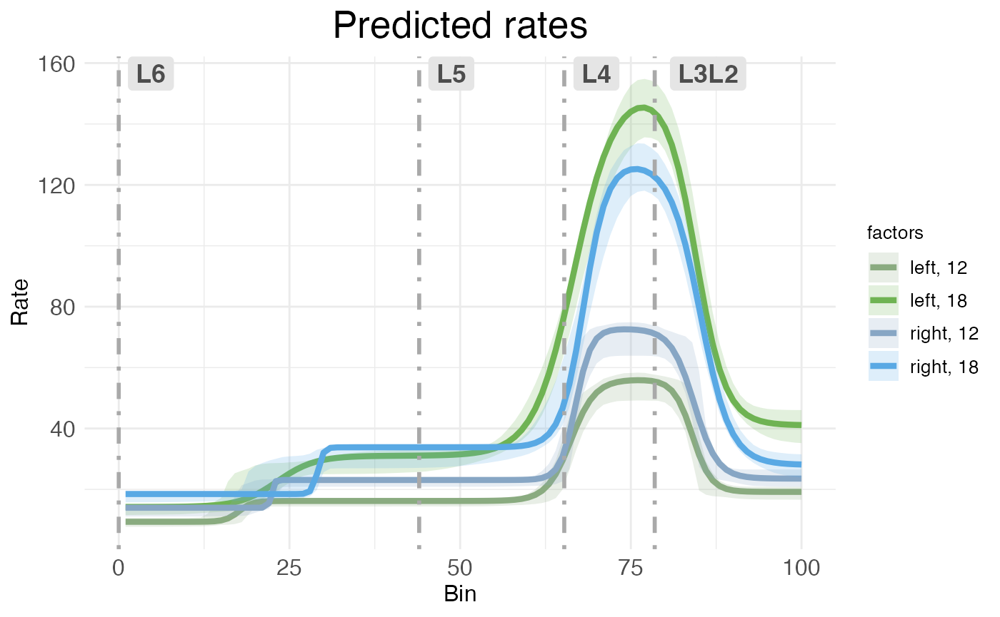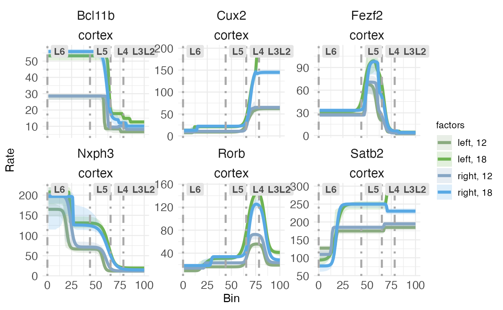

CI rate-count plots are straightforward to interpret: The horizontal (x)
axis shows spatial position along the modeled spatial dimension, the
vertical (y) axis shows predicated rate. The solid line represents
predicated rate, after random effects have been filtered out. The shaded
ribbons show the 95% confidence interval around the predicated rate. As
explained in the RORB
[tutorial](https://michaelbarkasi.github.io/wispack/articles/tutorial_corticallaminar.md),
this confidence interval is computed without any multiple comparison
correction (unlike p-values, which are corrected for multiple
comparisons). Note that the different ribbon sizes in this plot compared
to the plot from the RORB
[tutorial](https://michaelbarkasi.github.io/wispack/articles/tutorial_corticallaminar.md)
are due to using bootstraps instead of MCMC samples.

Both kinds of rate-count plots separate treatment conditions. In this
data, we have two covariates, hemisphere and age, each with two levels
(left vs right for hemisphere, P12 vs P18 for age). Thus, the plot shows
the predications for the four possible combinations of covariates (i.e.,
the reference condition of left-12, plus three treatment conditions).

By default, both kinds of rate-count plots show rate as a raw value.
However, it’s possible to rescale the vertical axis into log form:

``` r
plot.ratecount(
  model,
  dim.boundaries = colMeans(layer.boundary.bins),
  species = "Rorb",
  log.scale = TRUE
  )
```

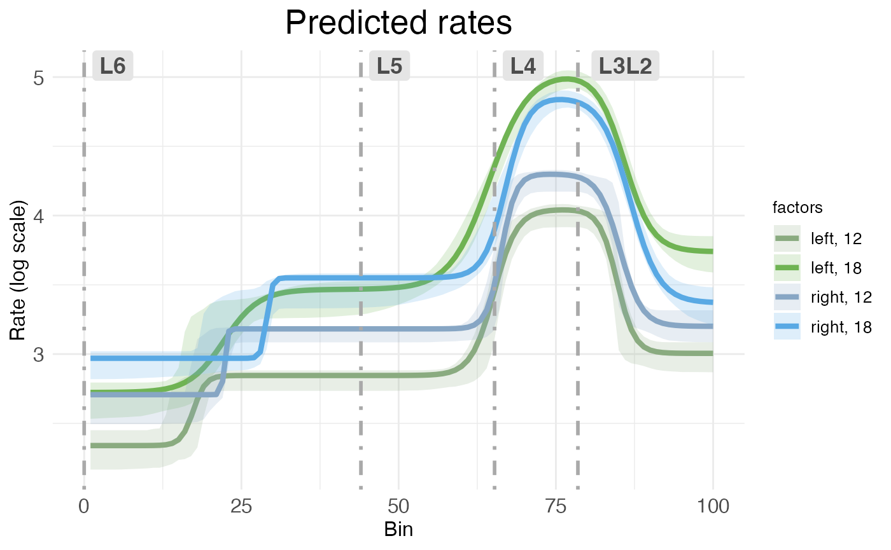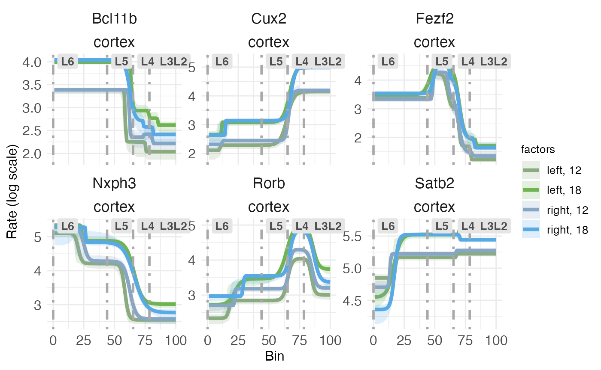

### Scatter plots

The second kind of rate-count plot, the scatter rate-count plot, is a
more complex plot showing predicted rate without random effects as a
line, model fit to individual replicates as dashed lines, and observed
counts as scatter points. It’s accessed via the CI_style argument in
plot.ratecount:

``` r
plot.ratecount(
  model,
  dim.boundaries = colMeans(layer.boundary.bins),
  CI_style = FALSE,
  species = "Rorb" 
  )
```

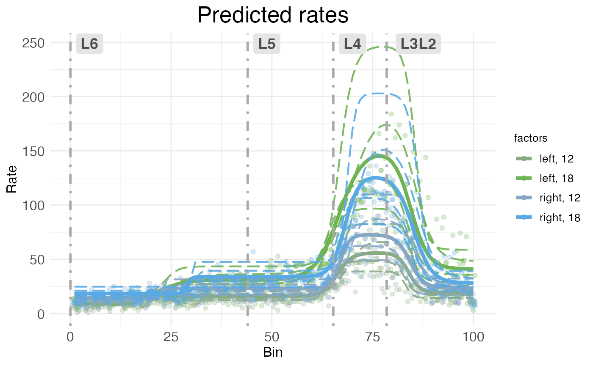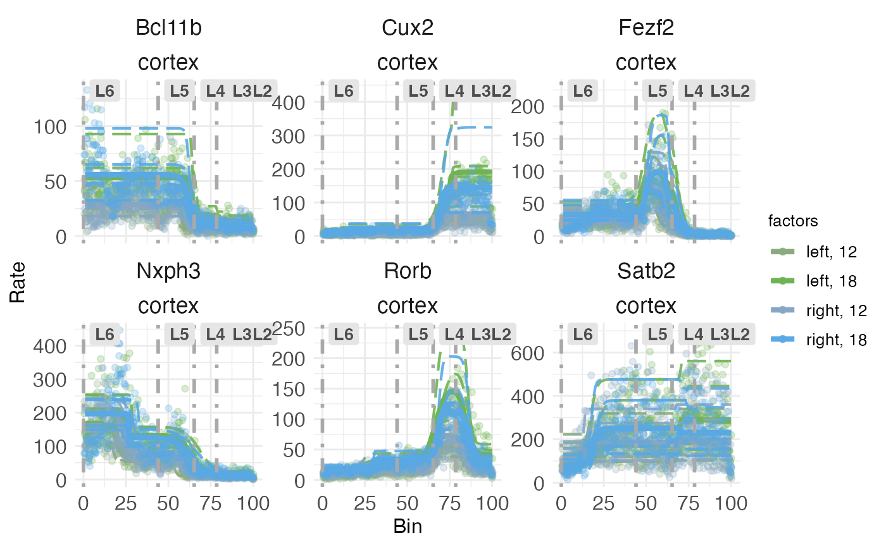

As with CI rate-count plots, the horizontal axis represents spatial
position along the modeled dimension, and the vertical axis represents
predicted rate.

The main advantages of scatter rate-count plots are that they show how
well the model fits the observed data, and also show the variability in
individual replicates. Still, they can be visually crowded, so wispack
provides a function to decompose them into their components.

``` r
plots.decomp <- plot.decomposition(
  model,
  dim.boundaries = colMeans(layer.boundary.bins),
  species = "Rorb"
  )
```

First, let’s look at separate plots of counts (observed vs extrapolated
without random effets) and predicted rates (fit of observed counts vs
predicted rates without random effects):

``` r
grid.arrange(grobs = plots.decomp[2:5], ncol = 2)
```

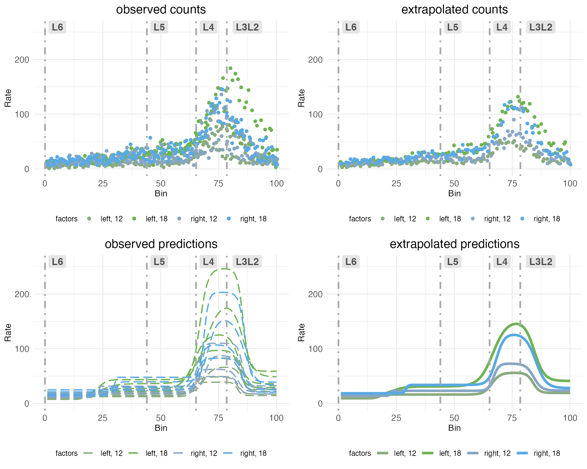

The upper left plot (observed counts) shows one point for the total
count of RORB transcripts observed in a given replicate at a given
spatial bin. The upper right plot (extrapolated counts) shows
extrapolated counts got by taking the mean of the actual replicates
within in bin. These means stand in for observations from a hypothetical
replicate with no noise or other random effects. The lower left plot
(observed predictions) shows the model fit to the observed counts. The
lower right plot (extrapolated predictions) shows the fit to the
extrapolated counts, which serves as a stand in for the predicted rate
without random effects.

Next, let’s look at observed counts (points) and their fits (dashed
lines) on the same plot, but broken out by sample:

``` r
grid.arrange(grobs = plots.decomp[7:length(plots.decomp)], ncol = 2)
```

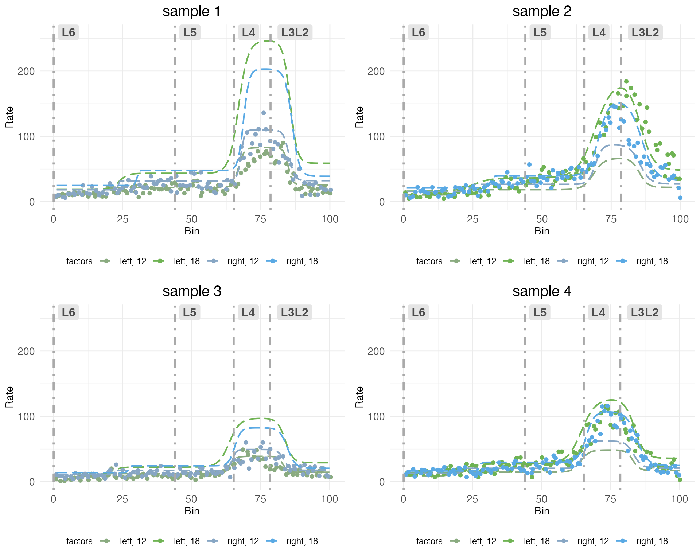

Notice how each plot has two dashed lines which fit the observed counts
well, and two which do not. This is because the model is fit to each
sample in all treatment conditions. The treatment conditions are got by
the interaction of covariates hemisphere and age. Although each sample
includes both hemispheres, it can only include one age. The model pulls
information across samples to extrapolate the fit for the missing
treatment conditions. Thus, some of the dashed lines represent fits to
observed counts in treatment conditions that were not actually observed
in that sample.

## Time-series plots

For models fit with a covariate specified as a [time
series](https://michaelbarkasi.github.io/wispack/articles/tutorial_timeseries.md),
wispack provides a function to plot predicted rates as a function of
time. This is done with the plot.timeseries function. Although there are
only two ages in the cortical laminar data, we can still use this
function to visualize how predicted rates change with age. Let’s look at
the time-series plot for RORB again:

``` r
plot.timeseries(
  model, 
  species = "Rorb"
  )
```

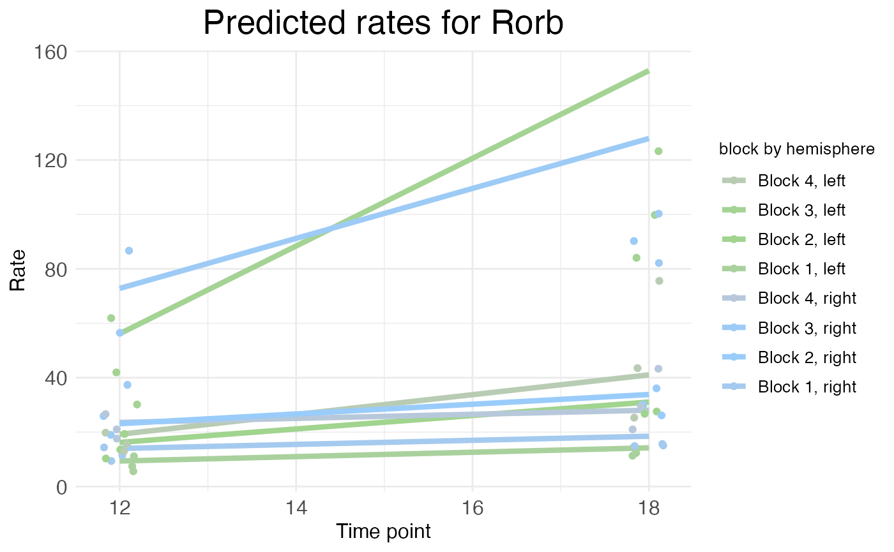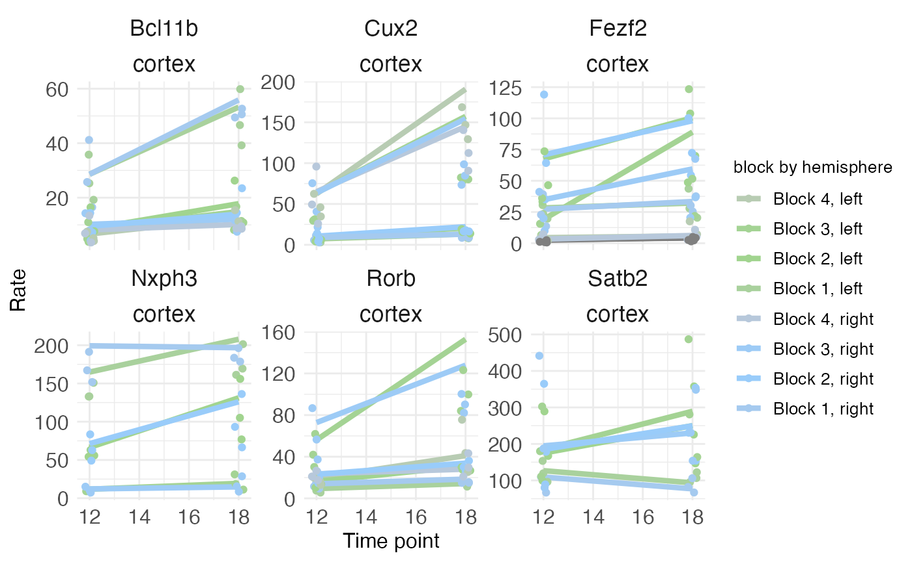

As explained in the [time series
tutorial](https://michaelbarkasi.github.io/wispack/articles/tutorial_timeseries.md),
the rate represented by the height of the solid lines is the rate
parameter itself (for each block), not the actual predicted rate. The
actual predicated rate at a given bin (or the mean predicated rate
across an entire block) can be lower than the rate parameter, depending
on the slope parameters of the transitions. In time series plots, the
points represent the mean observed rate across an entire block (with
random effects filtered out). Thus, as is the case in this example, the
distance between the observed points and the predicted rates is not
necessarily a sign of a bad fit. As can be seen in the rate-count plots
above, the fit is quite good.

## Parameter plots

Rate-count and time-series plots show observed and predicted gene
expression rates as a function of spatial position, time, and (at least
implicitly) treatment conditions. However, with the exception of
time-series plots showing rate parameters, these plots do not directly
show the underlying rate, transition point, and slope parameters – or
the corresponding random-effect scalars – that define a wisp model.

``` r
plots.param <- plot.parameters(
  model,
  species = "Rorb"
  )
```

The plot.parameters function produces separate plots for the baseline
(reference condition) parameters, the treatment condition parameters,
and the random-effect scalars. Let’s look at the baseline parameters
first:

``` r
plots.param$plot_baseline_cortex_Rorb
```

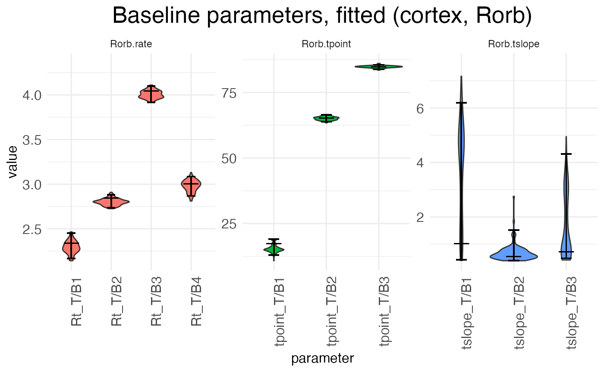

There are three separate plots: Rorb.rate gives the baseline (left, P12)
block rates in log space, Rorb.tpoint gives the baseline transition
point locations, and Rorb.tslope gives the baseline transition slopes
for each of the three transition points. The horizontal axis tick labels
are formatted as \_T/B, where is Rt (rate), tpoint (transition point
location), or tslope (transition slope), T/B stands for
“transition/block”, and gives the transition or block number. For
example, Rt_T/B2 is the rate parameter for block 2, while tpoint_T/B1 is
the location of the first transition point, i.e., the transition between
block 1 and block 2. For each horizontal axis tick, there is a violin
plot showing the distribution of the estimates for that parameter across
the bootstraps (or the MCMC walk), with a longer horizontal line showing
the best-fit estimate and two shorter horizontal bars showing the 95%
confidence interval.

There are three true (i.e., non-baseline) treatment conditions: the left
hemisphere at P18, the right hemisphere at P12, and the right hemisphere
at P18. Let’s look first at the parameters giving the effect of
switching hemispheres in the reference condition, i.e., the shift from
left to right hemisphere at P12:

``` r
plots.param$plot_treatment_right_cortex_Rorb
```

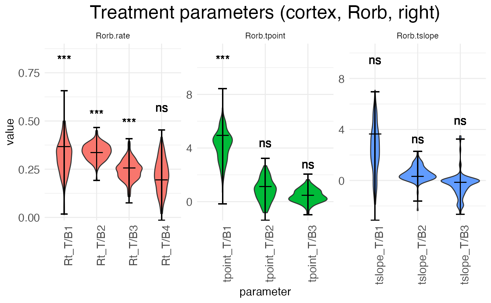

Notice that interpreting the parameters in the baseline condition is
straightforward. For example, Rt_T/B2 is the actual rate in block 2.
However, the parameters for the treatment conditions are additive
offsets, i.e., log-fold changes. Thus, positive parameter values
represent an *increase* in the value, while negative parameter values
represent a *decrease* in the value.

Another point of difference between the baseline and (true) treatment
condition parameters is that the latter are tested for significance
against a null hypothesis of zero (no change from baseline). The results
of these tests are shown above the parameter in the typical notation:
“ns” is not significant, “\*” is p \< 0.05, “\*\*” is p \< 0.01, and
“\*\*\*” is p \< 0.001.

``` r
plots.param$plot_treatment_18_cortex_Rorb
```

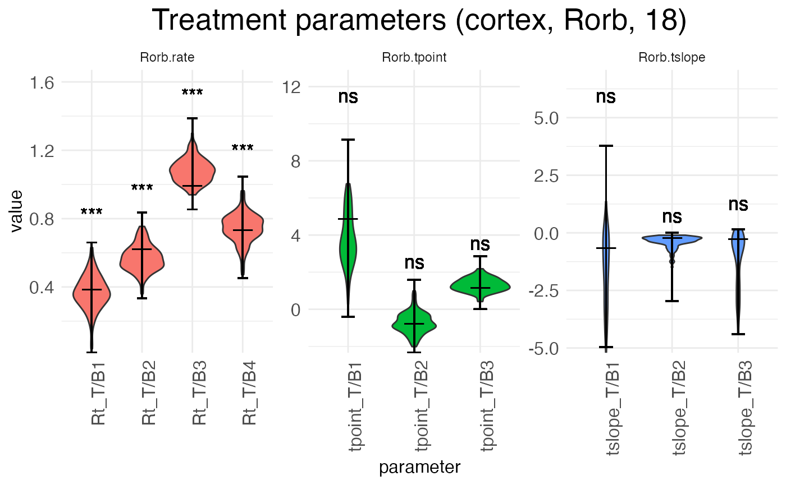

The above plot shows the parameters for the effect of age (the shift
from P12 to P18) in the reference condition (left hemisphere). The next
plot shows the interaction effect of age in the right hemisphere:

``` r
plots.param$plot_treatment_right18_cortex_Rorb
```

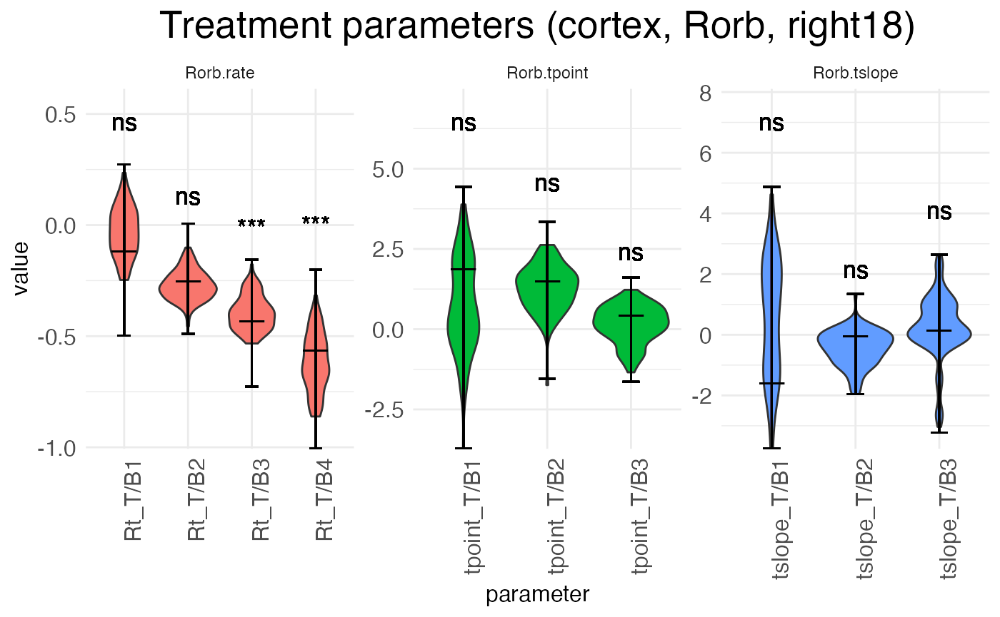

Finally, we can look at the random-effect scalars for each parameter:

``` r
plots.param$plot_ranEff_cortex_Rorb
```

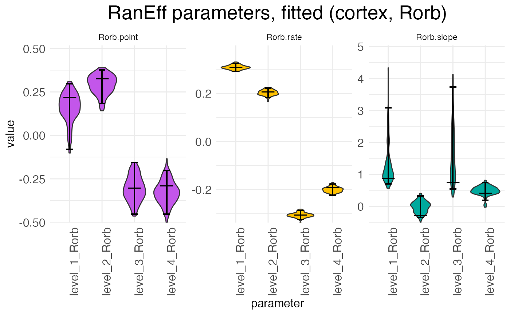

There is one scalar for each parameter type (rate, transition point,
transition slope), with each sample (i.e., replicate) having its own set
of scalars. For example, in the above plot we can see at a glance that
samples 1 and 2 have rates that are higher than expected while samples 3
and 4 have rates that are lower than expected. The exact interpretation
of the random-effect parameters is discussed in the [warping
tutorial](https://michaelbarkasi.github.io/wispack/articles/tutorial_warping.md).
