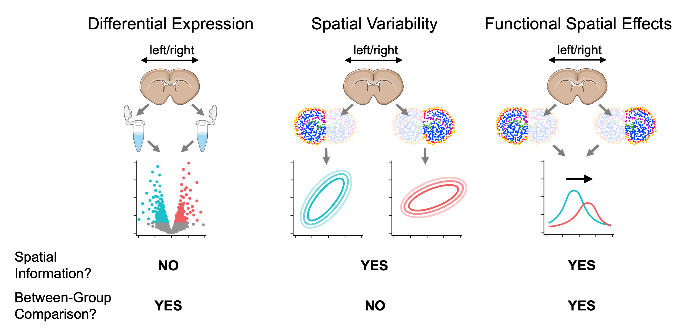

# Wispack: An R package for warped sigmoidal Poisson-process mixed-effects modeling

Michael Barkasi

July 3, 2026 (v2.5)

## Introduction

Wispack (pronounced “wisp package” or “wisp pack”) is an R package for
testing for between-group effects on spatial variation in spatial
transcriptomics data. As such variation is often functional, these can
be thought of as *functional spatial effects* (FSE).


True-color image of fluorescing probes bound to mRNA molecules in
cortical cells, the raw data of spatial transcriptomics.

Unlike testing for spatially variable genes (SVGs), which only involves
testing for spatial variation of gene expression *within* a group, and
unlike differential expression (DE) analysis which tests for
*between-group* effects without regard to spatial distribution, testing
for FSEs involves testing whether a factor such as age or rearing
conditions has a nonzero effect on spatial variation between groups
differing on that factor.



Comparison between testing for differentially expressed genes, spatially
variable genes, and genes with function spatial effects. For
visualization purposes, mouse brain slices represent the tissue sample
and laterality (left vs right hemisphere) represents a fixed effect
(i.e., covariate).

Wispack performs FSE testing by first using change-point detection to
find spatial variation in samples, then fitting a nonlinear mixed-effect
model to the detected change points. The core of the nonlinear model is
a parameterization of the found change-points as inflections in logistic
functions representing gradients of gene expression change. Multiple
change-points are handled by summing the component logistic functions
into a “poly-sigmoid” function. Fixed effects (such as age or rearing
conditions) are then modeled as effects on the underlying logistic
parameters. Random (within group) effects are modeled as further
nonlinear warping of the poly-sigmoid. Significance testing is performed
on the effects through either bootstrapping or MCMC resampling. A
complete mathematical description of wisp models can be found in this
[paper](https://doi.org/10.1093/nar/gkag466), with more applied details
covered in the tutorials on this site. (See the “Articles” link in the
navigation bar.)


Demo plots of the functions involved in wisp. (A) The logistic function,
used to model a single change point in gene expression. (B) The wisp
poly-sigmoid function, built from three logistic components,
representing three change points. (C) The warping function used to
represent random effects, e.g., variation due to differences between
individual animals or due to measurement noise. (D) The wisp
poly-sigmoid from (B) with warping function applied.

Wispack provides a user-facing function, wisp, which takes a data frame
in the familiar format expected by standard R functions for linear
models (e.g.,
[lme4::lmer](https://cran.r-project.org/web/packages/lme4/index.html) or
[stats::lm](https://stat.ethz.ch/R-manual/R-devel/library/stats/html/lm.html))
and runs the complete test for FSEs. Preprocessing of the data is
generally required before passing it to wisp, after which wisp executes
a pipeline involving parameter estimates, prediction, model fitting, and
hypothesis testing. Note that as of version 2.2, wisp includes the
option (LRO_cost, under model.settings) to perform a grid search for the
best settings for the change-point detection (LRO) search, where “best”
is defined as either lowest AIC, BIC, or negative log-likelihood.


Top-level overview of wisp modeling pipeline.

As shown by the figure below, the steps of this pipeline are nonlinear
and recurrent.


Full modeling pipeline for wisp. Boxes represent variables in the model,
or operations performed on variables. Arrows represent input-output
relationships between these variables and operations.

Unlike standard linear modeling packages in R which require a model
formula, wisp merely needs the data. For example, the quick-start demo
(which uses data from mice on RORB expression across the laminar axis of
the primary somatosensory cortex) runs the following code:

``` r

# Set random seed for reproducibility
ran.seed <- 123
set.seed(ran.seed)

# Load wispack
library(wispack)

# Load demo data
countdata <- read.csv(system.file(
      "extdata", 
      "S1_laminar_countdata_demo_default_col_names.csv", 
      package = "wispack"
    )
  )

# Fit model
laminar.model <- wisp(countdata)

# View model 
View(laminar.model)
```

No model formula is required. By default, wisp models include all
possible effect interactions. However, as of version 2.1, effect
interactions can be removed from the model using the trtKO argument in
model.settings. Further, if not a set of defaults, column names from the
data must be associated with model variables using the variables
argument. For example:

``` r

# Define variables in the dataframe for the model
data.variables <- list(
    count        = "count",
    bin          = "bin", 
    context      = "cortex", 
    species      = "gene",
    ran          = "mouse",
    timeseries   = "age",
    fixedeffects = c("hemisphere", "age")
  )
  
# Remove the hemisphere x age interaction from the model
model.settings <- list(
    trtKO = c("right18")
  )
  
# Fit model
laminar.model <- wisp(
    count.data     = countdata,
    variables      = data.variables,
    model.settings = model.settings
  )
```

Both the quick-start demo and another demo showing all model options can
be run using the demo() command:

``` r

demo("quick_start",  package = "wispack")  
demo("full_options", package = "wispack")
```

The tutorials provide more detailed walkthroughs of the package and its
options:

1.  [*Poisson processes and
    sigmoids:*](https://michaelbarkasi.github.io/wispack/articles/tutorial_Poisson.md)
    Introduction to how wisps parameterize and model the spatial
    distribution of count data from a Poisson process such as gene
    transcription.
2.  [*Random effects and
    warping:*](https://michaelbarkasi.github.io/wispack/articles/tutorial_warping.md)
    Explanation of random-effect modeling and how it’s implemented in a
    wisp.
3.  [*RORB along the cortical laminar
    axis:*](https://michaelbarkasi.github.io/wispack/articles/tutorial_corticallaminar.md)
    A detailed walkthrough of modeling a real biological dataset with
    wisp.
4.  [*Time-series
    data:*](https://michaelbarkasi.github.io/wispack/articles/tutorial_timeseries.md)
    Explanation of how wisp models times-series data.
5.  [*Radial zonation in liver
    lobules:*](https://michaelbarkasi.github.io/wispack/articles/tutorial_liverradial.md)
    A second example application from a different biological dataset,
    with an emphasis on time series and temporal-spatial interactions.
6.  [*Modeling cell
    types:*](https://michaelbarkasi.github.io/wispack/articles/tutorial_multicontext.md)
    An extension of the RORB example showing how to model not only
    Poisson-process species (e.g., genes), but also the broader
    biological context (e.g., cell type).
7.  [*Plotting wisp
    models:*](https://michaelbarkasi.github.io/wispack/articles/tutorial_wispplots.md)
    An explanation of the various kinds of plots available through
    wispack.
8.  [*Customizing statistical
    analyses:*](https://michaelbarkasi.github.io/wispack/articles/tutorial_stats.md)
    A walkthrough of the various options for customizing the statistical
    analyses performed by wisp, bootstrapping and MCMC resampling.
9.  [*Benchmarks and
    comparisons:*](https://michaelbarkasi.github.io/wispack/articles/tutorial_benchmarks.md)
    Development of a simulation framework (attractor simulations) for
    benchmarking wispack and two other packages for analyzing
    transcriptomics data.


Artistic rendering of a wisp model. See [this
tutorial](https://michaelbarkasi.github.io/wispack/articles/tutorial_wispplots.md)
for an explanation.

Copyright (C) 2026, Michael Barkasi <barkasi@wustl.edu>
