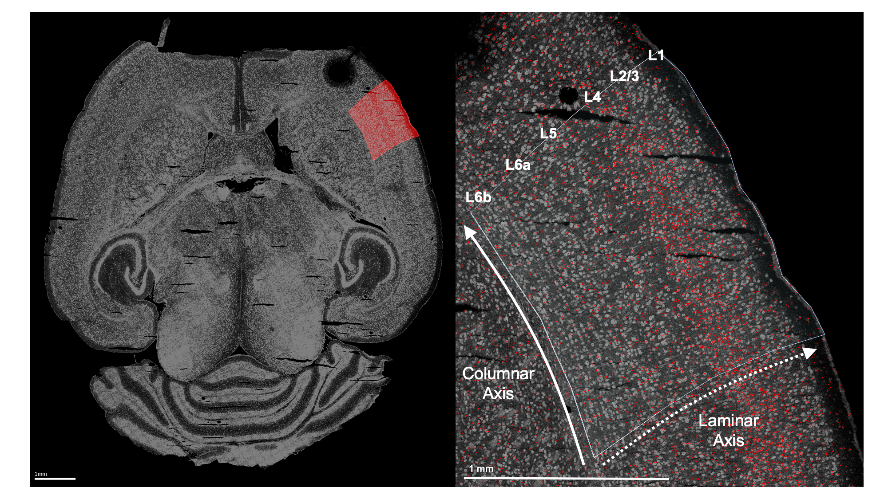
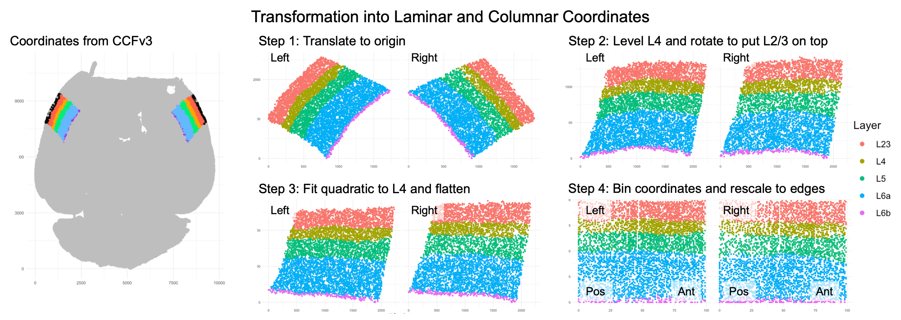
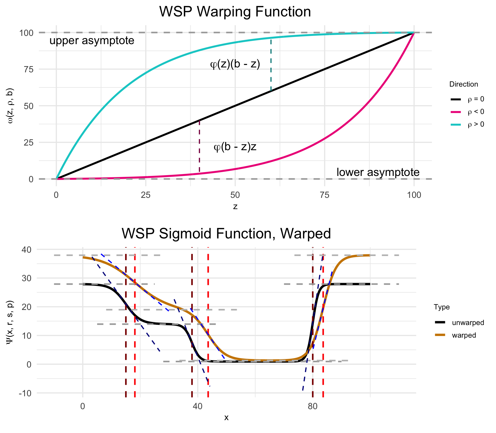

```{r setup, include = FALSE}
options(width = 10000)
knitr::opts_chunk$set(class.output = "scroll-output", cache = TRUE)
```

<h2>Introduction</h2>

The gene <span class = "gene">RORB</span> plays a key role in the development of somatosensory cortex in rodents. <span class = "gene">RORB</span> expression leads axons from thalamic neurons to innervate cortical layer 4 (L4). These thalamocortical projections organize into discrete "barrel" formations, each barrel containing the inputs from a single whisker. 

While it's sometimes assumed that there are no major differences in barrel formations between the left and right hemispheres (i.e., no *laterality*), over the years there have been several histological studies suggesting age-dependent hemispheric differences. Given the established role of <span class = "gene">RORB</span> in barrel formation, one might want to test for age-dependent laterality in <span class = "gene">RORB</span> expression. 

<h2>Data preprocessing</h2>

This tutorial uses data collected from four male wild-type mice to test for age effects on laterality in <span class = "gene">RORB</span> expression. The mice are split between two ages: postnatal day 12 (P12) and postnatal day 18 (P18). The starting point was raw, non-normalized mRNA counts from the cells within the primary somatosensory cortex (S1), both left and right hemispheres. 

<h3>Labeling the ROI</h3>

Before using any functions from wispack, S1 was identified in each sample by manually fitting the entire slice to the [CCFv3](https://doi.org/10.1016/j.cell.2020.04.007).

<div class="figure">
  
  <p class="caption">Left: Example horizontal slice as reconstructed from MERFISH data. Red highlight indicates the right primary somatosensory cortex. Right: The right somatosensory cortex, with <span class = "gene">RORB</span> molecules in red and laminar and columnar axes labeled.</p>
</div>

<h3>Coordinate transform</h3>

As wisp can only model one dimension of spatial variation (at least, as of v2.1), this axis must be identified and the <span class = "gene">RORB</span> molecule coordinates must be transformed into it. As the primary concern is with how <span class = "gene">RORB</span> is distributed across cortical layers, the laminar axis is the obvious candidate. Coordinate transformation into an axis of interest must be done outside of wispack. For this case, a custom coordinate transformation, described in this [preprint](https://doi.org/10.1101/2025.06.11.659209) (and available as code via the wispack function <span class = "function">cortical_coordinate_transform<\span>), was written. 

<div class="figure">
  
  <p class="caption">Visualization of coordinate transform steps from initial CCFv3 registration to laminar and columnar axes.</p>
</div>

Note that the laminar axis is encoded as _y_, with 0 being the bottom of L6b, 100 the top of L2/3. The columnar axis is encoded as _x_, with 0 being the most posterior point, 100 the most anterior point. L1 was removed from the analysis, as it contains very few cells.

<h2>Model setup</h2>

Wispack contains a csv file with the results of this coordinate transformation applied to the raw data. Let's set up a wisp model for it. 

<h3>Data format</h3>

To start, load this data and print its first few rows: 

```{r load_data}
countdata <- read.csv(
  system.file(
      "extdata", 
      "S1_laminar_countdata_demo.csv", 
      package = "wispack"
    )
  )

print(head(countdata))
```

As can be seen, the imported data has the columns: <span class = "code_variable">count</span>, <span class = "code_variable">bin</span>, <span class = "code_variable">context</span>, <span class = "code_variable">gene</span>, <span class = "code_variable">mouse</span>, <span class = "code_variable">hemisphere</span>, and <span class = "code_variable">age</span>. Although the focus is on <span class = "gene">RORB</span>, these first few rows show that there are other genes in the data as well. How many? 

```{r n_genes}
num_genes <- length(unique(countdata$gene))
cat("Number of genes:", num_genes, "\n")
```
```{r check1, echo = FALSE}
if (num_genes != 6) stop("failed check 1")
```

Which genes? 

```{r name_genes}
cat("Gene names:", paste0(unique(countdata$gene), collapse = ", "))
```
```{r check2, echo = FALSE}
if (unique(countdata$gene)[2] != "Fezf2") stop("failed check 2")
```

Just as <span class = "gene">RORB</span> is known to be localized to L4, the other genes are also known to be localized to specific layers. 

| Abbreviation | Name | Layer |
|:-------------|:-----|:------|
|<span class = "gene">BCL11B</span>, <span class = "gene">CTIP2</span> | B-cell CLL/lymphoma 11b | 5/6 |
|<span class = "gene">FEZF2</span> | FEZ Family Zinc Finger 2 | 5 |
|<span class = "gene">SATB2</span> | SATB Homeobox 2 | 2/3 |
|<span class = "gene">NXPH3</span> | Neurexophilin 3 | 6 |
|<span class = "gene">CUX2</span> | Cut like homeobox 2 | 2/3/4 |
|<span class = "gene">RORB</span> | Retinoic acid-related orphan receptor beta | 4 |

So, the modeling results can be compared to known biology in all cases. To facilitate this comparison, we can load the layer boundaries gotten from the CCFv3 registration for use later. Note that these boundaries are only used for this comparison, not to fit the model.

```{r load_boundaries}
layer.boundary.bins <- read.csv(
  system.file(
      "extdata", 
      "S1_layer_boundary_bins.csv", 
      package = "wispack"
    )
  )
```

Each row in the data frame represents a cell from the left or right S1 region of one of the four mice. Each cell is represented in multiple rows, one row per gene. Hence, the number of cells can be found by dividing the number of rows by the number of genes. 

```{r n_cells}
num_cells <- nrow(countdata)/num_genes
cat("Number of cells:", num_cells, "\n")
```
```{r check3, echo = FALSE}
if (num_cells != 54116) stop("failed check 3")
```

The count column thus gives the number of molecules of the RNA species listed in the gene column, found in the cell represented by a given row. Each cell, of course, comes from a specific mouse and brain hemisphere, information given in the correspondingly named columns. The age column gives the age of the mouse. 

This leaves two columns to explain: context and bin. "Context" refers to the biological context of the cell. In this case, all the cells are simply labeled as "cortex", thus making context a dummy variable. An obvious use of the context variable would be to label the type of each cell, e.g., glutamatergic vs. GABAergic neurons (see [Modeling celltypes](tutorial_multicontext.html)).

The bin column gives the position of the cell along the axis of interest (in this case, the laminar axis), in units of "bins". Any position coordinates could be used, including ones with non-integer values such as microns. However, we have binned the position coordinates into 100 (roughly) equal-width bins to allow for bootstrapping (see [Customizing statistical analyses](tutorial_stats.html)). 

<h2>Effects structure</h2>

The goal is to test for interacting effects of age and laterality, with mouse as a random-effect grouping factor. A linear model from the well-known R package lme4 with the appropriate effects structure could be gotten with the following call:

```{r lmer_formula, eval = FALSE}
model <- lme4::lmer(
    count ~ age * hemisphere + (age * hemisphere|mouse), 
    data = countdata
  )
```

The problem with this linear model is that it makes no use of the bin variable and thus loses all spatial information. A second problem is that the model makes no use of the gene variable, although this problem could be addressed by subsetting countdata to just a single gene of interest. (Gene should not be treated as another fixed-effect factor along with age and hemisphere, as there's no reason to think age or hemisphere have any effect independent of RNA species.) Nevertheless, this model shows the basic effects structure wisp aims to capture. 

A wisp captures this effects structure without discarding spatial information, and while segregating counts by gene. Unlike a mixed-effects linear model from the lme4 package, there is no model formula to specify in wispack. Instead of using a syntactic description (a formula), the effects structure in wispack is set semantically, i.e., by specifying which variables in the data frame correspond to which roles in the model. The roles are: 

1. <span class = "code_variable">count</span>: either a non-negative integer giving the number of RNA molecules of a given species in a given cell, or a non-negative real number giving normalized or log-transformed expression values.
2. <span class = "code_variable">bin</span>: the position of the cell along the axis of interest (whether or not the actual unit is "bin"). 
3. <span class = "code_variable">context</span>: the biological context of the cell, typically a cell-type label.
4. <span class = "code_variable">species</span>: the RNA species (gene) being modeled.
5. <span class = "code_variable">ran</span>: the random-effect grouping factor, typically a sample or animal ID.
6. <span class = "code_variable">timeseries</span>: a fixed-effects factor to treat as a time series (if any), typically developmental or experimental time points.
6. <span class = "code_variable">fixedeffects</span>: a vector of fixed-effect factors, typically biological or experimental conditions.

Note that wisps are intended to model [Poisson processes](tutorial_Poisson.html), and so both the underlying optimization and [statistical parameter estimation](tutorial_stats.html) assume the count variable is a Poisson-distributed integer. However, the code will accept and attempt to fit normalized and log-transformed real-valued expression data as well, albeit with care needed in interpreting the results.

The timeseries variable is optional. If none is provided, wisp will not treat any fixed effects as time series. However, if a variable is flagged as a time series, wisp will model it as a [discrete additive effect](tutorial_timeseries.html).

In the data frame loaded above, the <span class = "code_variable">count</span>, <span class = "code_variable">bin</span>, and <span class = "code_variable">context</span> columns match the names of the roles to which they correspond. Wispack will find those columns automatically. However, the <span class = "code_variable">species</span> and <span class = "code_variable">ran</span> roles have different names in the data frame, and thus wispack needs to know which data columns carry these variables. While wispack has no default names for fixed effects, if no fixed effects are specified, all columns not identified as one of the other roles will be treated as fixed effects. Unless flagged as a time series, all fixed effects must have at most two levels. 

```{r wisp_setup}
# Specify variables for wisp
data.variables <- list(
    species = "gene",
    ran = "mouse",
    timeseries = "age"
  )
```

As the data contains only two ages, it's not technically necessary to flag the age column as a time series. However, doing so triggers the wisp function to make plots showing rate changes over time. 

It would be redundant, but all roles would be specified as follows: 

```{r all_roles, eval=FALSE}
# Specify all variables for wisp
data.variables <- list(
    count = "count",
    bin = "bin", 
    context = "context", 
    species = "gene",
    ran = "mouse",
    timeseries = "age",
    fixedeffects = c("hemisphere", "age")
  )
```

<h3>Model parameters</h3>

In wisp, a semantic specification of the variable roles suffices because, with respect to those roles, all wisp models have the same effects structure. This effects structure is defined over a parameterization of the spatial distribution of RNA molecules. Wisp models describe the distribution of RNA molecules along a one-dimensional axis (the <span class = "code_variable">bin</span> variable) as a log-transformed rate that is constant across space, except for transition points where the rate changes with a slope given by a logistic function. Within this [spatial parameterization](tutorial_Poisson.html), fixed effects from fixed-effect factors or their interactions are simple linear effects, being multiplicative on rates and additive on transition points and slopes. The multiplicative effects on rate are log-fold changes, and so mesh nicely with standard practice. (Note that while all interactions of fixed-effect factors are included by default, interactions can be removed from the model using the <span class = "code_variable">trtKO</span> argument in <span class = "code_variable">model.settings</span>.)

<div class="figure">
  
  <p class="caption">(Top) The logistic function, used to model a single change point in gene expression. (Bottom) The wisp poly-sigmoid function, built from three logistic components, representing three change points.</p>
</div>

Random effects from the random-effect grouping factor are a [nonlinear warping](tutorial_warping.html) of the three spatial parameters. 

<div class="figure">
  
  <p class="caption">(Top) The warping function used to represent random effects, e.g., variation due to differences between individual animals or due to measurement noise. (Bottom) The wisp poly-sigmoid with warping function applied.</p>
</div>

<h2>Fitting a wisp</h2>

Thus, the goal of fitting a wisp model to spatial transcriptomics data is to estimate, for each gene: 

1. The number of transition points.
2. The spatial parameters (expression rates, transition-point locations, and transition-point slopes) in the reference condition.
3. The linear effects of fixed-effect factors and their interactions on the spatial parameters.
4. The nonlinear warping effects of the random-effect grouping factor on spatial parameters.

Although wispack includes many settings for fine-tuning the modeling process, fitting a wisp model and estimating its parameters is done with a single R function, <span class = "function">wisp</span>. This function only needs one argument, the data to be modeled (<span class = "code_variable">count.data</span>). If, as above, the variable roles are filled by data columns with with different names, then the variables must be provided via another argument (<span class = "code_variable">variables</span>). 

The following code fits a wisp model to the data loaded above, with verbose output. Plots are suppressed, as by default many are generated in the fitting process. As noted above, layer boundaries are provided to the model, but are used only in making plots so that the model fit and parameter estimates can be compared to the laminar boundaries estimated by the CCFv3 registration.

```{r fit_wisp}
# Set random seed for reproducibility
set.seed(123)
# Load wispack
library(wispack, quietly = TRUE)
# Fit model
model <- wisp(
    count.data = countdata,
    variables = data.variables,
    plot.settings = list(
        print.plots = FALSE, 
        dim.bounds = colMeans(layer.boundary.bins)
      ),
    verbose = TRUE
  )
```

<h2>Results</h2> 

As can be seen in the print out above, wisp models typically have hundreds (or even thousands) of parameters, which means that they usually lack the kind of brief-yet-informative summary familiar from R packages for linear models. 

<h3>Extracting results</h3> 

The most flat-footed way to extract desired results is to hunt through the output. The output of <span class = "function">wisp</span> is a list with the following named components: 

```{r wisp_model_components}
for (n in names(model)) cat(n, ": ", paste0(class(model[[n]]), collapse = ", "), "\n", sep = "")
```

Within the <span class = "code_variable">stats</span> object (another list itself), the following is found: 

```{r stats_components}
for (n in names(model$stats)) cat(n, ": ", paste0(class(model$stats[[n]]), collapse = ", "), "\n", sep = "")
```

The parameter object <span class = "code_variable">stats$parameter</span> is a data frame the rows of which are the model parameters, the columns of which are various statistical results of interest, e.g., confidence intervals and $p$-values: 

```{r parameter_components}
print(head(model$stats$parameter))
```
```{r check4, echo = FALSE}
test_val <- model$stats$parameter[1,2]
if (test_val < 3.38 || test_val > 3.4) stop("failed check 4")
```

All fixed-effects of hemisphere (i.e., laterality) on the expression rate of <span class = "gene">RORB</span> can be extracted by masking with the treatment variable name for the factor <span class = "code_variable">hemisphere</span> (which is "right", with "left" as the reference level), the name of the gene of interest ("<span class = "gene">RORB</span>"), and the type of parameter (fixed effect on rate, which is "beta" on "Rt"):

```{r hemisphere_effects_RORB}
mask <- grepl("Rorb", model$stats$parameters$parameter) &    # just this gene
  grepl("right", model$stats$parameters$parameter) &         # just the effect of hemisphere
  grepl("beta", model$stats$parameters$parameter) &          # just the fixed effects of the above factor
  grepl("Rt", model$stats$parameters$parameter)              # just the effects on rate
print(model$stats$parameter[mask, ])
```
```{r check5, echo = FALSE}
test_val <- model$stats$parameter[mask, ][2,3]
if (test_val < -0.01 || test_val > 0.1) stop("failed check 5")
```

Notice that all of the parameter names end in "Tns/Blk1", "Tns/Blk2", "Tns/Blk3", or "Tns/Blk4". This is because the model fit found three transition points, thus dividing the laminar axis into four blocks of roughly constant expression rate. The estimated effect of <span class = "code_variable">hemisphere</span> on rate is given for each of the four blocks. Each block lists two estimates, one for the effect at the reference age (P12), and one for the interaction of <span class = "code_variable">hemisphere</span> with <span class = "code_variable">age</span> (the effect of laterality at P18). As can be seen, <span class = "gene">RORB</span> expression is up-regulated in the right hemisphere (compared to left) across all blocks, but the interaction of <span class = "code_variable">hemisphere</span> with <span class = "code_variable">age</span> decreases that up-regulation, i.e., the laterality effect is less pronounced at P18 than at P12.

<h3>Plotting results</h3>

It's difficult to get a handle on the results as pure effect numbers. A better way to understand the results is through visualization. Wispack provides a number of functions for [making intuitive spatial plots](tutorial_wispplots.html). Indeed; a strength of wisp models is their use of concrete spatial parameters. 

The standard way to visualize a fitted wisp model, for an individual gene, is to plot gene expression level (e.g., total <span class = "code_variable">count</span> per bin) on the y-axis and spatial position (<span class = "code_variable">bin</span>) on the x-axis, with effects conditions represented by different colors. The <span class = "function">wisp</span> function automatically generates these plots and stores them in <span class = "code_variable">plots$ratecount</span>. Here, for example, is the plot for <span class = "gene">RORB</span>: 

```{r plot_RORB_ratecount}
print(model$plots$ratecount$plot_pred_context_cortex_fixEff_Rorb)
```

The shading shows 95% confidence intervals for the rate estimates. Note that while the p-values and confidence intervals for the model parameters are corrected for multiple-comparisons (by default, using Holm-Bonferroni), the confidence intervals shown in these plots are not corrected for multiple comparisons. This is because the confidence intervals on this plot are for predicted rate, not for model parameters. Model parameter estimates can be adjusted for multiple comparisons because they each constitute a well-defined single hypothesis test. However, predicted rates at different spatial positions are not independent of one another and so do not constitute distinct hypothesis tests; hence, there's no well-defined way to correct for multiple comparisons. 

Regarding what this particular plot shows for <span class = "gene">RORB</span>, as expected there is a large peak in <span class = "gene">RORB</span> expression in L4. This peak is present for both left (green) and right (blue) hemispheres. However, the plot suggests that there is laterality at both ages, albeit with a swap in up-regulation. Specifically, at P12 the plot shows up-regulation in the right hemisphere (light blue) compared to the left (light green), while at P18 there is up-regulation in the left hemisphere (dark green) compared to the right (dark blue). 

This swap is easy to see on a time-series plot. When a time series is provided (via the <span class = "code_variable">variables</span> argument), the <span class = "function">wisp</span> function automatically generates time-series plots for each gene.

```{r plot_RORB_timeseries}
print(model$plots$timeseries$plot_pred_context_cortex_timeseries_Rorb)
```

The time-series plot puts the time points on the x-axis, with rate (as before) on the y-axis. However, the rate value is not the expected value at a given bin, but rather the rate parameter itself. As each block has a different rate parameter, the time-series plot shows the rate for each block. If the data also includes a single additional covariate (fixed effect) besides the time series, that variable is used as a splitting factor to generate separate lines for each level of that variable. Here, the splitting factor is <span class = "code_variable">hemisphere</span>, and so we see separate lines for left (green) and right (blue) hemispheres. Notice how the rate counts are relatively low and bunched at the bottom for all but one block. This exception is block 3, the block overlapping L4. Here we see the swap clearly: right (blue) higher at P12, left (green) higher at P18.

Along with the lines representing block rate, the (jittered) dots at each age represent the mean observed count per bin within that block. Notice that sometimes these dots will be lower than the line, as is the case here at P18 in block 3. This is because the predicted rate is not just the rate parameter for the block, but is also a function of the slopes and transition points. The rate parameter is only a good approximation of the expected rate far from transition points and assuming relatively steep slopes. When slopes are shallow and most bins in a block are near a transition point, we can expect the mean observed (and predicted) rate per bin within a block to be appreciably lower than the block rate parameter. This is not a poor fit of the model, but a limit of the visualization. 
