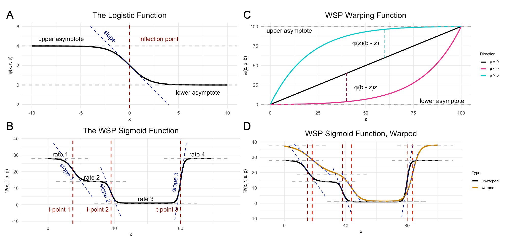

```{r setup, include=FALSE}
options(width = 10000)
```

The gene RORB plays a key role in the development of sensorimotor cortex in rodents. RORB expression leads axons from thalamic neurons to innervate cortical layer 4. These thalamocortical projections organize into discrete "barrel" formations, each barrel containing the inputs from a single whisker. 

While it's generally assumed that there are no major differences in barrel formations between the left and right hemispheres (i.e., no "laterality"), over the years there have been several histological studies suggesting age and sex-dependent hemispheric differences. Given the established role of RORB in barrel formation, one might want to test for age or sex-dependent laterality in RORB expression. 

<h1> Labeling the ROI </h1>

This tutorial uses data collected from four male wild-type mice to test for age effects on laterality in RORB expression. The mice are split between two ages: postnatal day 12 (P12) and postnatal day 18 (P18). The starting point was raw, non-normalized mRNA counts from the cells within the primary sensorimotor cortex (S1), both left and right hemispheres. Before using any functions from wispack, S1 was identified in each sample by manually fitting the entire slice to the CCFv3.

<div class="figure">
  
  <p class="caption">Left: Example horizontal slice as reconstructed from MERFISH data. Red highlight indicates the right primary sensorimotor cortex. Right: The right sensorimotor cortex, with RORB molecules in red and laminar and columnar axes labeled.</p>
</div>

<h1> Coordinate transform into axis of interest </h1>

As wisp can only model one dimension of spatial variation (at least, as-of the writing of this demo for v1.0), this axis must be identified and the RORB molecule coordinates must be transformed into it. As the primary concern is with how RORB is distributed across cortical layers, the laminar axis is the obvious candidate. Coordinate transformation into an axis of interest must be done outside of wispack. For this case, a custom coordinate transformation, described in this [preprint](https://doi.org/10.1101/2025.06.11.659209) and available as code in this [repo](https://github.com/Oviedo-Lab/wspmm_methods.git) (see function cortical_coordinate_transform in script merfish_preprocessing.R), was written. 

<div class="figure">
  
  <p class="caption">Visualization of coordinate transform steps from initial CCFv3 registration to laminar and columnar axes.</p>
</div>

Note that the laminar axis is encoded as _y_, with 0 being the bottom of L6b, 100 the top of L2/3. The columnar axis is encoded as _x_, with 0 being the most posterior point, 100 the most anterior point. L1 was removed from the analysis, as it contains very few cells.

<h1> Data format </h1>

Wispack contains a csv file with the results of this coordinate transformation applied to the raw data. To start, load this data and print its first few rows: 

```{r load_data}
countdata <- read.csv(
  system.file(
      "extdata", 
      "S1_laminar_countdata_demo.csv", 
      package = "wispack"
    )
  )

print(head(countdata))
```

As can be seen, the imported data has the columns: count, bin, context, gene, mouse, hemisphere, age. Although the focus is on RORB, these first few rows show that there are other genes in the data as well. How many? 

```{r n_genes}
num_genes <- length(unique(countdata$gene))
cat("Number of genes:", num_genes, "\n")
```

Which genes? 

```{r name_genes}
cat("Gene names:", paste0(unique(countdata$gene), collapse = ", "))
```

Just as RORB is known to be localized to L4, the other genes are also known to be localized to specific layers (see [here](https://doi.org/10.1101/2025.06.11.659209)). So, the modeling results can be compared to known biology in all cases. To facilitate this comparison, the layer boundaries gotten from the CCFv3 registration are also loaded. Note that these boundaries are not used to fit the model.

```{r load_boundaries}
layer.boundary.bins <- read.csv(
  system.file(
      "extdata", 
      "layer_boundary_bins.csv", 
      package = "wispack"
    )
  )
```

Each row in the data frame represents a cell from the left or right S1 region of one of the four mice. Each cell is represented in multiple rows, one row per gene. Hence, the number of cells can be found by dividing the number of rows by the number of genes. 

```{r n_cells}
num_cells <- nrow(countdata)/num_genes
cat("Number of cells:", num_cells, "\n")
```

The count column thus gives the number of molecules of the RNA species listed in the gene column, found in the cell represented by a given row. Each cell, of course, comes from a specific mouse and brain hemisphere, information given in the correspondingly named columns. The age column gives the age of the mouse. 

This leaves two columns to explain: context and bin. "Context" refers to the biological context of the cell. In this case, all the cells are simply labeled as "cortex", thus making context a dummy variable. An obvious use of the context variable would be to label the type of each cell, e.g., glutamatergic vs. GABAergic neurons (see [Modeling celltypes](tutorial_multicontext.html)).

The bin column gives the position of the cell along the axis of interest (in this case, the laminar axis), in units of "bins". Any position coordinates could be used, including ones with non-integer values such as microns. However, we have binned the position coordinates into 100 (roughly) equal-width bins to allow for bootstrapping (see [Customizing statistical analyses](tutorial_stats.html)). 

<h1> Effects structure </h1>

The goal is to test for interacting effects of age and laterality, with mouse as a random-effect grouping factor. A linear model from the well-known R package lme4 would have the following: 

```{r lmer_formula, eval=FALSE}
model <- lme4::lmer(
    count ~ age * hemisphere + (age * hemisphere|mouse), 
    data = countdata
  )
```

The problem with this linear model is that it makes no use of the bin variable and thus loses all spatial information. A second problem is that the model makes no use of the gene variable, although this problem could be addressed by subsetting countdata to just a single gene of interest. (Gene should not be treated as another fixed-effect factor along with age and hemisphere, as there's no reason to think age or hemisphere have any effect independent of RNA species.) Nevertheless, this model shows the basic effects structure wisp aims to capture. 

A wisp captures this effects structure without discarding spatial information, and while segregating counts by gene. Unlike a mixed-effects linear model from the lme4 package, there is no model formula to specify in wispack. Instead of using a syntactic description (a formula), the effects structure in wispack is set "semantically", i.e., by specifying which variables in the data frame correspond to which roles in the model. The roles are: 

1. **count:** a non-negative integer (not normalized or log-transformed) giving the number of RNA molecules of a given species in a given cell.
2. **bin:** the position of the cell along the axis of interest (whether or not the actual unit is "bin"). 
3. **context:** the biological context of the cell, typically a celltype label.
4. **species:** the RNA species (gene) being modeled.
5. **ran:** the random-effect grouping factor, typically a sample or animal ID.
6. **fixedeffects:** a vector of fixed-effect factors, typically biological or experimental conditions.

In the data frame loaded above, the count, bin, and context columns match the names of the roles to which they correspond. Wispack will find those columns automatically. However, the species and ran roles have different names in the data frame, and thus wispack needs to know which data columns carry these variables. While wispack has no default names for fixed effects, if no fixed effects are specified, all columns not identified as one of the other roles will be treated as fixed effects.

```{r wisp_setup}
# Specify variables for wisp
data.variables <- list(
    context = "cortex",
    species = "gene",
    ran = "mouse"
  )
```

It would be redundant, but all roles would be specified as follows: 

```{r all_roles, eval=FALSE}
# Specify all variables for wisp
data.variables <- list(
    count = "count",
    bin = "bin", 
    context = "cortex", 
    species = "gene",
    ran = "mouse",
    fixedeffects = c("hemisphere", "age")
  )
```

<h1> Spatial parameterization and warping </h1>

In wisp, a semantic specification of the variable roles suffices because, with respect to those roles, all wisp models have the same effects structure. This effects structure is defined over a parameterization of the spatial distribution of RNA molecules. Wisp models describe the distribution of RNA molecules along a one-dimensional axis (the bin variable) as a log-transformed rate that is constant across space, except for transition points where the rate changes with a slope given by a logistic function. Within this spatial parameterization, fixed effects from fixed-effect factors or their interactions are simple linear effects, being multiplicative on rates and additive on transition points and slopes. (As it turns out, the multiplicative effects on rate are log-fold changes, and so mesh nicely with standard practice.) Random effects from the random-effect grouping factor are a nonlinear "warping" of the three spatial parameters. 

<div class="figure">
  
  <p class="caption">Demo plots of the functions involved in wisp. (A) The logistic function, used to model a single change point in gene expression. (B) The wisp poly-sigmoid function, built from three logistic components, representing three change points. (C) The warping function used to represent random effects, e.g., variation due to differences between individual animals or due to measurement noise. (D) The wisp poly-sigmoid from (B) with warping function applied.</p>
</div>

<h1> Fitting the model </h1>

Thus, the goal of fitting a wisp model to spatial transcriptomics data is to estimate, for each gene: 

1. The number of transition points.
2. The spatial parameters (expression rates, transition-point locations, and transition-point slopes) in the reference condition.
3. The linear effects of fixed-effect factors and their interactions on the spatial parameters.
4. The nonlinear warping effects of the random-effect grouping factor on spatial parameters.

Although wispack includes many settings for fine-tuning the modeling process, fitting a wisp model and estimating its parameters is done with a single R function, wisp(). This function only needs one argument, the data to be modeled (count.data). If, as above, the variable roles are filled by data columns with with names besides the roles, then the variables (data.variables) must be provided via another argument. The following code fits a wisp model to the data loaded above, with verbose output. Plots are suppressed as well, as by default many are generated in the fitting process. As noted above, layer boundaries are provided to the model, but are used only in making plots so that the model fit and parameter estimates can be compared to the laminar boundaries estimated by the CCFv3 registration.

```{r fit_wisp}
# Set random seed for reproducibility
set.seed(123)
# Load wispack
library(wispack, quietly = TRUE)
# Fit model
model <- wisp(
    count.data = countdata,
    variables = data.variables,
    dim.bounds = colMeans(layer.boundary.bins),
    verbose = TRUE,
    print.plots = FALSE
  )
```

<h1> Extracting the results </h1> 

As can be seen in the print out above, wisp models typically have hundreds of parameters, which means that they usually lack the kind of brief-yet-informative summary familiar from R packages for linear models. The most flat-footed way to extract desired results is to hunt through the output. The output of wisp() is a list with the following named components: 

```{r wisp_model_components}
for (n in names(model)) cat(n, ": ", class(model[[n]]), "\n", sep = "")
```

Within the "stats" object (another list itself), the following is found: 

```{r stats_components}
for (n in names(model$stats)) cat(n, ": ", class(model$stats[[n]]), "\n", sep = "")
```

The parameter object (stats$parameter) is a data frame the rows of which are the model parameters, the columns of which are various statistical results of interest, e.g., confidence intervals and p-values: 

```{r parameter_components}
print(head(model$stats$parameter))
```

All fixed-effects of hemisphere (i.e., laterality) on the expression rate of RORB can be extracted by masking with the treatment variable name for the factor hemisphere (which is "right", with "left" as the reference level), the name of the gene of interest ("Rorb"), and the type of parameter (fixed effect on rate, which is "beta" on "Rt"):

```{r hemisphere_effects_RORB}
mask <- grepl("Rorb", model$stats$parameters$parameter) &    # just this gene
  grepl("right", model$stats$parameters$parameter) &         # just the effect of hemisphere
  grepl("beta", model$stats$parameters$parameter) &          # just the fixed effects of the above factor
  grepl("Rt", model$stats$parameters$parameter)              # just the effects on rate
print(model$stats$parameter[mask, ])
```

Notice that all of the parameter names end in "Tns/Blk1", "Tns/Blk2", "Tns/Blk3", or "Tns/Blk4". This is because the model fit found three transition points, thus dividing the laminar axis into four "blocks" of roughly constant expression rate. The estimated effect of hemisphere on rate is given for each of the four blocks. Each block lists two estimates, one for the effect of laterality at the reference age (P12), and one for the interaction of laterality with age (the effect of laterality at P18). As can be seen, RORB expression is up-regulated in the right hemisphere (compared to left) across all blocks, but the interaction of age and hemisphere decreases that up-regulation, i.e., the laterality effect is less pronounced at P18 than at P12.

However, it's difficult to get a handle on the results as pure effect numbers. A better way to understand the results is through visualization. Wispack provides a number of functions for [making intuitive spatial plots](tutorial_wispplots.html). Indeed; a strength of wisp models is their use of concrete spatial parameters. 